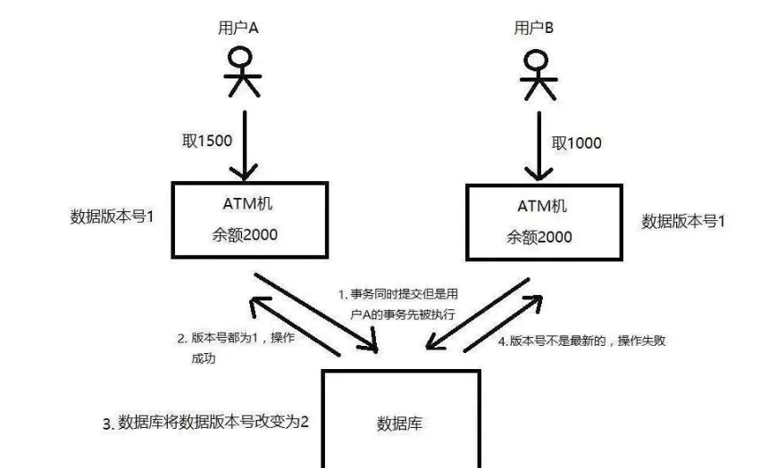
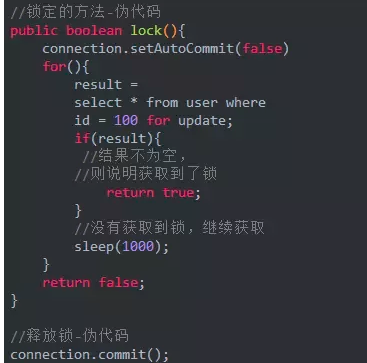
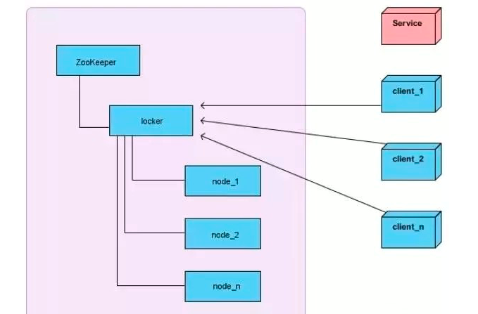

 当某个资源在多系统之间，具有共享性的时候，为了保证大家访问这个资源数据是一致的，那么就必须要求在同一时刻只能被一个客户端处理，
 不能并发的执行，否者就会出现同一时刻有人写有人读，大家访问到的数据就不一致了。 
 
# 需要使用分布式锁的原因
在单机时代，虽然不需要分布式锁，但也面临过类似的问题，只不过在单机的情况下，
如果有多个线程要同时访问某个共享资源的时候，我们可以采用线程间加锁的机制，
即当某个线程获取到这个资源后，就立即对这个资源进行加锁，当使用完资源之后，
再解锁，其它线程就可以接着使用了。例如，在JAVA中，甚至专门提供了一些
处理锁机制的一些API（synchronize/Lock等）。   
同步的本质是通过锁来实现的。为了实现多个线程在同一时刻同一个代码块只能有一个线程可执行，
那么需要在某个地方做个标记，这个标记必须每个线程都能看到，当标记不存在时某个线程可以设置该标记，
其余后续线程发现已经有标记了则等待拥有标记的线程结束同步代码块取消标记后再去尝试设置标记。   
`分布式与单机情况下最大的不同在于其不是多线程而是多进程。多线程由于可以共享堆内存，因此可以简单的采取内存作为标记存储位置。  
而进程之间甚至可能都不在同一台物理机上，因此需要将标记存储在一个所有进程都能看到的地方。`

## 业务场景分析
常见的是秒杀场景，订单服务部署了多个实例。如秒杀商品有4个，第一个用户购买3个，第二个用户购买2个，理想状态下第一个用户能购买成功，第二个用户提示购买失败，
反之亦可。而实际可能出现的情况是，两个用户都得到库存为4，第一个用户买到了3个，更新库存之前，第二个用户下了2个商品的订单，更新库存为2，导致出错。

在上面的场景中，商品的库存是共享变量，面对高并发情形，需要保证对资源的访问互斥。在单机环境中，Java中其实提供了很多并发处理相关的API，
但是这些API在分布式场景中就无能为力了。也就是说单纯的Java Api并不能提供分布式锁的能力。分布式系统中，由于分布式系统的分布性，
即多线程和多进程并且分布在不同机器中，synchronized和lock这两种锁将失去原有锁的效果，需要我们自己实现分布式锁。    

上面只是对同一个进程中的线程访问临界资源相关锁的说明，那么多个进程之间访问共享资源怎么处理呢？  
但是到了分布式系统的时代，这种线程之间的锁机制，就没作用了，系统可能会有多份并且部署在不同的机器上，
这些资源已经不是在线程之间共享了，而是属于进程之间共享的资源。  
因此，为了解决这个问题，我们就必须引入「分布式锁」。    
`分布式锁，是指在分布式的部署环境下，通过锁机制来让多客户端互斥的对共享资源进行访问。`
分布式锁要满足哪些要求呢？ 
` 
排他性：在同一时间只会有一个客户端能获取到锁，其它客户端无法同时获取。  
避免死锁：这把锁在一段有限的时间之后，一定会被释放（正常释放或异常释放）。  
高可用：获取或释放锁的机制必须高可用且性能佳。  
`
分布式锁的实现方式有哪些？  
目前主流的有三种，从实现的复杂度上来看，从上往下难度依次增加：  
基于数据库实现  
基于Redis实现  
基于ZooKeeper实现  
无论哪种方式，其实都不完美，依旧要根据咱们业务的实际场景来选择。   

## 基于数据库实现
基于数据库来做分布式锁的话，通常有两种做法：  
### 基于数据库的乐观锁
乐观锁机制其实就是在数据库表中引入一个版本号（version）字段来实现的。  
当我们要从数据库中读取数据的时候，同时把这个version字段也读出来，
如果要对读出来的数据进行更新后写回数据库，则需要将version加1，
同时将新的数据与新的version更新到数据表中，且必须在更新的时候同时检查目前数据库里version值是不是之前的那个version，
如果是，则正常更新。如果不是，则更新失败，说明在这个过程中有其它的进程去更新过数据了。  
 
   

如上图所示，假设同一个账户，用户A和用户B都要去进行取款操作，账户的原始余额是2000，
用户A要去取1500，用户B要去取1000，如果没有锁机制的话，在并发的情况下，
可能会出现余额同时被扣1500和1000，导致最终余额的不正确甚至是负数。
但如果这里用到乐观锁机制，当两个用户去数据库中读取余额的时候，除了读取到2000余额以外，
还读取了当前的版本号version=1，等用户A或用户B去修改数据库余额的时候，无论谁先操作，
都会将版本号加1，即version=2，那么另外一个用户去更新的时候就发现版本号不对，已经变成2了，
不是当初读出来时候的1，那么本次更新失败，就得重新去读取最新的数据库余额。   

通过上面这个例子可以看出来，使用「乐观锁」机制，必须得满足：    
（1）锁服务要有递增的版本号version。  
（2）每次更新数据的时候都必须先判断版本号对不对，然后再写入新的版本号。  

### 基于数据库的悲观锁
悲观锁也叫作排它锁，在Mysql中是基于 for update 来实现加锁的，例如：
  
    

上面的示例中，user表中，id是主键，通过 for update 操作，数据库在查询的时候就会给这条记录加上排它锁。  
`需要注意的是，在InnoDB中只有字段加了索引的，才会是行级锁，否者是表级锁，所以这个id字段要加索引。`    
对一条记录加上排它锁，一般针对for update 是对索引记录加锁。  
当这条记录加上排它锁之后，其它线程是无法操作这条记录的。  
那么，这样的话，我们就可以认为获得了排它锁的这个线程是拥有了分布式锁，然后就可以执行我们想要做的业务逻辑，当逻辑完成之后，
再调用上述释放锁的语句即可。  

### 缺点
存在的问题主要是性能不高和sql超时的异常，因为其他没有获取到锁的就会阻塞在上述select语句上，
可能的结果有2种，在超时之前获取到了锁，在超时之前仍未获取到锁。操作数据库需要一定的磁盘的IO开销，
性能问题需要考虑。  

## 基于缓存Redis实现
基于缓存来实现在性能方面会表现的更好一点，存取速度快很多。而且很多缓存是可以集群部署的，可以解决单点问题。  
基于Redis实现的锁机制，主要是依赖redis自身的原子性操作，例如：   
`SET user_key user_value NX PX 100 `  
若返回值为1，说明该进程获得锁，SETNX将键 user_key 的值设置为 user_value，并设置超时时间100ms。  
若返回值为0，说明其他进程已经获得了锁，进程不能进入临界区。进程可以在一个循环中不断地尝试 SETNX 操作，以获得分布式锁。  
redis从2.6.12版本开始，SET命令才支持这些参数：  
NX：只有在键不存在时，才对键进行设置操作，SET key value NX 效果等同于 SETNX key value。  
PX millisecond：设置键的过期时间为millisecond毫秒，当超过这个时间后，设置的键会自动失效。  
上述代码示例是指：当redis中不存在user_key这个键的时候，才会去设置一个user_key键，
                  并且给这个键的值设置为 user_value，且这个键的存活时间为100ms。
                  
为什么这个命令可以帮我们实现锁机制呢？  
因为这个命令是只有在某个key不存在的时候，才会执行成功。那么当多个进程同时并发的去设置同一个key的时候，
就永远只会有一个进程设置成功。当某个进程设置成功之后，就可以去执行业务逻辑了，等业务逻辑执行完毕之后，
再去进行解锁。解锁很简单，只需要删除这个key就可以了，不过删除之前需要判断，这个key对应的value是当初自己设置的那个。   
另外，针对redis集群模式的分布式锁，可以采用redis的Redlock机制。  

### 缺点
SETNX实现分布式锁，可能会存在死锁的情况（在没有设置超时时间的情况下）。与单机模式下的锁相比，分布式环境下不仅需要保证进程可见，
还需要考虑进程与锁之间的网络问题。某个线程获取了锁之后，断开了与Redis 的连接，锁没有及时释放，
竞争该锁的其他线程都会hang住，产生死锁的情况。   

`注意：在使用 SETNX 获得锁时，我们将键 user_key 的值设置为锁的有效时间，线程获得锁后，其他线程还会不断的检测锁是否已超时，
如果超时，等待的线程也将有机会获得锁。然而，锁超时，我们不能简单地使用 DEL 命令删除键 user_key 以释放锁。`
考虑以下情况:  
1、首先进程A已经获得了锁 user_key，然后进程A与redis连接断开。进程B,进程C都在等待竞争该分布式锁；  
2、B，C读取 user_key 的值，比较当前时间和键 user_key 的值来判断是否超时，发现超时；  
3、B执行 DEL user_key 命令，并执行 SETNX user_key 命令，并返回1，B获得锁；  
4、C由于刚刚检测到锁已超时，执行 DEL user_key 命令，将B刚刚设置的键 user_key 删除， 
   执行 SETNX user_key 命令，并返回1，即C获得锁。  

`上面的步骤很明显出现了问题，导致B,C同时获取了锁。在检测到锁超时后，线程不能直接简单地执行 DEL 删除键的操作以获得分布式锁。  `  

对于上面的步骤进行改进，问题是出在删除键的操作上面，那么获取锁之后应该怎么改进呢？
`首先看一下redis的GETSET这个操作，GETSET key value，将给定 key 的值设为 value ，并返回 key 的旧值(old value)。利用这个操作指令，我们改进一下上述的步骤。  
1、首先A已经获得了锁 user_key，然后线A断线。B,C都在等待竞争该锁；
2、B,C读取 user_key 的值，比较当前时间和键 user_key 的值来判断是否超时，发现超时；
3、B检测到锁已超时，即当前的时间大于键 user_key 的值，B会执行
GETSET user_key <current Unix timestamp + lock timeout + 1>设置时间戳，通过比较键 user_key 的旧值是否小于当前时间，判断进程是否已获得锁；
B发现GETSET返回的值小于当前时间，则执行 DEL user_key 命令，释放A的分布式锁，并执行 SETNX user_key 命令，并返回1，B获得锁；
4、C执行GETSET得到的时间大于当前时间，则继续等待。 ` 
在线程释放锁，即执行 DEL user_key 操作前，需要先判断锁是否已超时。如果锁已超时，那么锁可能已由其他线程获得，
这时直接执行 DEL user_key 操作会导致把其他线程已获得的锁释放掉。   
 

## 基于ZooKeeper实现
其实基于ZooKeeper，就是使用它的临时有序节点来实现的分布式锁。    
原理就是：当某客户端要进行逻辑的加锁时，就在zookeeper上的某个指定节点的目录下，
去生成一个`唯一的临时有序节点`， 并且在zookeeper的节点上绑定监听器，然后判断自己是否是这些有序节点中序号最小的一个，
如果是，则算是获取了锁。如果不是，则说明没有获取到锁，那么就需要在序列中找到比自己小的那个节点，并对其调用exist()方法，
对其注册事件监听，一旦节点有变化，Zookeeper会通知客户端，当监听到这个节点被删除了，那就再去判断一次自己当初创建的节点是否变成了序列中最小的。
如果是，则获取锁，如果不是，则重复上述步骤。  

当释放锁的时候，只需将这个临时节点删除即可。    

### 缺点
性能上可能并没有缓存服务那么高，因为每次在创建锁和释放锁的过程中，都要动态创建、销毁瞬时节点来实现锁功能。
ZK中创建和删除节点只能通过Leader服务器来执行，然后将数据同步到所有的Follower机器上。 
`并发问题，可能存在网络抖动，客户端和ZK集群的session连接断了，zk集群以为客户端挂了，就会删除临时节点，这时候其他客户端就可以获取到分布式锁了。  `
 
   

如上图，locker是一个持久节点，node_1/node_2/…/node_n 就是上面说的临时节点，由客户端client去创建的。  
client_1/client_2/…/clien_n 都是想去获取锁的客户端。以client_1为例，它想去获取分布式锁，
则需要跑到locker下面去创建临时节点（假如是node_1）创建完毕后，看一下自己的节点序号是否是locker下面最小的，
如果是，则获取了锁。如果不是，则去找到比自己小的那个节点（假如是node_2），找到后，就监听node_2，直到node_2被删除，
那么就开始再次判断自己的node_1是不是序列中最小的，如果是，则获取锁，如果还不是，则继续找一下一个节点。   

 

 

  
 

