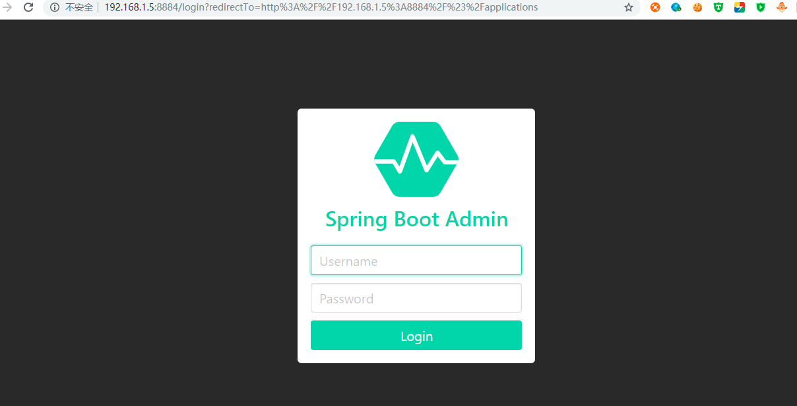
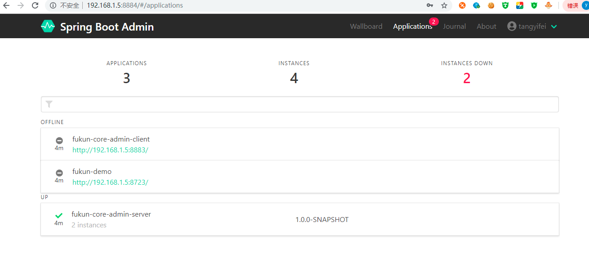
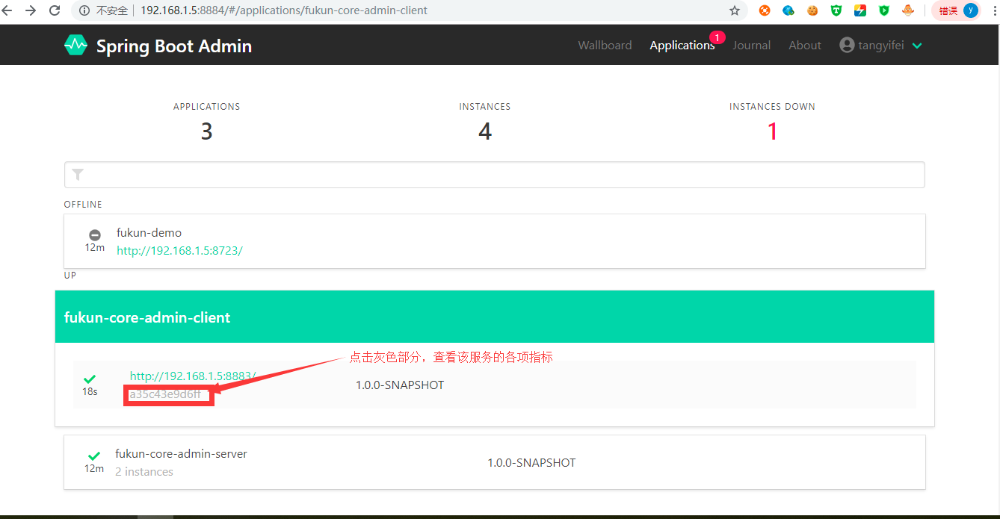
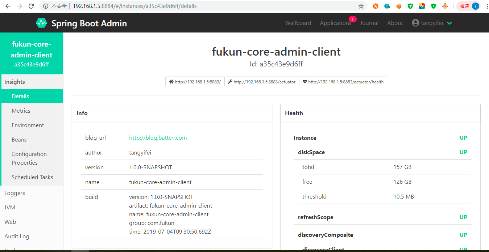

# SBA简介
SBA 全称 Spring Boot Admin 是一个管理和监控 Spring Boot 应用程序的开源项目。分为admin-server 与 admin-client 两个组件，
admin-server通过采集 actuator 端点数据，显示在 spring-boot-admin-ui 上，已知的端点几乎都有进行采集，
通过 spring-boot-admin 可以动态切换日志级别、导出日志、导出heapdump、监控各项指标 等等。  
Spring Boot Admin 在对单一应用服务监控的同时也提供了集群监控方案，支持通过eureka、consul、zookeeper等注册中心的方式实现多服务监控与管理。  
下面我以 Spring Boot Admin 结合服务中心consul来监控consul中注册的微服务。  

# 创建SBA服务端
服务端的名称为fukun-core-admin-server。  
## 添加依赖
```
 <dependencies>
        <!-- 服务端：带UI界面 -->
        <dependency>
            <groupId>de.codecentric</groupId>
            <artifactId>spring-boot-admin-starter-server</artifactId>
            <version>${admin.version}</version>
        </dependency>
        <!-- 客户端包 -->
        <dependency>
            <groupId>de.codecentric</groupId>
            <artifactId>spring-boot-admin-starter-client</artifactId>
            <version>${admin.version}</version>
        </dependency>
        <!-- 安全认证 -->
        <dependency>
            <groupId>org.springframework.boot</groupId>
            <artifactId>spring-boot-starter-security</artifactId>
        </dependency>
        <!-- 端点 -->
        <dependency>
            <groupId>org.springframework.boot</groupId>
            <artifactId>spring-boot-starter-actuator</artifactId>
        </dependency>
        <dependency>
            <groupId>org.springframework.boot</groupId>
            <artifactId>spring-boot-starter-web</artifactId>
            <exclusions>
                <exclusion>
                    <groupId>org.springframework.boot</groupId>
                    <artifactId>spring-boot-starter-tomcat</artifactId>
                </exclusion>
            </exclusions>
        </dependency>
        <dependency>
            <groupId>org.springframework.boot</groupId>
            <artifactId>spring-boot-starter-jetty</artifactId>
        </dependency>
        <dependency>
            <groupId>org.springframework.cloud</groupId>
            <artifactId>spring-cloud-starter-consul-discovery</artifactId>
        </dependency>
        <dependency>
            <groupId>org.projectlombok</groupId>
            <artifactId>lombok</artifactId>
            <version>${lombok.version}</version>
            <scope>provided</scope>
        </dependency>
        <!--<dependency>
            <groupId>org.springframework.boot</groupId>
            <artifactId>spring-boot-starter-mail</artifactId>
        </dependency>-->
        <dependency>
            <groupId>javax</groupId>
            <artifactId>javaee-api</artifactId>
            <version>7.0</version>
        </dependency>
        <!-- 在管理界面中与 JMX-beans 进行交互所需要被依赖的 JAR -->
        <dependency>
            <groupId>org.jolokia</groupId>
            <artifactId>jolokia-core</artifactId>
            <version>${jolokia.version}</version>
        </dependency>
 </dependencies>
```
注意当我们依赖spring-boot-starter-web的jar包的时候，如果不去除tomcat的依赖，会报  
```
java.lang.IllegalStateException: Calling [asyncError()] is not valid for a request with Async state

```
相关的错误，怎么解决呢？排除tomcat的依赖，使用 jetty ，或者降级tomcat的版本。  
如果SBA要访问并监控info接口获取maven中的属性内容，上面还要注意spring-boot-maven-plugin这个插件要添加  
```
<executions>
        <execution>
            <goals>
                <goal>build-info</goal>
            </goals>
        </execution>
</executions>
```
## 修改配置信息
```
修改application.yml文件的配置信息：  
spring:
  profiles:
    active: prod
  application:
     name: fukun-core-admin-server
  main:
    allow-bean-definition-overriding: true

  boot:
      admin:
        ui:
          title: 微服务监控
        #配置邮件监控
        #便于客户端可以在受保护的服务器上注册api
        client:
           url: http://${spring.cloud.client.ip-address}:${server.port}
           instance:
              prefer-ip: true

  cloud:
     consul:
        host: localhost
        port: 8500
        discovery:
          enabled: true
          register: true
          tags:  management.context-path=/, health.path=/health, user.name=tangyifei, user.password=123456
          serviceName: ${spring.application.name}
          hostname: ${spring.application.name}
          port: ${server.port}
          instanceId: ${spring.application.name}:${server.port}
          preferIpAddress: true
          healthCheckInterval: 10s
          healthCheckUrl: http://${spring.cloud.client.ip-address}:${server.port}/health
          heartbeat:
             enabled: true

server:
 port: 8884

# Spring Boot2.x中，默认只开放了info、health两个端点，剩余的需要自己通过配置management.endpoints.web.exposure.include属性来加载
# 这个management.endpoints.web.base-path属性比较重要，因为Spring Boot2.x后每个端点默认的路径是/actuator/endpointId这样一来Spring Boot Admin是无法正常采集的
management:
   endpoints:
     web:
       exposure:
         include: "*"
       #  比较重要,默认 /actuator spring-boot-admin 扫描不到
       base-path: /
       path-mapping:
         health: /health

   endpoint:
       health:
         show-details: ALWAYS

# 描述信息
info:
   blog-url: http://blog.battcn.com
   author: tangyifei
   # 如果 Maven 插件没配置此处请注释掉
   version: @project.version@
   name: @project.artifactId@

# 日志文件
logging.file: ./target/admin-server.log

```
上面都有注释说明，关键就是如果SBA服务端配置了安全校验，那么如果需要监控consul中的
服务信息，那么上面相关的consul的配置的tags需要配置如下内容，不然会报强制断开
客户端连接的相关错误。 
``` 
tags:  management.context-path=/, health.path=/health, user.name=tangyifei, user.password=123456

```
health.path=/health 的路径最好跟 management.endpoints.web.path-mapping.health=/health 相同。  
management.context-path=/ 的路径最好跟 management.endpoints.web.base-path=/ 相同。  
user.name=tangyifei 和 user.password=123456 要跟 application-prod.yml 中的
spring.security.user.name 和 spring.security.user.password保持相同。  
如果排除consul不被SBA监控，application-prod.yml文件中加入
spring.boot.admin.discovery.ignored-services=consul即可，application-prod.yml其他
配置就不一一说明了，里面有注释说明。  

## 修改启动类
```
package com.fukun.admin;

import de.codecentric.boot.admin.server.config.AdminServerProperties;
import de.codecentric.boot.admin.server.config.EnableAdminServer;
import org.springframework.boot.SpringApplication;
import org.springframework.boot.autoconfigure.SpringBootApplication;
import org.springframework.cloud.client.discovery.EnableDiscoveryClient;
import org.springframework.context.annotation.Configuration;
import org.springframework.context.annotation.Profile;
import org.springframework.security.config.annotation.web.builders.HttpSecurity;
import org.springframework.security.config.annotation.web.configuration.EnableWebSecurity;
import org.springframework.security.config.annotation.web.configuration.WebSecurityConfigurerAdapter;
import org.springframework.security.web.authentication.SavedRequestAwareAuthenticationSuccessHandler;

//import org.springframework.cloud.client.discovery.EnableDiscoveryClient;

/**
 * 监控端
 * 添加上 @EnableAdminServer 注解即代表是Server端，集成UI的
 *
 * @author tangyifei
 * @since 2019-6-11 17:34:01
 * @since jdk1.8
 */
@SpringBootApplication
@EnableDiscoveryClient
@EnableAdminServer
public class AdminApplication {

    public static void main(String[] args) {
        SpringApplication.run(AdminApplication.class, args);
    }

    /**
     * dev 环境加载
     */
    @Profile("dev")
    @Configuration
    @EnableWebSecurity
    public static class SecurityPermitAllConfig extends WebSecurityConfigurerAdapter {
        @Override
        protected void configure(HttpSecurity http) throws Exception {
            http.authorizeRequests().anyRequest().permitAll()
                    .and().csrf().disable();
        }
    }

    /**
     * prod 环境加载
     */
    @Profile("prod")
    @Configuration
    @EnableWebSecurity
    public static class SecuritySecureConfig extends WebSecurityConfigurerAdapter {

        private final String adminContextPath;

        public SecuritySecureConfig(AdminServerProperties adminServerProperties) {
            this.adminContextPath = adminServerProperties.getContextPath();
        }

        @Override
        protected void configure(HttpSecurity http) throws Exception {
            SavedRequestAwareAuthenticationSuccessHandler successHandler = new SavedRequestAwareAuthenticationSuccessHandler();
            successHandler.setTargetUrlParameter("redirectTo");

            http.authorizeRequests()
                    .antMatchers(adminContextPath + "/assets/**").permitAll()
                    .antMatchers(adminContextPath + "/login").permitAll()
                    .anyRequest().authenticated()
                    .and()
                    .formLogin().loginPage(adminContextPath + "/login").successHandler(successHandler).and()
                    .logout().logoutUrl(adminContextPath + "/logout").and()
                    .httpBasic().and()
                    .csrf().disable();
        }
    }
}
```
根据不同环境设置不同的安全规则，添加@EnableAdminServer注解就代表SBA服务端。 
启动它，进入登录页面：  

  

输入用户名与密码进行登录，如下：  

  

# 创建客户端
客户端的名字为fukun-core-admin-client，以后其他的业务模块参照此项目的配置即可。  

## 添加依赖
```
 <dependencies>
        <dependency>
            <groupId>org.springframework.boot</groupId>
            <artifactId>spring-boot-starter-actuator</artifactId>
        </dependency>
        <dependency>
            <groupId>org.springframework.cloud</groupId>
            <artifactId>spring-cloud-starter-consul-discovery</artifactId>
        </dependency>
        <dependency>
            <groupId>org.projectlombok</groupId>
            <artifactId>lombok</artifactId>
            <version>${lombok.version}</version>
            <scope>provided</scope>
        </dependency>
        <!-- 在管理界面中与 JMX-beans 进行交互所需要被依赖的 JAR -->
        <dependency>
            <groupId>org.jolokia</groupId>
            <artifactId>jolokia-core</artifactId>
            <version>${jolokia.version}</version>
        </dependency>
        <dependency>
            <groupId>org.springframework.boot</groupId>
            <artifactId>spring-boot-starter-web</artifactId>
        </dependency>
  </dependencies>
```
上面必须添加端点相关的jar包，只要注册到consul中的服务并且需要SBA监控的就必须依赖
spring-boot-starter-actuator这个jar包。  
 
## 修改配置
添加描述信息和放行所有的监控端点，如下：  
```
# 描述信息
info:
   blog-url: http://blog.battcn.com
   author: tangyifei
   # 如果 Maven 插件没配置此处请注释掉
   version: @project.version@
   name: @project.artifactId@
   
management:
   endpoints:
     web:
       exposure:
         include: "*"

   endpoint:
       health:
         show-details: ALWAYS   
   
   
```  
## 启动客户端
启动客户端以后，再次进入监控中心，查看fukun-core-admin-client的各种指标信息，如下：  

  

 
