随着线上项目变的日益庞大，每个项目都散落着各种配置文件，如果采用分布式的开发模式，需要的配置文件随着服务增加而不断增多。某一个基础服务信息变更，都会引起一系列的更新和重启，运维苦不堪言也容易出错。
配置中心便是解决此类问题的灵丹妙药。  

市面上开源的配置中心有很多，BAT每家都出过，360的QConf、淘宝的diamond、百度的disconf都是解决这类问题。国外也有很多开源的配置中心Apache Commons Configuration、owner、cfg4j等等。
这些开源的软件以及解决方案都很优秀，但是我最钟爱的却是Spring Cloud Config，因为它功能全面强大，可以无缝的和spring体系相结合，够方便够简单颜值高我喜欢。  

# Spring Cloud Config
在我们了解spring cloud config之前，我可以想想一个配置中心提供的核心功能应该有什么  

1、提供服务端和客户端支持    
2、集中管理各环境的配置文件    
3、配置文件修改之后，可以快速的生效  
4、可以进行版本管理  
5、支持大的并发查询  
6、支持各种语言  

Spring Cloud Config可以完美的支持以上所有的需求。  

Spring Cloud Config项目是一个解决分布式系统的配置管理方案。它包含了Client和Server两个部分，server提供配置文件的存储、
以接口的形式将配置文件的内容提供出去，client通过接口获取数据、并依据此数据初始化自己的应用。Spring cloud使用git或svn存放配置文件，
默认情况下使用git，我们先以git为例做一套示例。  

首先在github上面创建了一个文件夹config-repo用来存放配置文件，为了模拟生产环境，我们创建以下三个配置文件：  
fukun-config-dev.properties    
fukun-config-test.properties    
fukun-config-prod.properties   
每个配置文件中都写一个属性fukun.env,属性值分别是 dev/test/pro 。  
但是访问外国的GitHub网站由于网络的原因（网络连接超时）导致访问失败，所以我这里就使用我之前码云上的config-repo。  
如下： 
 
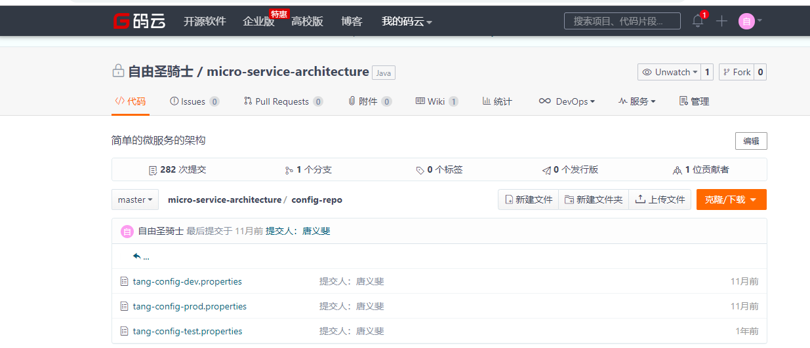  

下面我们开始配置server端   

## server 端
### 1、添加依赖 
 
```
 <dependency>
            <groupId>org.springframework.cloud</groupId>
            <artifactId>spring-cloud-config-server</artifactId>
 </dependency>
```
只需要加入spring-cloud-config-server包引用既可。  

### 2、配置文件 

``` 
spring:
  cloud:
    config:
      server:
        git:
          uri: https://gitee.com/tangyifei/micro-service-architecture.git    # 配置git仓库的地址
          search-paths: config-repo                             # git仓库地址下的相对地址，可以配置多个，用,分割。
          username:                                             # git仓库的账号
          password:                                             # git仓库的密码
```
Spring Cloud Config也提供本地存储配置的方式。我们只需要设置属性spring.profiles.active=native，Config Server会默认从应用的src/main/resource目录下检索配置文件。
也可以通过spring.cloud.config.server.native.searchLocations=file:E:/properties/属性来指定配置文件的位置。虽然Spring Cloud Config提供了这样的功能，
但是为了支持更好的管理内容和版本控制的功能，还是推荐使用git的方式。  

### 3、启动类  
启动类添加@EnableConfigServer，激活对配置中心的支持
  
```
package com.fukun.config;

import org.springframework.boot.SpringApplication;
import org.springframework.boot.autoconfigure.SpringBootApplication;
import org.springframework.cloud.client.discovery.EnableDiscoveryClient;
import org.springframework.cloud.config.server.EnableConfigServer;

/**
 * 分布式配置中心服务端
 *
 * @author tangyifei
 * @since 2019年6月25日17:07:24
 */
@SpringBootApplication
@EnableDiscoveryClient
@EnableConfigServer
public class ConfigApplication {

    public static void main(String[] args) {
        SpringApplication.run(ConfigApplication.class, args);
    }

}
```
到此server端相关配置已经完成  

### 4、测试  
首先我们先要测试server端是否可以读取到github上面的配置信息，直接访问：http://localhost:8889/tang-config/dev   
返回信息如下：  
```  
{
	"name": "tang-config",
	"profiles": ["dev"],
	"label": null,
	"version": "92e1c5d89bdc1e321475bb8193cf156342d78b19",
	"state": null,
	"propertySources": [{
		"name": "https://gitee.com/tangyifei/micro-service-architecture.git/config-repo/tang-config-dev.properties",
		"source": {
			"neo.hello": "hello tangyifei06",
			"spring.datasource.type": "com.alibaba.druid.pool.DruidDataSource",
			"spring.datasource.url": "jdbc:mysql://182.254.241.24:3306/micro-service-architecture?useUnicode=true&characterEncoding=utf-8&allowMultiQueries=true",
			"spring.datasource.username": "root",
			"spring.datasource.password": "##!zggc5055",
			"spring.datasource.driverClassName": "com.mysql.jdbc.Driver",
			"spring.datasource.initialSize": "5  ",
			"spring.datasource.minIdle": "5  ",
			"spring.datasource.maxActive": "20  ",
			"spring.datasource.maxWait": "60000  ",
			"spring.datasource.timeBetweenEvictionRunsMillis": "60000  ",
			"spring.datasource.minEvictableIdleTimeMillis": "300000  ",
			"spring.datasource.validationQuery": "SELECT 1 FROM DUAL ",
			"spring.datasource.testWhileIdle": "true ",
			"spring.datasource.testOnBorrow": "false ",
			"spring.datasource.testOnReturn": "false ",
			"spring.datasource.poolPreparedStatements": "true ",
			"spring.datasource.maxPoolPreparedStatementPerConnectionSize": "20",
			"spring.datasource.filters": "stat,wall,log4j2",
			"spring.datasource.connectionProperties": "druid.stat.mergeSql=true;druid.stat.slowSqlMillis=5000 ",
			"authority.datasource.druid.first.url": "jdbc:mysql://182.254.241.24:3306/micro-service-architecture?useUnicode=true&characterEncoding=utf-8&allowMultiQueries=true",
			"authority.datasource.druid.first.username": "root",
			"authority.datasource.druid.first.password": "##!zggc5055",
			"authority.datasource.druid.second.url": "jdbc:mysql://localhost:3306/micro-service-architecture?useUnicode=true&characterEncoding=utf-8&allowMultiQueries=true",
			"authority.datasource.druid.second.username": "root",
			"authority.datasource.druid.second.password": "root",
			"authority.datasource.druid.initialSize": "10",
			"authority.datasource.druid.maxActive": "10",
			"authority.datasource.druid.minIdle": "10",
			"authority.datasource.druid.maxWait": "10",
			"authority.datasource.druid.poolPreparedStatements": "true",
			"authority.datasource.druid.maxPoolPreparedStatementPerConnectionSize": "20",
			"authority.datasource.druid.timeBetweenEvictionRunsMillis": "60000",
			"authority.datasource.druid.minEvictableIdleTimeMillis": "300000",
			"authority.datasource.druid.testWhileIdle": "true",
			"authority.datasource.druid.testOnBorrow": "false",
			"authority.datasource.druid.testOnReturn": "false",
			"authority.datasource.druid.statViewServlet.enabled": "true",
			"authority.datasource.druid.statViewServlet.url-pattern": "/druid/*",
			"authority.datasource.druid.filter.stat.log-slow-sql": "1000",
			"authority.datasource.druid.filter.stat.slowSqlMillis": "1000",
			"authority.datasource.druid.filter.stat.mergeSql": "false",
			"authority.datasource.druid.filter.wall.config.multi-statement-allow": "true",
			"mongodb.host": "115.159.201.120",
			"mongodb.port": "27017",
			"mongodb.db": "admin",
			"mongodb.username": "root",
			"mongodb.password": "##!zggc5055",
			"redis.hostName": "115.159.201.120",
			"redis.port": "6379",
			"redis.password": "##!zggc5055",
			"redis.timeout": "10000",
			"redis.maxIdle": "300",
			"redis.maxActive": "600",
			"redis.maxTotal": "1000",
			"redis.maxWaitMillis": "1000",
			"redis.minEvictableIdleTimeMillis": "300000",
			"redis.numTestsPerEvictionRun": "1024",
			"redis.timeBetweenEvictionRunsMillis": "30000",
			"redis.testOnBorrow": "true",
			"redis.testWhileIdle": "true"
		}
	}]
}
```
上述的返回的信息包含了配置文件的位置、版本、配置文件的名称以及配置文件中的具体内容，说明server端已经成功获取了git仓库的配置信息。  
如果直接查看配置文件中的配置信息可访问：http://localhost:8889/tang-config-dev.properties。  
修改配置文件tang-config-dev.properties中配置信息为：neo.hello=hello tangyifei08,再次在浏览器访问http://localhost:8889/tang-config-dev.properties，
如果neo.hello的value返回为最新的值hello tangyifei08。说明server端会自动读取最新提交的内容。如下：  

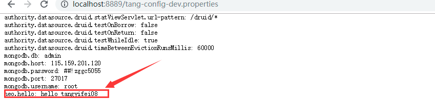  

仓库中的配置文件会被转换成web接口，访问可以参照以下的规则： 
 
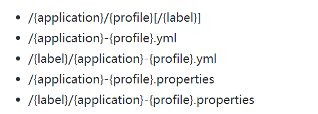 

以tang-config-dev.properties为例子，它的application是tang-config，profile是dev。client会根据填写的参数来选择读取对应的配置。  

## client 端

主要展示如何在业务项目中去获取server端的配置信息。  

### 添加依赖   
在fukun-core-consul-producer1项目中添加如下依赖。  
```
 <dependency>
            <groupId>org.springframework.cloud</groupId>
            <artifactId>spring-cloud-starter-config</artifactId>
 </dependency>
 
```  
### 配置文件
添加一个配置文件，bootstrap.properties，添加如下内容： 
```
# 下面这些与spring-cloud相关的属性必须配置在bootstrap.properties中，
# config部分内容才能被正确加载。因为config的相关配置会先于application.properties，
# 而bootstrap.properties的加载也是先于application.properties。
spring.cloud.config.name=tang-config
# 对应{profile}部分
spring.cloud.config.profile=dev
# 配置中心的具体地址
spring.cloud.config.uri=http://localhost:8889/
# 对应git的分支。如果配置中心使用的是本地存储，则该参数无用
spring.cloud.config.label=master
# 指定配置中心的service-id，便于扩展为高可用配置集群。
spring.cloud.config.discovery.service-id=fukun-core-config-server 
```
### 测试
使用@Value注解来获取server端参数的值  

```
@RestController
class HelloController {

    @Value("${neo.hello}")
    
    private String hello;
   
    @RequestMapping("/config")
    public String getConfigDetail() {
        return this.hello;
    }
}
```
启动项目后访问： http://localhost:8501/config，返回：hello tangyifei08，
说明已经正确的从server端获取到了参数。到此一个完整的服务端提供配置服务，
客户端获取配置参数的例子就完成了。  

## 主动感知配置中心服务端的配置信息内容的变化
我们在进行一些小实验，手动修改tang-config-dev.properties中配置信息为：neo.hello=hello tangyifei09提交到github,
再次在浏览器访问http://localhost:8501/config，返回：hello tangyifei08，说明获取的信息还是旧的参数，
这是为什么呢？因为springboot项目只有在启动的时候才会获取配置文件的值，修改github信息后，client端并没有再次去获取，
所以导致这个问题。如何去解决这个问题呢？  
Spring Cloud Config分服务端和客户端，服务端负责将git（svn）中存储的配置文件发布成REST接口，客户端可以从服务端REST接口获取配置。
但客户端并不能主动感知到配置的变化，从而主动去获取新的配置。客户端如何去主动获取新的配置信息呢，
SpringCloud已经给我们提供了解决方案，每个客户端通过POST方法触发各自的/refresh。  
修改fukun-core-consul-producer1项目已到达可以refresh的功能。   

### 添加依赖
```
<dependency>
  <groupId>org.springframework.boot</groupId>
  <artifactId>spring-boot-starter-actuator</artifactId>
</dependency>
```
增加了spring-boot-starter-actuator包，spring-boot-starter-actuator是一套监控的功能，可以监控程序在运行时状态，其中就包括/refresh的功能。  

###  开启更新机制
需要给加载变量的类上面加载@RefreshScope，在客户端执行/refresh的时候就会更新此类下面的变量值。
因为@RefreshScope这个注解会在接到SpringCloud配置中心配置刷新的时候，自动将新的配置更新到该类对应的字段中。  
```
@RestController
@RefreshScope // 使用该注解的类，会在接到SpringCloud配置中心配置刷新的时候，自动将新的配置更新到该类对应的字段中。
class HelloController {

    @Value("${neo.hello}")
    private String hello;

    @RequestMapping("/hello")
    public String from() {
        return this.hello;
    }
}
```
### 测试
springboot 2.X 以上默认禁用了所有端点的配置，所以需要在配置文件application.properties添加以下配置    
```
management.endpoints.web.exposure.include=*

```
如果是springboot 1.5.X 以上，默认开通了安全认证，所以需要在配置文件application.properties添加以下配置  

```
management.security.enabled=false
```
OK 这样就改造完了，以post请求的方式来访问http://localhost:8501/actuator/refresh 就会更新修改后的配置文件。  
比如先启动fukun-core-consul-producer1这个项目，然后进入git版本仓库更新neo.hello的值为hello tangyifei09，然后执行
curl -X POST http://localhost:8501/actuator/refresh，当返回
```
["config.client.version","neo.hello"]

```
说明已经更新了neo.hello的值。我们再次访问http://localhost:8501/config，返回：hello tangyifei09，客户端已经得到了最新的值。  
每次手动刷新客户端也很麻烦，有没有什么办法只要提交代码就自动调用客户端来更新呢，github的webhook是一个好的办法。  

### WebHook
WebHook是当某个事件发生时，通过发送http post请求的方式来通知信息接收方。Webhook来监测你在Github.com上的各种事件，最常见的莫过于push事件。  
如果你设置了一个监测push事件的WebHook，那么每当你的这个项目有了任何提交，这个Webhook都会被触发，这时Github就会发送一个HTTP POST请求到你配置好的地址。  
如此一来，你就可以通过这种方式去自动完成一些重复性工作，比如，你可以用Webhook来自动触发一些持续集成（CI）工具的运作，比如Travis CI；
又或者是通过 Webhook 去部署你的线上服务器。下图就是github上面的webhook配置。  

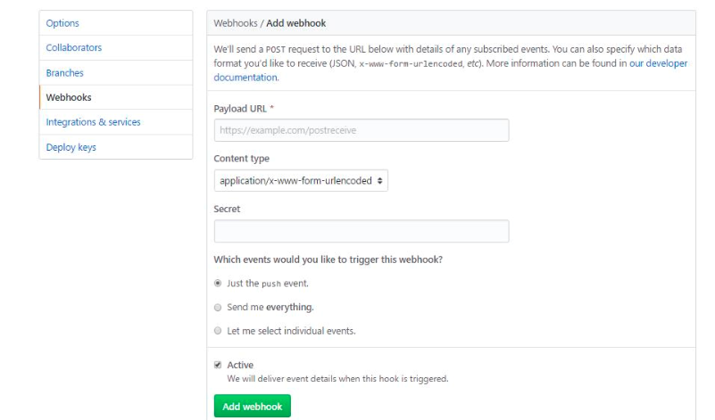   

Payload URL ：触发后回调的URL  
Content type ：数据格式，两种一般使用json  
Secret ：用作给POST的body加密的字符串。采用HMAC算法  
events ：触发的事件列表。 
 
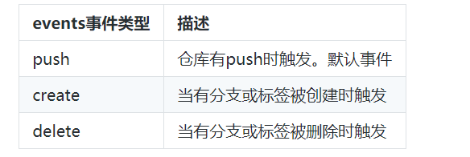 

svn也有类似的hook机制，每次提交后会触发post-commit脚本，我们可以在这里写一些post请求  

这样我们就可以利用hook的机制去触发客户端的更新，但是当客户端越来越多的时候hook支持的已经不够优雅，另外每次增加客户端都需要改动hook也是不现实的。其实Spring Cloud给了我们更好解决方案，下面
我们来介绍。  

## Spring Cloud Config服务端配置高可用
客户端都是直接调用配置中心的server端来获取配置文件信息。这样就存在了一个问题，客户端和服务端的耦合性太高，
如果server端要做集群，客户端只能通过原始的方式来路由，server端改变IP地址的时候，
客户端也需要修改配置，不符合springcloud服务治理的理念。springcloud提供了这样的解决方案，
我们只需要将server端当做一个服务注册到eureka中，client端去eureka中去获取配置中心server端的服务既可。  

### 添加依赖
引入服务中心的相关的依赖包，添加对consul的支持。  
```
 <dependency>
            <groupId>org.springframework.cloud</groupId>
            <artifactId>spring-cloud-starter-consul-discovery</artifactId>
 </dependency>
```
### 配置文件 
配置文件的修改只是增加consul的相关的配置项，这里就不展示了，详情请查看application.properties属性文件内容。  

### 启动类 
启动类添加consul服务中心的相关注解@EnableDiscoveryClient即可。  

### 修改客户端
客户端fukun-core-consul-producer1也需要consul的服务中心。修改bootstrap.properties属性文件，注释掉spring.cloud.config.uri=http://localhost:8889/，如下：  
```
# 下面这些与spring-cloud相关的属性必须配置在bootstrap.properties中，
# config部分内容才能被正确加载。因为config的相关配置会先于application.properties，
# 而bootstrap.properties的加载也是先于application.properties。
spring.cloud.config.name=tang-config
# 对应{profile}部分
spring.cloud.config.profile=dev
# 配置中心的具体地址
#spring.cloud.config.uri=http://localhost:8889/
# 对应git的分支。如果配置中心使用的是本地存储，则该参数无用
spring.cloud.config.label=master
#开启Config服务发现支持
spring.cloud.config.discovery.enabled=true
# 指定配置中心的service-id，也就是server端spring.application.name的值，便于扩展为高可用配置集群。
spring.cloud.config.discovery.service-id=fukun-core-config-server

```
上面去掉了spring.cloud.config.uri直接指向server端地址的配置，增加了最后的两个配置：  
spring.cloud.config.discovery.enabled ：开启Config服务发现支持  
spring.cloud.config.discovery.serviceId ：指定server端的name,也就是server端spring.application.name的值  
注意：这两个配置都需要放到bootstrap.properties的配置中   

分别启动Spring Cloud Config 服务端fukun-core-config-server和Spring Cloud Config 客户端fukun-core-consul-producer1，打开consul
的监控平台，发现都注册成功，如下：  

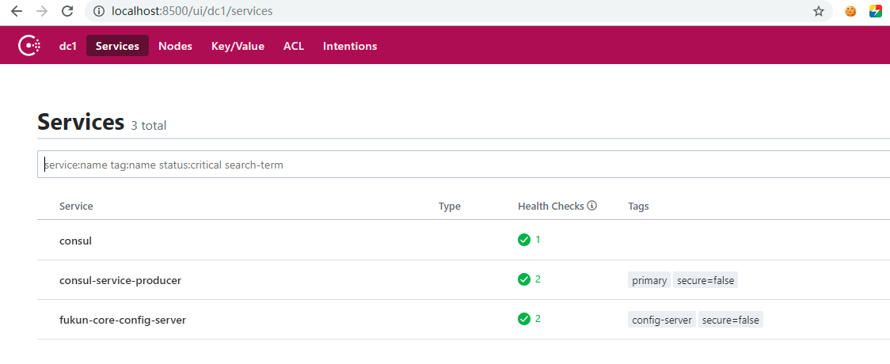 

然后访问http://localhost:8501/config，返回hello tangyifei09的相关内容。

### 测试高可用
增加一个fukun-core-config-server，修改端口8887，名称为fukun-core-config-server01，其他的配置
都跟fukun-core-config-server一样，然后启动它，访问consul的监控平台，如下：  

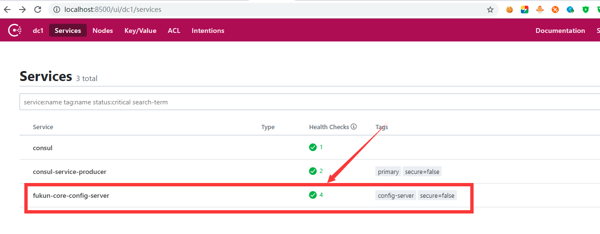 

如上图就可发现会有两个server端同时提供配置中心的服务，防止某一台down掉之后影响整个系统的使用。  
我们先单独测试服务端，分别访问：http://localhost:8889/tang-config/dev、http://localhost:8887/tang-config/dev返回信息：  
```
{
	"name": "tang-config",
	"profiles": ["dev"],
	"label": null,
	"version": "e1cb661b2432ef058b42ede3a5a349ffc0a8786e",
	"state": null,
	"propertySources": [{
		"name": "https://gitee.com/tangyifei/micro-service-architecture.git/config-repo/tang-config-dev.properties",
		"source": {
			"neo.hello": "hello tangyifei09",
			"spring.datasource.type": "com.alibaba.druid.pool.DruidDataSource",
			"spring.datasource.url": "jdbc:mysql://182.254.241.24:3306/micro-service-architecture?useUnicode=true&characterEncoding=utf-8&allowMultiQueries=true",
			"spring.datasource.username": "root",
			"spring.datasource.password": "##!zggc5055",
			"spring.datasource.driverClassName": "com.mysql.jdbc.Driver",
			"spring.datasource.initialSize": "5  ",
			"spring.datasource.minIdle": "5  ",
			"spring.datasource.maxActive": "20  ",
			"spring.datasource.maxWait": "60000  ",
			"spring.datasource.timeBetweenEvictionRunsMillis": "60000  ",
			"spring.datasource.minEvictableIdleTimeMillis": "300000  ",
			"spring.datasource.validationQuery": "SELECT 1 FROM DUAL ",
			"spring.datasource.testWhileIdle": "true ",
			"spring.datasource.testOnBorrow": "false ",
			"spring.datasource.testOnReturn": "false ",
			"spring.datasource.poolPreparedStatements": "true ",
			"spring.datasource.maxPoolPreparedStatementPerConnectionSize": "20",
			"spring.datasource.filters": "stat,wall,log4j2",
			"spring.datasource.connectionProperties": "druid.stat.mergeSql=true;druid.stat.slowSqlMillis=5000 ",
			"authority.datasource.druid.first.url": "jdbc:mysql://182.254.241.24:3306/micro-service-architecture?useUnicode=true&characterEncoding=utf-8&allowMultiQueries=true",
			"authority.datasource.druid.first.username": "root",
			"authority.datasource.druid.first.password": "##!zggc5055",
			"authority.datasource.druid.second.url": "jdbc:mysql://localhost:3306/micro-service-architecture?useUnicode=true&characterEncoding=utf-8&allowMultiQueries=true",
			"authority.datasource.druid.second.username": "root",
			"authority.datasource.druid.second.password": "root",
			"authority.datasource.druid.initialSize": "10",
			"authority.datasource.druid.maxActive": "10",
			"authority.datasource.druid.minIdle": "10",
			"authority.datasource.druid.maxWait": "10",
			"authority.datasource.druid.poolPreparedStatements": "true",
			"authority.datasource.druid.maxPoolPreparedStatementPerConnectionSize": "20",
			"authority.datasource.druid.timeBetweenEvictionRunsMillis": "60000",
			"authority.datasource.druid.minEvictableIdleTimeMillis": "300000",
			"authority.datasource.druid.testWhileIdle": "true",
			"authority.datasource.druid.testOnBorrow": "false",
			"authority.datasource.druid.testOnReturn": "false",
			"authority.datasource.druid.statViewServlet.enabled": "true",
			"authority.datasource.druid.statViewServlet.url-pattern": "/druid/*",
			"authority.datasource.druid.filter.stat.log-slow-sql": "1000",
			"authority.datasource.druid.filter.stat.slowSqlMillis": "1000",
			"authority.datasource.druid.filter.stat.mergeSql": "false",
			"authority.datasource.druid.filter.wall.config.multi-statement-allow": "true",
			"mongodb.host": "115.159.201.120",
			"mongodb.port": "27017",
			"mongodb.db": "admin",
			"mongodb.username": "root",
			"mongodb.password": "##!zggc5055",
			"redis.hostName": "115.159.201.120",
			"redis.port": "6379",
			"redis.password": "##!zggc5055",
			"redis.timeout": "10000",
			"redis.maxIdle": "300",
			"redis.maxActive": "600",
			"redis.maxTotal": "1000",
			"redis.maxWaitMillis": "1000",
			"redis.minEvictableIdleTimeMillis": "300000",
			"redis.numTestsPerEvictionRun": "1024",
			"redis.timeBetweenEvictionRunsMillis": "30000",
			"redis.testOnBorrow": "true",
			"redis.testWhileIdle": "true"
		}
	}]
}
```
说明两个server端都正常读取到了配置信息。  

再次访问：http://localhost:8501/config，返回：hello tangyifei09。说明客户端已经读取到了server端的内容，
我们随机停掉一台server端的服务，再次访问http://localhost:8501/config，
返回：hello tangyifei09，说明达到了高可用的目的。 

## Spring Cloud Bus 的使用
如果需要客户端获取到最新的配置信息需要执行refresh，我们可以利用webhook的机制每次提交代码发送请求来刷新客户端，
当客户端越来越多的时候，需要每个客户端都执行一遍，这种方案就不太适合了。使用Spring Cloud Bus可以完美解决这一问题。  

Spring Cloud Bus 通过轻量消息代理连接各个分布的节点。这会用在广播状态的变化（例如配置变化）或者其他的消息指令。  
Spring Bus 的一个核心思想是通过分布式的启动器对spring boot应用进行扩展，也可以用来建立一个多个应用之间的通信频道。
目前唯一实现的方式是用AMQP消息代理作为通道，同样特性的设置（有些取决于通道的设置）在更多通道的文档中。  
Spring Cloud Bus 被国内很多都翻译为消息总线，也挺形象的。大家可以将它理解为管理和传播所有分布式项目中的消息既可，
`其实本质是利用了MQ的广播机制在分布式的系统中传播消息，`利用 Bus 的机制可以做很多的事情，其中配置中心客户端刷新配置
就是典型的应用场景之一，我们用一张图来描述bus在配置中心使用的机制。  

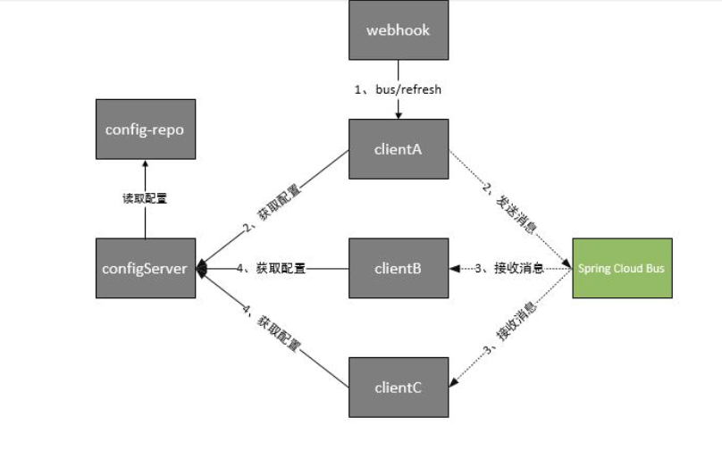   

根据此图我们可以看出利用Spring Cloud Bus做配置更新的步骤:  

1、提交代码触发post给客户端A发送bus/refresh  
2、客户端A接收到请求从Server端更新配置并且发送给Spring Cloud Bus  
3、Spring Cloud bus接到消息并通知给其它客户端  
4、其它客户端接收到通知，请求Server端获取最新配置  
5、全部客户端均获取到最新的配置  

MQ我们使用RabbitMQ来做示例。  

### 添加依赖

客户端项目fukun-core-consul-producer1增加如下的依赖  

```
<dependency>
    <groupId>org.springframework.cloud</groupId>
    <artifactId>spring-cloud-starter-bus-amqp</artifactId>
</dependency>
```
需要多引入spring-cloud-starter-bus-amqp包，增加对消息总线的支持  

### 配置文件
配置文件需要增加RabbitMq的相关配置，这样客户端代码就改造完成了。  
注意下面的配置加入到bootstrap.properties。  

```
#启用所有的监控端点，默认情况下，这些端点是禁用的，上面的值暴露health端点
management.endpoints.web.exposure.include=*
## 开启消息跟踪
spring.cloud.bus.trace.enabled=true
# 增加rabbitmq的配置
spring.rabbitmq.host=115.159.201.120
spring.rabbitmq.port=5672
spring.rabbitmq.username=guest
spring.rabbitmq.password=guest
```
### 测试
依次启动fukun-core-config-server、fukun-core-consul-producer1项目，
在启动fukun-core-consul-producer1项目的时候我们会发现启动日志会输出这样的一条记录。  

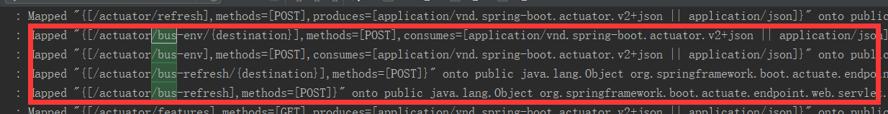   

说明客户端已经具备了消息总线通知的能力了，为了更好的模拟消息总线的效果，再次启动一个客户端
fukun-core-consul-producer2，相关的配置信息跟fukun-core-consul-producer2是一样的。查看consul
的监控中心如下：  

 

说明fukun-core-consul-producer1和fukun-core-consul-producer2已经启动成功。  
首先测试一下fukun-core-consul-producer1和fukun-core-consul-producer2是否能正常读取到配种中心的
服务端的配置信息。分别访问http://localhost:8501/config 和 http://localhost:8503/config，如果返回
hello tangyifei09说明配置中心server端、fukun-core-consul-producer1和fukun-core-consul-producer2都正常读取到了配置信息。  
现在我们更新tang-config-dev.properties 中neo.hello的值为tangyifei07并提交到代码库中，
访问：http://localhost:8501/config 依然返回hello tangyifei09，
我们对端口为8501的客户端发送一个curl -X POST http://localhost:8501/actuator/bus-refresh的post请求。
在win下使用下面命令来模拟webhook。注意spring-boot1.X版本使用curl -X POST http://localhost:8501/bus/refresh，
如下：  

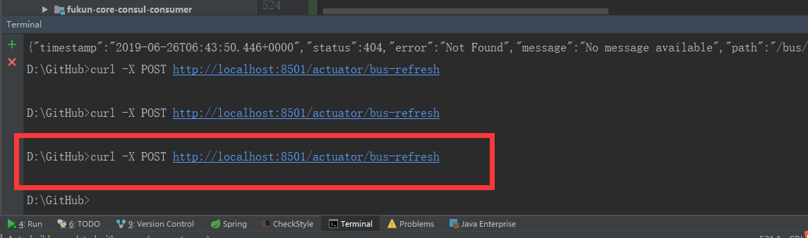 

执行完成后，依次访问：http://localhost:8501/config、http://localhost:8503/config，
返回：hello tangyifei07。说明两个客户端均已经拿到了最新配置文件的信息。

### 改进
在上面的流程中，我们已经达到了利用消息总线触发一个客户端/actuator/bus-refresh,
进而刷新所有客户端的配置的目的。但这种方式并不优雅。原因如下：  
1、打破了微服务的职责单一性。微服务本身是业务模块，它本不应该承担配置刷新的职责。  
2、破坏了微服务各节点的对等性。 
3、有一定的局限性。例如，微服务在迁移时，它的网络地址常常会发生变化，此时如果想要做到自动刷新，那就不得不修改WebHook的配置。  

因此我们将上面的架构模式稍微改变一下  
 
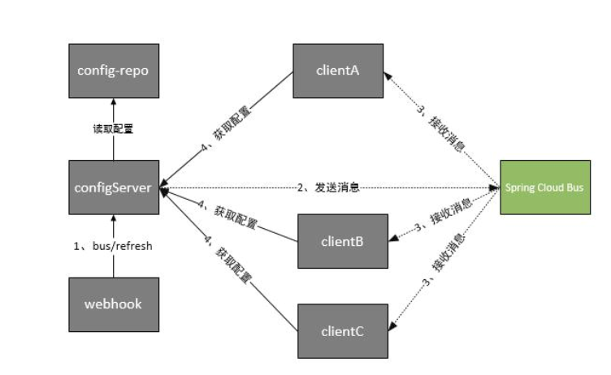   

这时Spring Cloud Bus做配置更新步骤如下:  
1、提交代码触发post请求给/actuator/bus-refresh    
2、配置中心server端接收到请求并发送给Spring Cloud Bus    
3、Spring Cloud bus接到消息并通知给其它客户端    
4、其它客户端接收到通知，请求配置中心Server端获取最新配置    
5、全部客户端均获取到最新的配置    

这样的话我们在配置中心server端的fukun-core-config-server代码做一些改动，
来支持/actuator/bus-refresh  
#### 添加依赖
```
 <dependency>
            <groupId>org.springframework.cloud</groupId>
            <artifactId>spring-cloud-starter-bus-amqp</artifactId>
  </dependency>
```
需要多引入spring-cloud-starter-bus-amqp包，增加对消息总线的支持    

#### 修改配置
配置文件增加RebbitMq的相关配置，关闭安全验证。这样server端代码就改造完成了。 

``` 
spring:
  application:
     name: fukun-core-config-server
  cloud:
     consul:
        host: localhost
        port: 8500
        discovery:
          enabled: true
          register: true
          tags: config-server
          serviceName: ${spring.application.name}
          hostname: ${spring.application.name}
          port: ${server.port}
          instanceId: ${spring.application.name}:${server.port}
          preferIpAddress: true
          healthCheckInterval: 10s
          healthCheckUrl: http://${spring.cloud.client.ip-address}:${server.port}/health
          heartbeat:
             enabled: true
     config:
        server:
          git:
             # 配置git仓库的地址
            uri: https://gitee.com/tangyifei/micro-service-architecture.git
            # git仓库地址下的相对地址，可以配置多个，用,分割。
            search-paths: config-repo
            # git仓库的账号
            username: 15062230055@163.com
            # git仓库的密码
            password: 726267tyf
  rabbitmq:
      host: 115.159.201.120
      port: 5672
      username: guest
      password: guest

server:
 port: 8889

management:
   endpoints:
      web:
        exposure:
             include: '*'

```
依次启动fukun-core-config-server、fukun-core-consul-producer1、fukun-core-consul-producer2服务，
需要检测一下这三个项目能不能读到配置中心中的配置信息。
同样修改tang-config-dev.properties 中neo.hello的值为hello tangyifei03并提交到代码库中。
在win下使用下面命令来模拟 WebHook 触发配置中心server端/actuator/bus-refresh 。  

curl -X POST http://localhost:8889/actuator/bus-refresh  

执行完成后，依次访问：http://localhost:8501/config、http://localhost:8503/config，返回：hello tangyifei03。
说明三个客户端均已经拿到了最新配置文件的信息。      

### 局部刷新
某些场景下（例如灰度发布），我们可能只想刷新部分微服务的配置，此时可通过/bus/refresh端点的destination参数来定位要刷新的应用程序。  
例如：/actuator/bus-refresh?destination=consul-service-producer:8501，这样消息总线上的微服务实例就会根据destination参数的值来判断是否需要要刷新。
其中，consul-service-producer:8501指的是各个微服务的实例 ID。
destination参数也可以用来定位特定的微服务。例如：/actuator/bus-refresh?destination=consul-service-producer:**，
这样就可以触发customers微服务所有实例的配置刷新。    

### 跟踪总线事件
一些场景下，我们可能希望知道Spring Cloud Bus事件传播的细节。此时，我们可以跟踪总线事件（RemoteApplicationEvent的子类都是总线事件）。  
跟踪总线事件非常简单，只需设置spring.cloud.bus.trace.enabled=true，这样在/actuator/bus-refresh端点被请求后，访问/actuator/httptrace 端点就可获得类似如下的结果：  
```
{
	"traces": [{
				"timestamp": "2019-06-26T08:21:29.987Z",
				"principal": null,
				"session": null,
				"request": {
					"method": "GET",
					"uri": "http://localhost:8503/act
					uator / bus - trace ","
					headers ":{"
					host ":["
					localhost: 8503 "],"
					accept ":[" *
					/*"],"user-agent":["curl/7.55.1"]},"remoteAddress":null},"response":{"statu
					s":404,"headers":{}},"timeTaken":2},{"timestamp":"2019-06-26T08:15:44.090Z","principal":null,"session":null,"request":{"method":"GET","uri":"
					http://localhost:8503/actuator/trace","headers":{"host":["localhost:8503"],"accept":["*/
					* "],"
					user - agent ":["
					curl / 7.55 .1 "]},"
					remoteAddress ":nul
					l
				},
				"response": {
					"status": 404,
					"headers": {}
				},
				"timeTaken": 2
			}, {
				"timestamp": "2019-06-26T08:14:38.648Z",
				"principal": null,
				"session": null,
				"request": {
					"
					method ":"
					GET ","
					uri ":"
					http: //localhost:8503/trace","headers":{"host":["localhost:8503"],"accept":["*/*"],"user-agent":["curl/7.55.1"]},"remote
						Address ":null},"
					response ":{"
					status ":404,"
					headers ":{}},"
					timeTaken ":5},{"
					timestamp ":"
					2019 - 06 - 26 T08: 14: 36.186 Z ","
					principal ":null,"
					session ":null,
					"request": {
						"method": "GET",
						"uri": "http://localhost:8503/trace",
						"headers": {
							"accept-language": ["zh-CN"],
							"host": ["localhost:8503"],
							"connection": [
								"Keep-Alive"
							],
							"accept-encoding": ["gzip, deflate"],
							"user-agent": ["Mozilla/5.0 (Windows NT 10.0; WOW64; Trident/7.0; rv:11.0) like Gecko"],
							"acc
							ept ":["
							text / html,
							application / xhtml + xml,
							image / jxr,
							*
							/*"]},"remoteAddress":null},"response":{"status":404,"headers":{}},"timeTaken":5},{"time
							stamp":"2019-06-26T08:14:35.822Z","principal":null,"session":null,"request":{"method":"GET","uri":"http://localhost:8503/trace","headers":{"a
							ccept-language":["zh-CN"],"host":["localhost:8503"],"connection":["Keep-Alive"],"accept-encoding":["gzip, deflate"],"user-agent":["Mozilla/5.
							0 (Windows NT 10.0; WOW64; Trident/7.0; rv:11.0) like Gecko"],"accept":["text/html, application/xhtml+xml, image/jxr, */
							* "]},"
							remoteAddress ":
							null
						},
						"response": {
							"status": 404,
							"headers": {}
						},
						"timeTaken": 4
					},
					{
						"timestamp": "2019-06-26T07:59:47.752Z",
						"principal": null,
						"session": null,
						"request": {
							"method": "GET",
							"uri": "http://localhost:8503/trace",
							"headers": {
								"host": ["localhost:8503"],
								"accept": ["*/*"],
								"user-agent": ["curl/7.55.1"]
							},
							"rem
							oteAddress ":null},"
							response ":{"
							status ":404,"
							headers ":{}},"
							timeTaken ":3},{"
							timestamp ":"
							2019 - 06 - 26 T07: 59: 39.805 Z ","
							principal ":null,"
							session ":nu
							ll,
							"request": {
								"method": "GET",
								"uri": "http://localhost:8503/actuator/trace",
								"headers": {
									"host": ["localhost:8503"],
									"accept": ["*/*"],
									"user-agent": ["curl/7.55.1"]
								},
								"remoteAddress": null
							},
							"response": {
								"status": 404,
								"headers": {}
							},
							"timeTaken": 2
						},
						{
							"timestamp": "2019-06-26T07:50:53.889Z",
							"princip
							al ":null,"
							session ":null,"
							request ":{"
							method ":"
							GET ","
							uri ":"
							http: //localhost:8503/favicon.ico","headers":{"referer":["http://localhost:8503/conf
								ig "],"
							cookie ":["
							UM_distinctid = 16 b69d37206423 - 060395 fcec2fee - 6353160 - 100200 - 16 b69d372072fb;CNZZDATA1260945749 = 1286020430 - 1560845070 - % 7 C156084
							5070 "],"
							accept - language ":["
							zh - CN,
							zh;q = 0.9 "],"
							host ":["
							localhost: 8503 "],"
							connection ":["
							keep - alive "],"
							cache - control ":["
							no - cache "],"
							accept - encodi
							ng ":["
							gzip,
							deflate,
							br "],"
							pragma ":["
							no - cache "],"
							accept ":["
							image / webp,
							image / apng,
							image /*,*/ * ;q = 0.8 "],"
							user - agent ":["
							Mozilla / 5.0(Windows NT 1 0.0; Win64; x64) AppleWebKit / 537.36(KHTML, like Gecko) Chrome / 74.0 .3729 .131 Safari / 537.36 "]},"
							remoteAddress ":null},"
							response ":{"
							status ":200,
							"headers": {
								"Accept-Ranges": ["bytes"],
								"Last-Modified": ["Tue, 28 May 2019 09:45:27 GMT"],
								"Content-Length": ["946"],
								"Date": ["Wed, 26 Jun 2019 07:
									50: 53 GMT "],"
									Content - Type ":["
									image / x - icon "]}},"
									timeTaken ":2},{"
									timestamp ":"
									2019 - 06 - 26 T07: 50: 53.818 Z ","
									principal ":null,"
									session ":null,"
									request ":{"
									method ":"
									GET ","
									uri ":"
									http: //localhost:8503/config","headers":{"cookie":["UM_distinctid=16b69d37206423-060395fcec2fee-6353160-100200-16b69
									d372072fb;CNZZDATA1260945749 = 1286020430 - 1560845070 - % 7 C1560845070 "],"
									accept - language ":["
									zh - CN, zh;q = 0.9 "],"
									upgrade - insecure - requests ":["
									1 "],"
									h
									ost ":["
									localhost: 8503 "],"
									connection ":["
									keep - alive "],"
									cache - control ":["
									max - age = 0 "],"
									accept - encoding ":["
									gzip, deflate, br "],"
									accept ":["
									text / htm
									l, application / xhtml + xml, application / xml;q = 0.9, image / webp, image / apng, *
									/*;q=0.8,application/signed-exchange;v=b3"],"user-agent":["Mozilla/5.0 (
									Windows NT 10.0; Win64; x64) AppleWebKit/537.36 (KHTML, like Gecko) Chrome/74.0.3729.131 Safari/537.36"]},"remoteAddress":null},"response":{"
									status":200,"headers":{"Content-Length":["17"],"Date":["Wed, 26 Jun 2019 07:50:53 GMT"],"Content-Type":["text/html;charset=UTF-8"]}},"timeTak
									en":6},{"timestamp":"2019-06-26T07:50:53.736Z","principal":null,"session":null,"request":{"method":"GET","uri":"http://localhost:8503/favicon
									.ico","headers":{"referer":["http://localhost:8503/config"],"cookie":["UM_distinctid=16b69d37206423-060395fcec2fee-6353160-100200-16b69d37207
									2fb; CNZZDATA1260945749=1286020430-1560845070-%7C1560845070"],"accept-language":["zh-CN,zh;q=0.9"],"host":["localhost:8503"],"connection":["k
									eep-alive"],"cache-control":["no-cache"],"accept-encoding":["gzip, deflate, br"],"pragma":["no-cache"],"accept":["image/webp,image/apng,image
									/*,*/
									* ;q = 0.8 "],"
									user - agent ":["
									Mozilla / 5.0(Windows NT 10.0; Win64; x64) AppleWebKit / 537.36(KHTML, like Gecko) Chrome / 74.0 .3729 .131 Safari / 53
									7.36 "]},"
									remoteAddress ":null},"
									response ":{"
									status ":200,"
									headers ":{"
									Accept - Ranges ":["
									bytes "],"
									Last - Modified ":["
									Tue, 28 May 2019 09: 45: 27 GMT "], "Content-Length": ["946"], "Date": ["Wed, 26 Jun 2019 07:50:53 GMT"], "Content-Type": ["image/x-icon"]
								}
							},
							"timeTaken": 6
						},
						{
							"timestamp": "2019-06-26T
							07: 50: 53.656 Z ","
							principal ":null,"
							session ":null,"
							request ":{"
							method ":"
							GET ","
							uri ":"
							http: //localhost:8503/config","headers":{"cookie":["UM_distin
								ctid = 16 b69d37206423 - 060395 fcec2fee - 6353160 - 100200 - 16 b69d372072fb;CNZZDATA1260945749 = 1286020430 - 1560845070 - % 7 C1560845070 "],"
							accept - language ": ["zh-CN,zh;q=0.9"],
							"upgrade-insecure-requests": ["1"],
							"host": ["localhost:8503"],
							"connection": ["keep-alive"],
							"cache-control": ["max-age=0"],
							"acc
							ept - encoding ":["
							gzip,
							deflate,
							br "],"
							accept ":["
							text / html,
							application / xhtml + xml,
							application / xml;q = 0.9,
							image / webp,
							image / apng,
							*
							/*;q=0.8,applicat
							ion/signed-exchange;v=b3"],"user-agent":["Mozilla/5.0 (Windows NT 10.0; Win64; x64) AppleWebKit/537.36 (KHTML, like Gecko) Chrome/74.0.3729.1
							31 Safari/537.36"]},"remoteAddress":null},"response":{"status":200,"headers":{"Content-Length":["17"],"Date":["Wed, 26 Jun 2019 07:50:53 GMT"
							],"Content-Type":["text/html;charset=UTF-8"]}},"timeTaken":3},{"timestamp":"2019-06-26T07:50:50.747Z","principal":null,"session":null,"reques
							t":{"method":"GET","uri":"http://localhost:8503/favicon.ico","headers":{"referer":["http://localhost:8503/config"],"cookie":["UM_distinctid=1
							6b69d37206423-060395fcec2fee-6353160-100200-16b69d372072fb; CNZZDATA1260945749=1286020430-1560845070-%7C1560845070"],"accept-language":["zh-C
							N,zh;q=0.9"],"host":["localhost:8503"],"connection":["keep-alive"],"cache-control":["no-cache"],"accept-encoding":["gzip, deflate, br"],"prag
							ma":["no-cache"],"accept":["image/webp,image/apng,image/*,*/
							* ;q = 0.8 "],"
							user - agent ":["
							Mozilla / 5.0(Windows NT 10.0; Win64; x64) AppleWebKit / 53
							7.36(KHTML, like Gecko) Chrome / 74.0 .3729 .131 Safari / 537.36 "]},"
							remoteAddress ":null},"
							response ":{"
							status ":200,"
							headers ":{"
							Accept - Ranges ":["
							by
							tes "],"
							Last - Modified ":["
							Tue,
							28 May 2019 09: 45: 27 GMT "],"
							Content - Length ":["
							946 "],"
							Date ":["
							Wed,
							26 Jun 2019 07: 50: 50 GMT "],"
							Content - Type ":["
							im
							age / x - icon "]}},"
							timeTaken ":4},{"
							timestamp ":"
							2019 - 06 - 26 T07: 50: 50.642 Z ","
							principal ":null,"
							session ":null,"
							request ":{"
							method ":"
							GET ","
							uri ":"
							http: / /
								localhost: 8503 / config ","
							headers ":{"
							cookie ":["
							UM_distinctid = 16 b69d37206423 - 060395 fcec2fee - 6353160 - 100200 - 16 b69d372072fb;CNZZDATA1260945749 = 1
							286020430 - 1560845070 - % 7 C1560845070 "],"
							accept - language ":["
							zh - CN,
							zh;q = 0.9 "],"
							upgrade - insecure - requests ":["
							1 "],"
							host ":["
							localhost: 8503 "],"
							connec
							tion ":["
							keep - alive "],"
							cache - control ":["
							max - age = 0 "],"
							accept - encoding ":["
							gzip,
							deflate,
							br "],"
							accept ":["
							text / html,
							application / xhtml + xml,
							applica
							tion / xml;q = 0.9,
							image / webp,
							image / apng,
							*
							/*;q=0.8,application/signed-exchange;v=b3"],"user-agent":["Mozilla/5.0 (Windows NT 10.0; Win64; x64) Ap
							pleWebKit/537.36 (KHTML, like Gecko) Chrome/74.0.3729.131 Safari/537.36"]},"remoteAddress":null},"response":{"status":200,"headers":{"Content
							-Length":["17"],"Date":["Wed, 26 Jun 2019 07:50:50 GMT"],"Content-Type":["text/html;charset=UTF-8"]}},"timeTaken":3},{"timestamp":"2019-06-26
							T07:50:50.562Z","principal":null,"session":null,"request":{"method":"GET","uri":"http://localhost:8503/favicon.ico","headers":{"referer":["ht
							tp://localhost:8503/config"],"cookie":["UM_distinctid=16b69d37206423-060395fcec2fee-6353160-100200-16b69d372072fb; CNZZDATA1260945749=1286020
							430-1560845070-%7C1560845070"],"accept-language":["zh-CN,zh;q=0.9"],"host":["localhost:8503"],"connection":["keep-alive"],"cache-control":["n
							o-cache"],"accept-encoding":["gzip, deflate, br"],"pragma":["no-cache"],"accept":["image/webp,image/apng,image/*,*/
							* ;q = 0.8 "],"
							user - agent ":["
							M
							ozilla / 5.0(Windows NT 10.0; Win64; x64) AppleWebKit / 537.36(KHTML, like Gecko) Chrome / 74.0 .3729 .131 Safari / 537.36 "]},"
							remoteAddress ":null},"
							response ":{"
							status ":200,"
							headers ":{"
							Accept - Ranges ":["
							bytes "],"
							Last - Modified ":["
							Tue,
							28 May 2019 09: 45: 27 GMT "],"
							Content - Length ":["
							946 "],"
							Date ":["
							Wed,
							26 Jun 2019 07: 50: 50 GMT "],"
							Content - Type ":["
							image / x - icon "]}},"
							timeTaken ":7},{"
							timestamp ":"
							2019 - 06 - 26 T07: 50: 50.486 Z ","
							principal ":null,
							"session": null,
							"request": {
								"method": "GET",
								"uri": "http://localhost:8503/config",
								"headers": {
									"cookie": ["UM_distinctid=16b69d37206423-060395fcec2
											fee - 6353160 - 100200 - 16 b69d372072fb;CNZZDATA1260945749 = 1286020430 - 1560845070 - % 7 C1560845070 "],"
											accept - language ":["
											zh - CN, zh;q = 0.9 "],"
											upgrade - ins
											ecure - requests ":["
											1 "],"
											host ":["
											localhost: 8503 "],"
											connection ":["
											keep - alive "],"
											cache - control ":["
											max - age = 0 "],"
											accept - encoding ":["
											gzip, deflate,
											br "],"
											accept ":["
											text / html, application / xhtml + xml, application / xml;q = 0.9, image / webp, image / apng, *
											/*;q=0.8,application/signed-exchange;v=b3"],"use
											r-agent":["Mozilla/5.0 (Windows NT 10.0; Win64; x64) AppleWebKit/537.36 (KHTML, like Gecko) Chrome/74.0.3729.131 Safari/537.36"]},"remoteAddr
											ess":null},"response":{"status":200,"headers":{"Content-Length":["17"],"Date":["Wed, 26 Jun 2019 07:50:50 GMT"],"Content-Type":["text/html;ch
											arset=UTF-8"]}},"timeTaken":4},{"timestamp":"2019-06-26T07:50:50.377Z","principal":null,"session":null,"request":{"method":"GET","uri":"http:
											//localhost:8503/favicon.ico","headers":{"referer":["http://localhost:8503/config"],"cookie":["UM_distinctid=16b69d37206423-060395fcec2fee-63
											53160-100200-16b69d372072fb; CNZZDATA1260945749=1286020430-1560845070-%7C1560845070"],"accept-language":["zh-CN,zh;q=0.9"],"host":["localhost
											:8503"],"connection":["keep-alive"],"cache-control":["no-cache"],"accept-encoding":["gzip, deflate, br"],"pragma":["no-cache"],"accept":["ima
											ge/webp,image/apng,image/*,*/
											* ;q = 0.8 "],"
											user - agent ":["
											Mozilla / 5.0(Windows NT 10.0; Win64; x64) AppleWebKit / 537.36(KHTML, like Gecko) Chrome /
											74.0 .3729 .131 Safari / 537.36 "]},"
											remoteAddress ":null},"
											response ":{"
											status ":200,"
											headers ":{"
											Accept - Ranges ":["
											bytes "],"
											Last - Modified ":["
											Tue, 28
											May 2019 09: 45: 27 GMT "],"
											Content - Length ":["
											946 "],"
											Date ":["
											Wed, 26 Jun 2019 07: 50: 49 GMT "],"
											Content - Type ":["
											image / x - icon "]}},"
											timeTaken ":8},{
											"timestamp": "2019-06-26T07:50:50.317Z", "principal": null, "session": null, "request": {
												"method": "GET",
												"uri": "http://localhost:8503/config",
												"header
												s ":{"
												cookie ":["
												UM_distinctid = 16 b69d37206423 - 060395 fcec2fee - 6353160 - 100200 - 16 b69d372072fb;CNZZDATA1260945749 = 1286020430 - 1560845070 - % 7 C1560845
												070 "],"
												accept - language ":["
												zh - CN,
												zh;q = 0.9 "],"
												upgrade - insecure - requests ":["
												1 "],"
												host ":["
												localhost: 8503 "],"
												connection ":["
												keep - alive "],"
												cache - con
												trol ":["
												max - age = 0 "],"
												accept - encoding ":["
												gzip,
												deflate,
												br "],"
												accept ":["
												text / html,
												application / xhtml + xml,
												application / xml;q = 0.9,
												image / webp,
												image /
												apng,
												*
												/*;q=0.8,application/signed-exchange;v=b3"],"user-agent":["Mozilla/5.0 (Windows NT 10.0; Win64; x64) AppleWebKit/537.36 (KHTML, like G
												ecko) Chrome/74.0.3729.131 Safari/537.36"]},"remoteAddress":null},"response":{"status":200,"headers":{"Content-Length":["17"],"Date":["Wed, 2
												6 Jun 2019 07:50:49 GMT"],"Content-Type":["text/html;charset=UTF-8"]}},"timeTaken":2},{"timestamp":"2019-06-26T07:50:49.922Z","principal":nul
												l,"session":null,"request":{"method":"GET","uri":"http://localhost:8503/favicon.ico","headers":{"referer":["http://localhost:8503/config"],"c
												ookie":["UM_distinctid=16b69d37206423-060395fcec2fee-6353160-100200-16b69d372072fb; CNZZDATA1260945749=1286020430-1560845070-%7C1560845070"],
												"accept-language":["zh-CN,zh;q=0.9"],"host":["localhost:8503"],"connection":["keep-alive"],"cache-control":["no-cache"],"accept-encoding":["g
												zip, deflate, br"],"pragma":["no-cache"],"accept":["image/webp,image/apng,image/*,*/
												* ;q = 0.8 "],"
												user - agent ":["
												Mozilla / 5.0(Windows NT 10.0; Wi n64; x64) AppleWebKit / 537.36(KHTML, like Gecko) Chrome / 74.0 .3729 .131 Safari / 537.36 "]},"
												remoteAddress ":null},"
												response ":{"
												status ":200,"
												header
												s ":{"
												Accept - Ranges ":["
												bytes "],"
												Last - Modified ":["
												Tue,
												28 May 2019 09: 45: 27 GMT "],"
												Content - Length ":["
												946 "],"
												Date ":["
												Wed,
												26 Jun 2019 07: 50: 49 G
												MT "],"
												Content - Type ":["
												image / x - icon "]}},"
												timeTaken ":7},{"
												timestamp ":"
												2019 - 06 - 26 T07: 50: 49.847 Z ","
												principal ":null,"
												session ":null,"
												request ":{"
												met
												hod ":"
												GET ","
												uri ":"
												http: //localhost:8503/config","headers":{"cookie":["UM_distinctid=16b69d37206423-060395fcec2fee-6353160-100200-16b69d372072
													fb;CNZZDATA1260945749 = 1286020430 - 1560845070 - % 7 C1560845070 "],"
												accept - language ":["
												zh - CN,
												zh;q = 0.9 "],"
												upgrade - insecure - requests ":["
												1 "],"
												host ":["
												localhost: 8503 "],"
												connection ":["
												keep - alive "],"
												cache - control ":["
												max - age = 0 "],"
												accept - encoding ":["
												gzip,
												deflate,
												br "],"
												accept ":["
												text / html,
												appli
												cation / xhtml + xml,
												application / xml;q = 0.9,
												image / webp,
												image / apng,
												*
												/*;q=0.8,application/signed-exchange;v=b3"],"user-agent":["Mozilla/5.0 (Windows
												 NT 10.0; Win64; x64) AppleWebKit/537.36 (KHTML, like Gecko) Chrome/74.0.3729.131 Safari/537.36"]},"remoteAddress":null},"response":{"status"
												:200,"headers":{"Content-Length":["17"],"Date":["Wed, 26 Jun 2019 07:50:49 GMT"],"Content-Type":["text/html;charset=UTF-8"]}},"timeTaken":3},
												{"timestamp":"2019-06-26T07:50:49.484Z","principal":null,"session":null,"request":{"method":"GET","uri":"http://localhost:8503/favicon.ico","
												headers":{"referer":["http://localhost:8503/config"],"cookie":["UM_distinctid=16b69d37206423-060395fcec2fee-6353160-100200-16b69d372072fb; CN
												ZZDATA1260945749=1286020430-1560845070-%7C1560845070"],"accept-language":["zh-CN,zh;q=0.9"],"host":["localhost:8503"],"connection":["keep-ali
												ve"],"cache-control":["no-cache"],"accept-encoding":["gzip, deflate, br"],"pragma":["no-cache"],"accept":["image/webp,image/apng,image/*,*/
												* ;
												q = 0.8 "],"
												user - agent ":["
												Mozilla / 5.0(Windows NT 10.0; Win64; x64) AppleWebKit / 537.36(KHTML, like Gecko) Chrome / 74.0 .3729 .131 Safari / 537.36 "]},
												"remoteAddress": null
											}, "response": {
												"status": 200,
												"headers": {
													"Accept-Ranges": ["bytes"],
													"Last-Modified": ["Tue, 28 May 2019 09:45:27 GMT"],
													"Conte
													nt - Length ":["
													946 "],"
													Date ":["
													Wed,
													26 Jun 2019 07: 50: 49 GMT "],"
													Content - Type ":["
													image / x - icon "]}},"
													timeTaken ":8},{"
													timestamp ":"
													2019 - 06 - 26 T07: 50: 4
													9.391 Z ","
													principal ":null,"
													session ":null,"
													request ":{"
													method ":"
													GET ","
													uri ":"
													http: //localhost:8503/config","headers":{"cookie":["UM_distinctid=16
														b69d37206423 - 060395 fcec2fee - 6353160 - 100200 - 16 b69d372072fb;CNZZDATA1260945749 = 1286020430 - 1560845070 - % 7 C1560845070 "],"
													accept - language ":["
													zh - CN,
													zh;q = 0.9 "],"
													upgrade - insecure - requests ":["
													1 "],"
													host ":["
													localhost: 8503 "],"
													connection ":["
													keep - alive "],"
													cache - control ":["
													max - age = 0 "],"
													accept - enc
													oding ":["
													gzip,
													deflate,
													br "],"
													accept ":["
													text / html,
													application / xhtml + xml,
													application / xml;q = 0.9,
													image / webp,
													image / apng,
													*
													/*;q=0.8,application/sig
													ned-exchange;v=b3"],"user-agent":["Mozilla/5.0 (Windows NT 10.0; Win64; x64) AppleWebKit/537.36 (KHTML, like Gecko) Chrome/74.0.3729.131 Safa
													ri/537.36"]},"remoteAddress":null},"response":{"status":200,"headers":{"Content-Length":["17"],"Date":["Wed, 26 Jun 2019 07:50:49 GMT"],"Cont
													ent-Type":["text/html;charset=UTF-8"]}},"timeTaken":3},{"timestamp":"2019-06-26T07:50:48.201Z","principal":null,"session":null,"request":{"me
													thod":"GET","uri":"http://localhost:8503/favicon.ico","headers":{"referer":["http://localhost:8503/config"],"cookie":["UM_distinctid=16b69d37
													206423-060395fcec2fee-6353160-100200-16b69d372072fb; CNZZDATA1260945749=1286020430-1560845070-%7C1560845070"],"accept-language":["zh-CN,zh;q=
													0.9"],"host":["localhost:8503"],"connection":["keep-alive"],"cache-control":["no-cache"],"accept-encoding":["gzip, deflate, br"],"pragma":["n
													o-cache"],"accept":["image/webp,image/apng,image/*,*/
													* ;q = 0.8 "],"
													user - agent ":["
													Mozilla / 5.0(Windows NT 10.0; Win64; x64) AppleWebKit / 537.36(K HTML, like Gecko) Chrome / 74.0 .3729 .131 Safari / 537.36 "]},"
													remoteAddress ":null},"
													response ":{"
													status ":200,"
													headers ":{"
													Accept - Ranges ":["
													bytes "],"
													Last - Modified ":["
													Tue,
													28 May 2019 09: 45: 27 GMT "],"
													Content - Length ":["
													946 "],"
													Date ":["
													Wed,
													26 Jun 2019 07: 50: 48 GMT "],"
													Content - Type ":["
													image / x - i
													con "]}},"
													timeTaken ":4},{"
													timestamp ":"
													2019 - 06 - 26 T07: 50: 48.113 Z ","
													principal ":null,"
													session ":null,"
													request ":{"
													method ":"
													GET ","
													uri ":"
													http: //localh
														ost: 8503 / config ","
													headers ":{"
													cookie ":["
													UM_distinctid = 16 b69d37206423 - 060395 fcec2fee - 6353160 - 100200 - 16 b69d372072fb;CNZZDATA1260945749 = 12860204
													30 - 1560845070 - % 7 C1560845070 "],"
													accept - language ":["
													zh - CN,
													zh;q = 0.9 "],"
													upgrade - insecure - requests ":["
													1 "],"
													host ":["
													localhost: 8503 "],"
													connection ":[
													"keep-alive"],
												"cache-control": ["max-age=0"],
												"accept-encoding": ["gzip, deflate, br"],
												"accept": ["text/html,application/xhtml+xml,application/xm
														l;q = 0.9, image / webp, image / apng, *
														/*;q=0.8,application/signed-exchange;v=b3"],"user-agent":["Mozilla/5.0 (Windows NT 10.0; Win64; x64) AppleWebK
														it/537.36 (KHTML, like Gecko) Chrome/74.0.3729.131 Safari/537.36"]},"remoteAddress":null},"response":{"status":200,"headers":{"Content-Length
														":["17"],"Date":["Wed, 26 Jun 2019 07:50:48 GMT"],"Content-Type":["text/html;charset=UTF-8"]}},"timeTaken":8},{"timestamp":"2019-06-26T07:50:
														46.070Z","principal":null,"session":null,"request":{"method":"GET","uri":"http://localhost:8503/config","headers":{"cookie":["UM_distinctid=1
														6b69d37206423-060395fcec2fee-6353160-100200-16b69d372072fb; CNZZDATA1260945749=1286020430-1560845070-%7C1560845070"],"accept-language":["zh-C
														N,zh;q=0.9"],"purpose":["prefetch"],"upgrade-insecure-requests":["1"],"host":["localhost:8503"],"connection":["keep-alive"],"accept-encoding"
														:["gzip, deflate, br"],"accept":["text/html,application/xhtml+xml,application/xml;q=0.9,image/webp,image/apng,*/
														* ;q = 0.8, application / signed - ex
														change;v = b3 "],"
														user - agent ":["
														Mozilla / 5.0(Windows NT 10.0; Win64; x64) AppleWebKit / 537.36(KHTML, like Gecko) Chrome / 74.0 .3729 .131 Safari / 537
														.36 "]},"
														remoteAddress ":null},"
														response ":{"
														status ":200,"
														headers ":{"
														Content - Length ":["
														17 "],"
														Date ":["
														Wed, 26 Jun 2019 07: 50: 46 GMT "],"
														Content - Ty
														pe ":["
														text / html;charset = UTF - 8 "]}},"
														timeTaken ":5},{"
														timestamp ":"
														2019 - 06 - 26 T07: 38: 40.037 Z ","
														principal ":null,"
														session ":null,"
														request ":{"
														method ":
														"GET", "uri": "http://localhost:8503/favicon.ico", "headers": {
															"referer": ["http://localhost:8503/config"],
															"cookie": ["UM_distinctid=16b69d37206423 -
																060395 fcec2fee - 6353160 - 100200 - 16 b69d372072fb;CNZZDATA1260945749 = 1286020430 - 1560845070 - % 7 C1560845070 "],"
																accept - language ":["
																zh - CN, zh;q = 0.9 "],
																"host": ["localhost:8503"], "connection": ["keep-alive"], "cache-control": ["no-cache"], "accept-encoding": ["gzip, deflate, br"], "pragma": ["no-cach
																	e "],"
																	accept ":["
																	image / webp, image / apng, image /*,*/ * ;q = 0.8 "],"
																	user - agent ":["
																	Mozilla / 5.0(Windows NT 10.0; Win64; x64) AppleWebKit / 537.36(KHTML,
																		like Gecko) Chrome / 74.0 .3729 .131 Safari / 537.36 "]},"
																	remoteAddress ":null},"
																	response ":{"
																	status ":200,"
																	headers ":{"
																	Accept - Ranges ":["
																	bytes "],"
																	Last - M
																	odified ":["
																	Tue, 28 May 2019 09: 45: 27 GMT "],"
																	Content - Length ":["
																	946 "],"
																	Date ":["
																	Wed, 26 Jun 2019 07: 38: 39 GMT "],"
																	Content - Type ":["
																	image / x - icon "]}
																}, "timeTaken": 5
															},
															{
																"timestamp": "2019-06-26T07:38:39.954Z",
																"principal": null,
																"session": null,
																"request": {
																	"method": "GET",
																	"uri": "http://localhost:85
																	03 / config ","
																	headers ":{"
																	cookie ":["
																	UM_distinctid = 16 b69d37206423 - 060395 fcec2fee - 6353160 - 100200 - 16 b69d372072fb;CNZZDATA1260945749 = 1286020430 - 156
																	0845070 - % 7 C1560845070 "],"
																	accept - language ":["
																	zh - CN,
																	zh;q = 0.9 "],"
																	upgrade - insecure - requests ":["
																	1 "],"
																	host ":["
																	localhost: 8503 "],"
																	connection ":["
																	keep -
																	alive "],"
																	cache - control ":["
																	max - age = 0 "],"
																	accept - encoding ":["
																	gzip,
																	deflate,
																	br "],"
																	accept ":["
																	text / html,
																	application / xhtml + xml,
																	application / xml;q = 0.
																	9,
																	image / webp,
																	image / apng,
																	*
																	/*;q=0.8,application/signed-exchange;v=b3"],"user-agent":["Mozilla/5.0 (Windows NT 10.0; Win64; x64) AppleWebKit/537
																	.36 (KHTML, like Gecko) Chrome/74.0.3729.131 Safari/537.36"]},"remoteAddress":null},"response":{"status":200,"headers":{"Content-Length":["17
																	"],"Date":["Wed, 26 Jun 2019 07:38:39 GMT"],"Content-Type":["text/html;charset=UTF-8"]}},"timeTaken":4},{"timestamp":"2019-06-26T07:38:39.871
																	Z","principal":null,"session":null,"request":{"method":"GET","uri":"http://localhost:8503/favicon.ico","headers":{"referer":["http://localhos
																	t:8503/config"],"cookie":["UM_distinctid=16b69d37206423-060395fcec2fee-6353160-100200-16b69d372072fb; CNZZDATA1260945749=1286020430-156084507
																	0-%7C1560845070"],"accept-language":["zh-CN,zh;q=0.9"],"host":["localhost:8503"],"connection":["keep-alive"],"cache-control":["no-cache"],"ac
																	cept-encoding":["gzip, deflate, br"],"pragma":["no-cache"],"accept":["image/webp,image/apng,image/*,*/
																	* ;q = 0.8 "],"
																	user - agent ":["
																	Mozilla / 5.0(W indows NT 10.0; Win64; x64) AppleWebKit / 537.36(KHTML, like Gecko) Chrome / 74.0 .3729 .131 Safari / 537.36 "]},"
																	remoteAddress ":null},"
																	response ":{"
																	s
																	tatus ":200,"
																	headers ":{"
																	Accept - Ranges ":["
																	bytes "],"
																	Last - Modified ":["
																	Tue,
																	28 May 2019 09: 45: 27 GMT "],"
																	Content - Length ":["
																	946 "],"
																	Date ":["
																	Wed,
																	26 J
																	un 2019 07: 38: 38 GMT "],"
																	Content - Type ":["
																	image / x - icon "]}},"
																	timeTaken ":3},{"
																	timestamp ":"
																	2019 - 06 - 26 T07: 38: 39.779 Z ","
																	principal ":null,"
																	session ":nu
																	ll,
																	"request": {
																		"method": "GET",
																		"uri": "http://localhost:8503/config",
																		"headers": {
																			"cookie": ["UM_distinctid=16b69d37206423-060395fcec2fee-6353160-1
																				00200 - 16 b69d372072fb;CNZZDATA1260945749 = 1286020430 - 1560845070 - % 7 C1560845070 "],"
																				accept - language ":["
																				zh - CN, zh;q = 0.9 "],"
																				upgrade - insecure - request
																				s ":["
																				1 "],"
																				host ":["
																				localhost: 8503 "],"
																				connection ":["
																				keep - alive "],"
																				cache - control ":["
																				max - age = 0 "],"
																				accept - encoding ":["
																				gzip, deflate, br "],"
																				accept ": ["text/html,application/xhtml+xml,application/xml;q=0.9,image/webp,image/apng,*/*;q=0.8,application/signed-exchange;v=b3"], "user-agent": ["Mo
																					zilla / 5.0(Windows NT 10.0; Win64; x64) AppleWebKit / 537.36(KHTML, like Gecko) Chrome / 74.0 .3729 .131 Safari / 537.36 "]},"
																					remoteAddress ":null},"
																					r
																					esponse ":{"
																					status ":200,"
																					headers ":{"
																					Content - Length ":["
																					17 "],"
																					Date ":["
																					Wed, 26 Jun 2019 07: 38: 38 GMT "],"
																					Content - Type ":["
																					text / html;charset = UTF - 8 "]
																				}
																			},
																			"timeTaken": 7
																		},
																		{
																			"timestamp": "2019-06-26T07:38:39.703Z",
																			"principal": null,
																			"session": null,
																			"request": {
																				"method": "GET",
																				"uri": "http://localhost:8
																				503 / favicon.ico ","
																				headers ":{"
																				referer ":["
																				http: //localhost:8503/config"],"cookie":["UM_distinctid=16b69d37206423-060395fcec2fee-6353160-100200-
																					16 b69d372072fb;CNZZDATA1260945749 = 1286020430 - 1560845070 - % 7 C1560845070 "],"
																				accept - language ":["
																				zh - CN,
																				zh;q = 0.9 "],"
																				host ":["
																				localhost: 8503 "],"
																				conn
																				ection ":["
																				keep - alive "],"
																				cache - control ":["
																				no - cache "],"
																				accept - encoding ":["
																				gzip,
																				deflate,
																				br "],"
																				pragma ":["
																				no - cache "],"
																				accept ":["
																				image / webp,
																				image /
																				apng,
																				image /*,*/ * ;q = 0.8 "],"
																				user - agent ":["
																				Mozilla / 5.0(Windows NT 10.0; Win64; x64) AppleWebKit / 537.36(KHTML, like Gecko) Chrome / 74.0 .3729 .13
																				1 Safari / 537.36 "]},"
																				remoteAddress ":null},"
																				response ":{"
																				status ":200,"
																				headers ":{"
																				Accept - Ranges ":["
																				bytes "],"
																				Last - Modified ":["
																				Tue,
																				28 May 2019 09: 45: 27 GMT "],"
																				Content - Length ":["
																				946 "],"
																				Date ":["
																				Wed,
																				26 Jun 2019 07: 38: 38 GMT "],"
																				Content - Type ":["
																				image / x - icon "]}},"
																				timeTaken ":6},{"
																				timestamp ":"
																				2019 - 06 - 26 T07: 38: 39.610 Z ","
																				principal ":null,"
																				session ":null,"
																				request ":{"
																				method ":"
																				GET ","
																				uri ":"
																				http: //localhost:8503/config","headers":{"cookie":
																					["UM_distinctid=16b69d37206423-060395fcec2fee-6353160-100200-16b69d372072fb; CNZZDATA1260945749=1286020430-1560845070-%7C1560845070"],
																				"accept -
																				language ":["
																				zh - CN,
																				zh;q = 0.9 "],"
																				upgrade - insecure - requests ":["
																				1 "],"
																				host ":["
																				localhost: 8503 "],"
																				connection ":["
																				keep - alive "],"
																				cache - control ":["
																				max - a
																				ge = 0 "],"
																				accept - encoding ":["
																				gzip,
																				deflate,
																				br "],"
																				accept ":["
																				text / html,
																				application / xhtml + xml,
																				application / xml;q = 0.9,
																				image / webp,
																				image / apng,
																				*
																				/*;q=0
																				.8,application/signed-exchange;v=b3"],"user-agent":["Mozilla/5.0 (Windows NT 10.0; Win64; x64) AppleWebKit/537.36 (KHTML, like Gecko) Chrome/
																				74.0.3729.131 Safari/537.36"]},"remoteAddress":null},"response":{"status":200,"headers":{"Content-Length":["17"],"Date":["Wed, 26 Jun 2019 07
																				:38:38 GMT"],"Content-Type":["text/html;charset=UTF-8"]}},"timeTaken":6},{"timestamp":"2019-06-26T07:38:39.003Z","principal":null,"session":n
																				ull,"request":{"method":"GET","uri":"http://localhost:8503/favicon.ico","headers":{"referer":["http://localhost:8503/config"],"cookie":["UM_d
																				istinctid=16b69d37206423-060395fcec2fee-6353160-100200-16b69d372072fb; CNZZDATA1260945749=1286020430-1560845070-%7C1560845070"],"accept-langu
																				age":["zh-CN,zh;q=0.9"],"host":["localhost:8503"],"connection":["keep-alive"],"cache-control":["no-cache"],"accept-encoding":["gzip, deflate,
																				 br"],"pragma":["no-cache"],"accept":["image/webp,image/apng,image/*,*/
																				* ;q = 0.8 "],"
																				user - agent ":["
																				Mozilla / 5.0(Windows NT 10.0; Win64; x64) App
																				leWebKit / 537.36(KHTML, like Gecko) Chrome / 74.0 .3729 .131 Safari / 537.36 "]},"
																				remoteAddress ":null},"
																				response ":{"
																				status ":200,"
																				headers ":{"
																				Accept - R
																				anges ":["
																				bytes "],"
																				Last - Modified ":["
																				Tue,
																				28 May 2019 09: 45: 27 GMT "],"
																				Content - Length ":["
																				946 "],"
																				Date ":["
																				Wed,
																				26 Jun 2019 07: 38: 38 GMT "],"
																				Content -
																				Type ":["
																				image / x - icon "]}},"
																				timeTaken ":5},{"
																				timestamp ":"
																				2019 - 06 - 26 T07: 38: 38.910 Z ","
																				principal ":null,"
																				session ":null,"
																				request ":{"
																				method ":"
																				GET ","
																				u
																				ri ":"
																				http: //localhost:8503/config","headers":{"cookie":["UM_distinctid=16b69d37206423-060395fcec2fee-6353160-100200-16b69d372072fb; CNZZDATA1
																					260945749 = 1286020430 - 1560845070 - % 7 C1560845070 "],"
																				accept - language ":["
																				zh - CN,
																				zh;q = 0.9 "],"
																				upgrade - insecure - requests ":["
																				1 "],"
																				host ":["
																				localhost: 850
																				3 "],"
																				connection ":["
																				keep - alive "],"
																				cache - control ":["
																				max - age = 0 "],"
																				accept - encoding ":["
																				gzip,
																				deflate,
																				br "],"
																				accept ":["
																				text / html,
																				application / xhtml +
																				xml,
																				application / xml;q = 0.9,
																				image / webp,
																				image / apng,
																				*
																				/*;q=0.8,application/signed-exchange;v=b3"],"user-agent":["Mozilla/5.0 (Windows NT 10.0; Win
																				64; x64) AppleWebKit/537.36 (KHTML, like Gecko) Chrome/74.0.3729.131 Safari/537.36"]},"remoteAddress":null},"response":{"status":200,"headers
																				":{"Content-Length":["17"],"Date":["Wed, 26 Jun 2019 07:38:38 GMT"],"Content-Type":["text/html;charset=UTF-8"]}},"timeTaken":7},{"timestamp":
																				"2019-06-26T07:38:37.414Z","principal":null,"session":null,"request":{"method":"GET","uri":"http://localhost:8503/favicon.ico","headers":{"re
																				ferer":["http://localhost:8503/config"],"cookie":["UM_distinctid=16b69d37206423-060395fcec2fee-6353160-100200-16b69d372072fb; CNZZDATA1260945
																				749=1286020430-1560845070-%7C1560845070"],"accept-language":["zh-CN,zh;q=0.9"],"host":["localhost:8503"],"connection":["keep-alive"],"cache-c
																				ontrol":["no-cache"],"accept-encoding":["gzip, deflate, br"],"pragma":["no-cache"],"accept":["image/webp,image/apng,image/*,*/
																				* ;q = 0.8 "],"
																				user -
																				agent ":["
																				Mozilla / 5.0(Windows NT 10.0; Win64; x64) AppleWebKit / 537.36(KHTML, like Gecko) Chrome / 74.0 .3729 .131 Safari / 537.36 "]},"
																				remoteAddre
																				ss ":null},"
																				response ":{"
																				status ":200,"
																				headers ":{"
																				Accept - Ranges ":["
																				bytes "],"
																				Last - Modified ":["
																				Tue,
																				28 May 2019 09: 45: 27 GMT "],"
																				Content - Length ":["
																				946 "],"
																				Date ":["
																				Wed,
																				26 Jun 2019 07: 38: 37 GMT "],"
																				Content - Type ":["
																				image / x - icon "]}},"
																				timeTaken ":28},{"
																				timestamp ":"
																				2019 - 06 - 26 T07: 38: 37.214 Z ","
																				pri
																				ncipal ":null,"
																				session ":null,"
																				request ":{"
																				method ":"
																				GET ","
																				uri ":"
																				http: //localhost:8503/config","headers":{"cookie":["UM_distinctid=16b69d37206423
																					-060395 fcec2fee - 6353160 - 100200 - 16 b69d372072fb;CNZZDATA1260945749 = 1286020430 - 1560845070 - % 7 C1560845070 "],"
																				accept - language ":["
																				zh - CN,
																				zh;q = 0.9 "],
																				"upgrade-insecure-requests": ["1"],
																				"host": ["localhost:8503"],
																				"connection": ["keep-alive"],
																				"cache-control": ["max-age=0"],
																				"accept-encoding": ["gzi
																						p, deflate, br "],"
																						accept ":["
																						text / html, application / xhtml + xml, application / xml;q = 0.9, image / webp, image / apng, *
																						/*;q=0.8,application/signed-exchange
																						;v=b3"],"user-agent":["Mozilla/5.0 (Windows NT 10.0; Win64; x64) AppleWebKit/537.36 (KHTML, like Gecko) Chrome/74.0.3729.131 Safari/537.36"]}
																						,"remoteAddress":null},"response":{"status":200,"headers":{"Content-Length":["17"],"Date":["Wed, 26 Jun 2019 07:38:37 GMT"],"Content-Type":["
																						text/html;charset=UTF-8"]}},"timeTaken":79}]}
```


 


  

 


  


 


    
        


  
 


