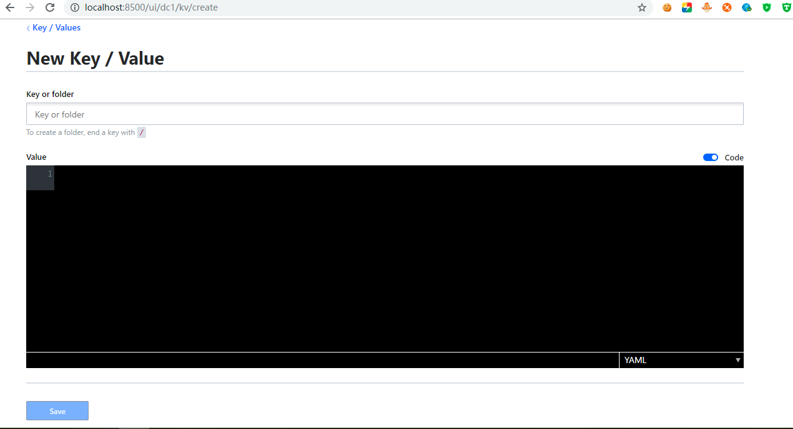

其实consul也给我们提供了类似于配置中心的功能，而不用使用Spring Cloud Config作为分布式
配置中心，但是有一个缺陷就是当consul宕机，那么上面配置的信息（key-value）就清空了，
所以consul最好配置成高可用。    

下面我们来进行配置。  

## 增加依赖，如下：
```
  <dependency>
            <groupId>org.springframework.cloud</groupId>
            <artifactId>spring-cloud-starter-consul-config</artifactId>
   </dependency>
```

## 增加配置类
增加一个配置类Config.java，内容如下：  
```
package com.fukun.consul.config;

import lombok.Data;
import org.springframework.boot.context.properties.ConfigurationProperties;
import org.springframework.context.annotation.Configuration;

/**
 * 读取consul中的配置信息的类
 *
 * @author tangyifei
 * @since 2019年6月27日16:23:55
 */

@ConfigurationProperties(prefix = "test-config")
@Configuration
@Data
public class Config {

    private String testValue;

}
```
## 添加不同环境的key-value
然后在consul的监控中心根据不同环境增加不同的key-value，点击Key/Value选项卡，点击创建
按钮，进入如下页面：  

  

Key or folder下面的输入框输入config/config-center-server,dev/data,
Value框中输入如下内容：
```
testConfig:      
   testValue: tangfukun-dev
```
因为是yaml文件，注意英文冒号后的空格，然后Value框的右下方的选项卡选择YAML。点击Save按钮
进行保存，注意testConfig对应的是Config.java文件中的注解@ConfigurationProperties(prefix = "test-config")的
test-config，testValue对应的是Config.java文件中的属性testValue。  
上面添加的是开发环境的Key-Value，这里面实际可以配置数据库的连接信息等，下面再次添加一个测试环境的Key-Value，
步骤跟添加开发环境的Key-Value一致，Key or folder下面的输入框输入config/config-center-server,test/data，
Value框中输入如下内容：  
```
testConfig:      
   testValue: tangfukun-test
```
Value框的右下方的选项卡选择YAML。点击Save按钮进行保存。    

## 修改配置
注意必须放入到bootstrap.yml中，内容如下：  
```
spring:
  application:
     name: fukun-core-consul-config
  profiles:
      active: test
  cloud:
     consul:
        host: localhost
        port: 8500
        discovery:
          enabled: true
          register: true
          tags: consul-config-service
          serviceName: ${spring.application.name}
          hostname: ${spring.application.name}
          port: ${server.port}
          instanceId: ${spring.application.name}:${server.port}
          preferIpAddress: true
          healthCheckInterval: 10s
          healthCheckUrl: http://${spring.cloud.client.ip-address}:${server.port}/health
          heartbeat:
             enabled: true
        config:
             # 允许配置中心
             enabled: true
             # 表示consul中的key-value中的value内容，采用YAML格式，据说有四种 YAML PROPERTIES KEY-VALUE FILES
             format: YAML
             # config 表示consul用于存储配置的文件夹根目录名为config
             prefix: config
             # application 表示配置文件对应的默认应用名称（优先获取当前服务名称配置，没有的话到application里找）
             defaultContext: config-center-server
             # 表示如果有多个profile(eg: 开发环境dev，测试环境test...) ，则key名中的profile与defaultContext之间，用什么分隔符来表示（例如config/config-center-server,dev/data）
             profileSeparator: ','
             # data 表示最后一层节点的key值名称，一般默认为data
             data-key: data

server:
 port: 8886

```
然后在HealthCheckController类中添加如下内容： 
``` 
    @Resource
    private Config config;

    @GetMapping(value = "/config")
    public String getConfig() {
        if (log.isInfoEnabled()) {
            log.info("获取的测试值：{}", config.getTestValue());
        }
        return config.toString();
    }
```
然后启动fukun-core-consul-config这个项目，启动成功后在浏览器中输入http://localhost:8886/config，返回
Config(testValue=tangfukun-test)信息，表示能够成功读取到Consul中的Key-Value，
然后在Consul中修改测试环境下的Key-Value，如下：  
```
testConfig:      
   testValue: tangfukun-test-1
```
再次访问http://localhost:8886/config，返回Config(testValue=tangfukun-test-1)表示获取到了最新的配置信息。  
修改生效，不像Spring Cloud Config还要向服务端发送POST请求/actuator/bus-refresh，进而通知Spring Cloud Bus
向其他客户端发送消息去获取最新的配置。  

然后修改bootstrap.yml文件，更改环境为dev，再次启动fukun-core-consul-config，访问http://localhost:8886/config
返回Config(testValue=tangfukun-dev)，表示根据不同的环境获取不同的配置信息成功。  

   
 

