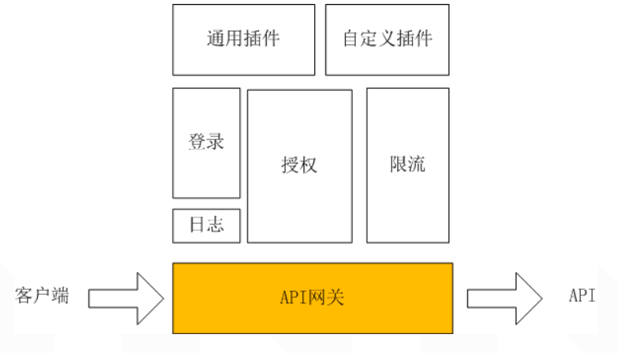
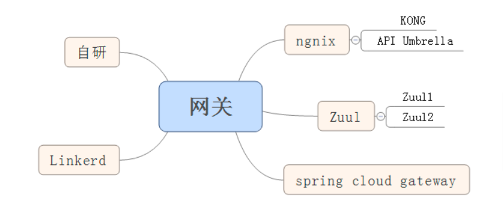
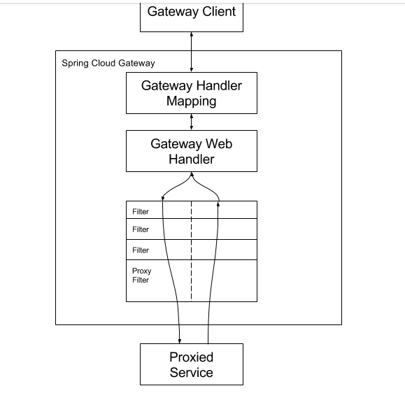
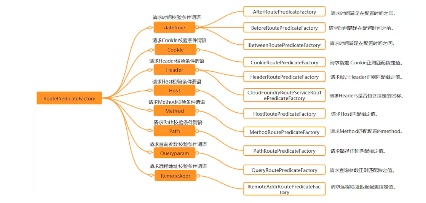
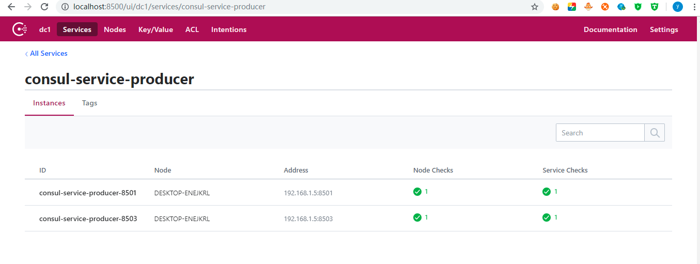
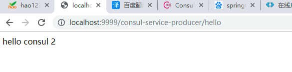
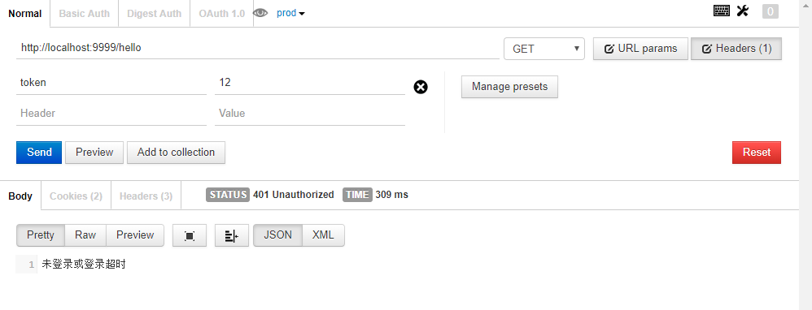
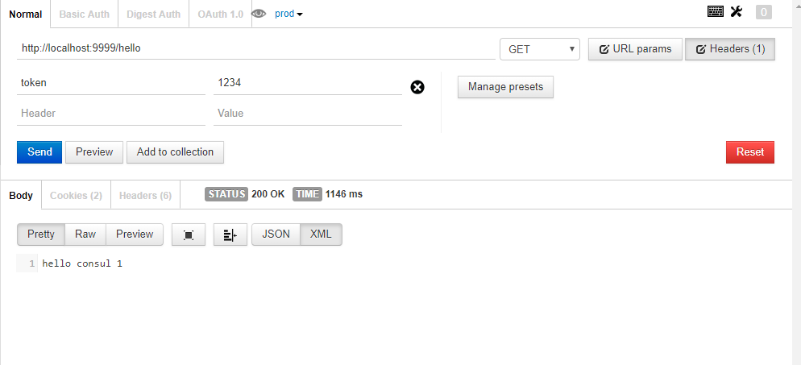

# 网关
API 网关出现的原因是微服务架构的出现，不同的微服务一般会有不同的网络地址，而外部客户端可能需要调用多个服务的接口才能完成一个业务需求，
如果让客户端直接与各个微服务通信，会有以下的问题：  

1、客户端会多次请求不同的微服务，增加了客户端的复杂性。  
2、存在跨域请求，在一定场景下处理相对复杂。  
3、认证复杂，每个服务都需要独立认证。  
4、难以重构，随着项目的迭代，可能需要重新划分微服务。例如，可能将多个服务合并成一个或者将一个服务拆分成多个。
如果客户端直接与微服务通信，那么重构将会很难实施。    
5、某些微服务可能使用了防火墙 / 浏览器不友好的协议，直接访问会有一定的困难。  

以上这些问题可以借助 API 网关解决。 API 网关是介于客户端和服务器端之间的中间层，
所有的外部请求都会先经过 API 网关这一层。也就是说，API 的实现方面更多的考虑业务逻辑，而安全、性能、监控可以交由 API 网关来做，
这样既提高业务灵活性又不缺安全性，典型的架构图如图所示：   

 
 
使用API网关后的优点如下：  
1、易于监控。可以在网关收集监控数据并将其推送到外部系统进行分析。  

2、易于认证。可以在网关上进行认证，然后再将请求转发到后端的微服务，而无须在每个微服务中进行认证。  

3、减少了客户端与各个微服务之间的交互次数，因为可以在网关层合并用户的请求。  

# API 网关选型
业界的情况：  
 
   

spring cloud gateway处理request请求的流程如下所示：  

 

即在最前端，启动一个netty server（默认端口为8080）接受请求，
然后通过Routes（每个Route由Predicate(等同于HandlerMapping)和Filter(等同于HandlerAdapter)）处理后通过Netty Client发给响应的微服务。  
Predicate和Filter的各个实现定义了spring-cloud-gateway拥有的功能（权限验证等）。  

# Spring Cloud Gateway与zuul的区别
Zuul（1.x） 基于 Servlet，使用阻塞API，它不支持任何长连接，如 WebSockets。  
Spring Cloud Gateway 使用非阻塞 API，支持 WebSockets，支持限流等新特性。   

# Spring Cloud Gateway
Spring Cloud Gateway 是 Spring Cloud 的一个全新项目，该项目是基于 Spring 5.0，Spring Boot 2.0 和 Project Reactor 等技术开发的网关，
它旨在为微服务架构提供一种简单有效的统一的API路由管理方式。   

Spring Cloud Gateway 作为 Spring Cloud 生态系统中的网关，目标是替代 Netflix Zuul，
其不仅提供统一的路由方式，并且基于 Filter 链的方式提供了网关基本的功能，例如：安全，监控/指标，和限流。  

## 相关概念
Route（路由）：这是网关的基本构建块。它由一个 ID，一个目标 URI，一组断言（predicates）和一组过滤器（filters）定义。如果断言为真，则路由匹配。  
Predicate（断言）：这是一个 Java 8 的 Predicate。输入类型是一个 ServerWebExchange。我们可以使用它来匹配来自 HTTP 请求的任何内容，例如 headers 或参数。 
Filter（过滤器）：这是org.springframework.cloud.gateway.filter.GatewayFilter的实例，我们可以使用它修改请求和响应。  

## 工作流程

   

客户端向Spring Cloud Gateway发出请求。如果 Gateway Handler Mapping 中找到与请求相匹配的路由，将其发送到 Gateway Web Handler。
Handler 再通过指定的过滤器链来将请求发送到我们实际的服务执行业务逻辑，然后返回。 
过滤器之间用虚线分开是因为过滤器可能会在发送代理请求之前（“pre”）或之后（“post”）执行业务逻辑。  

Spring Cloud Gateway 的特征：  
1、基于Spring Framework 5，Project Reactor和Spring Boot 2.0  
2、动态路由  
3、Predicates和Filters作用于特定路由  
4、集成Hystrix断路器  
5、集成Spring Cloud DiscoveryClient  
6、易于编写的Predicates和Filters  
7、限流  
8、路径重写  

# 使用
Spring Cloud Gateway 网关路由有两种配置方式：    
1、在配置文件yml中配置  
2、通过@Bean自定义RouteLocator，在启动主类Application中配置    

这两种方式是等价的，建议使用yml方式进行配置。  
使用 Spring Cloud Finchley 版本，Finchley 版本依赖于 Spring Boot 2.0.6.RELEASE。
```    
<parent>
	<groupId>org.springframework.boot</groupId>
	<artifactId>spring-boot-starter-parent</artifactId>
	<version>2.0.6.RELEASE</version>
	<relativePath/> <!-- lookup parent from repository -->
</parent>

<dependencyManagement>
	<dependencies>
		<dependency>
			<groupId>org.springframework.cloud</groupId>
			<artifactId>spring-cloud-dependencies</artifactId>
			<version>Finchley.SR2</version>
			<type>pom</type>
			<scope>import</scope>
		</dependency>
	</dependencies>
</dependencyManagement>
```
经测试 Finchley.RELEASE 有bug多次请求会报空指针异常，SR2 是 Spring Cloud 的最新版本。  
添加项目需要使用的依赖包    
```
<dependency>
	<groupId>org.springframework.cloud</groupId>
	<artifactId>spring-cloud-starter-gateway</artifactId>
</dependency>
```
Spring Cloud Gateway 是使用 netty+webflux 实现因此不需要再引入 web 模块。    
我们先来测试一个最简单的请求转发。  
```
spring:
  cloud:
    gateway:
      routes:
      - id: neo_route
        uri: http://www.ityouknow.com
        predicates:
        - Path=/spring-cloud
```
各字段含义如下：  
id：我们自定义的路由 ID，保持唯一。      
uri：目标服务地址。  
predicates：路由条件，Predicate 接受一个输入参数，返回一个布尔值结果。该接口包含多种默认方法来将 Predicate 组合成其他复杂的逻辑（比如：与，或，非）。  
filters：过滤规则。  
上面这段配置的意思是，配置了一个 id 为 neo_route 的路由规则，当访问地址 http://localhost:9999/spring-cloud时会自动转发到地址：
http://www.ityouknow.com/spring-cloud。配置完成启动项目即可在浏览器访问进行测试。  
转发功能同样可以通过代码来实现，我们可以在启动类 GateWayApplication 中添加方法 customRouteLocator() 来定制转发规则。  
```
@SpringBootApplication
public class GateWayApplication {

	public static void main(String[] args) {
		SpringApplication.run(GateWayApplication.class, args);
	}

	@Bean
	public RouteLocator customRouteLocator(RouteLocatorBuilder builder) {
		return builder.routes()
				.route("path_route", r -> r.path("/about")
						.uri("http://ityouknow.com"))
				.build();
	}

}
```
上面配置了一个 id 为 path_route 的路由，当访问地址http://localhost:9999/about时会自动转发到地址：http://www.ityouknow.com/about和上面的转发效果一样，
只是这里转发的是以项目地址/about格式的请求地址。  
实际项目使用中可以将 uri 指向对外提供服务的项目地址，统一对外输出接口。  

# 路由规则
Spring Cloud Gateway的功能很强大，我们仅仅通过Predicates的设计就可以看出来，前面我们只是使用了 predicates 进行了简单的条件匹配，
其实 Spring Cloud Gataway 帮我们内置了很多 Predicates 功能。  
Spring Cloud Gateway 是通过 Spring WebFlux 的 HandlerMapping 做为底层支持来匹配到转发路由，
Spring Cloud Gateway 内置了很多 Predicates 工厂，这些 Predicates 工厂通过不同的 HTTP 请求参数来匹配，
多个 Predicates 工厂可以组合使用。  

# Predicate 介绍
Predicate 来源于 Java 8，是 Java 8 中引入的一个函数，Predicate 接受一个输入参数，返回一个布尔值结果。
该接口包含多种默认方法来将 Predicate 组合成其他复杂的逻辑（比如：与，或，非）。
可以用于接口请求参数校验、判断新老数据是否有变化需要进行更新操作。  

在 Spring Cloud Gateway 中 Spring 利用 Predicate 的特性实现了各种路由匹配规则，有通过 Header、
请求参数等不同的条件来进行作为条件匹配到对应的路由。网上有一张图总结了 Spring Cloud 内置的几种 Predicate 的实现。

   

说白了 Predicate 就是为了实现一组匹配规则，方便让请求过来找到对应的 Route 进行处理，
接下来我们使用 Spring Cloud GateWay 内置几种 Predicate。    

## 通过时间匹配
Predicate 支持设置一个时间，在请求进行转发的时候，可以通过判断在这个时间之前或者之后进行转发。
比如我们现在设置只有在2019年1月1日才会转发到我的网站，在这之前不进行转发，我就可以这样配置：

```  
spring:
  cloud:
    gateway:
      routes:
       - id: time_route
        uri: http://ityouknow.com
        predicates:
         - After=2018-01-20T06:06:06+08:00[Asia/Shanghai]
```
Spring 是通过 ZonedDateTime 来对时间进行的对比，ZonedDateTime 是 Java 8 中日期时间功能里，用于表示带时区的日期与时间信息的类，ZonedDateTime 支持通过时区来设置时间，中国的时区是：Asia/Shanghai。  

After Route Predicate 是指在这个时间之后的请求都转发到目标地址。上面的示例是指，请求时间在 2018年1月20日6点6分6秒之后的所有请求都转发到地址http://ityouknow.com。+08:00是指时间和UTC时间相差八个小时，时间地区为Asia/Shanghai。  

添加完路由规则之后，访问地址http://localhost:8080会自动转发到http://ityouknow.com。  

Before Route Predicate 刚好相反，在某个时间之前的请求的请求都进行转发。我们把上面路由规则中的 After 改为 Before，如下：  

```
spring:
  cloud:
    gateway:
      routes:
       - id: before_route
        uri: http://ityouknow.com
        predicates:
         - Before=2018-01-20T06:06:06+08:00[Asia/Shanghai]
  ```
就表示在这个时间之前可以进行路由，在这时间之后停止路由，修改完之后重启项目再次访问地址http://localhost:8080，页面会报 404 没有找到地址。  

除了在某个时间之前或者之后外，Gateway 还支持限制路由请求在某一个时间段范围内，可以使用 Between Route Predicate 来实现。  
```
spring:
  cloud:
    gateway:
      routes:
       - id: between_route
        uri: http://ityouknow.com
        predicates:
         - Between=2018-01-20T06:06:06+08:00[Asia/Shanghai], 2019-01-20T06:06:06+08:00[Asia/Shanghai]
```
这样设置就意味着在这个时间段内可以匹配到此路由，超过这个时间段范围则不会进行匹配。通过时间匹配路由的功能很酷，可以用在限时抢购的一些场景中。  

## 通过 Cookie 匹配
Cookie Route Predicate 可以接收两个参数，一个是 Cookie name ,一个是正则表达式，路由规则会通过获取对应的 Cookie name 值和正则表达式去匹配，如果匹配上就会执行路由，如果没有匹配上则不执行。  

```
spring:
  cloud:
    gateway:
      routes:
       - id: cookie_route
         uri: http://ityouknow.com
         predicates:
         - Cookie=ityouknow, kee.e
```
使用 curl 测试，命令行输入:  

curl http://localhost:8080 --cookie "ityouknow=kee.e"  

则会返回页面代码，如果去掉--cookie "ityouknow=kee.e"，后台汇报 404 错误。  

## 通过 Header 属性匹配
Header Route Predicate 和 Cookie Route Predicate 一样，也是接收 2 个参数，一个 header 中属性名称和一个正则表达式，这个属性值和正则表达式匹配则执行。  
```
spring:
  cloud:
    gateway:
      routes:
      - id: header_route
        uri: http://ityouknow.com
        predicates:
        - Header=X-Request-Id, \d+
 ```
 使用 curl 测试，命令行输入:    
 
 curl http://localhost:8080  -H "X-Request-Id:666666"   
 
 则返回页面代码证明匹配成功。将参数-H "X-Request-Id:666666"改为-H "X-Request-Id:neo"再次执行时返回404证明没有匹配。   
 
 ## 通过 Host 匹配
 Host Route Predicate 接收一组参数，一组匹配的域名列表，这个模板是一个 ant 分隔的模板，用.号作为分隔符。它通过参数中的主机地址作为匹配规则。  
 ```
 spring:
   cloud:
     gateway:
       routes:
       - id: host_route
         uri: http://ityouknow.com
         predicates:
         - Host=**.ityouknow.com
```
使用 curl 测试，命令行输入:  
curl http://localhost:8080  -H "Host: www.ityouknow.com"   
curl http://localhost:8080  -H "Host: md.ityouknow.com"    
经测试以上两种 host 均可匹配到 host_route 路由，去掉 host 参数则会报 404 错误。    

## 通过请求方式匹配
可以通过是 POST、GET、PUT、DELETE 等不同的请求方式来进行路由。  
```
spring:
  cloud:
    gateway:
      routes:
      - id: method_route
        uri: http://ityouknow.com
        predicates:
        - Method=GET
```
使用 curl 测试，命令行输入:  
curl 默认是以 GET 的方式去请求  
curl http://localhost:8080     

测试返回页面代码，证明匹配到路由，我们再以 POST 的方式请求测试。   
curl -X POST http://localhost:8080  
返回 404 没有找到，证明没有匹配上路由  

## 通过请求路径匹配
Path Route Predicate 接收一个匹配路径的参数来判断是否走路由。  
```
spring:
  cloud:
    gateway:
      routes:
      - id: host_route
        uri: http://ityouknow.com
        predicates:
        - Path=/foo/{segment}
```
如果请求路径符合要求，则此路由将匹配，例如：/foo/1 或者 /foo/bar。  

使用 curl 测试，命令行输入:     
curl http://localhost:8080/foo/1  
curl http://localhost:8080/foo/xx  
curl http://localhost:8080/boo/xx  

经过测试第一和第二条命令可以正常获取到页面返回值，最后一个命令报404，证明路由是通过指定路由来匹配。   

## 通过请求参数匹配
Query Route Predicate 支持传入两个参数，一个是属性名一个为属性值，属性值可以是正则表达式。    
```
spring:
  cloud:
    gateway:
      routes:
      - id: query_route
        uri: http://ityouknow.com
        predicates:
        - Query=smile
```
这样配置，只要请求中包含 smile 属性的参数即可匹配路由。  

使用 curl 测试，命令行输入:       
curl localhost:8080?smile=x&id=2  
经过测试发现只要请求汇总带有 smile 参数即会匹配路由，不带 smile 参数则不会匹配。  

还可以将 Query 的值以键值对的方式进行配置，这样在请求过来时会对属性值和正则进行匹配，匹配上才会走路由。     
```
spring:
  cloud:
    gateway:
      routes:
      - id: query_route
        uri: http://ityouknow.com
        predicates:
        - Query=keep, pu.
```
这样只要当请求中包含 keep 属性并且参数值是以 pu 开头的长度为三位的字符串才会进行匹配和路由。   

使用 curl 测试，命令行输入:   
curl localhost:8080?keep=pub  
测试可以返回页面代码，将 keep 的属性值改为 pubx 再次访问就会报 404,证明路由需要匹配正则表达式才会进行路由。  

## 通过请求 ip 地址进行匹配
Predicate 也支持通过设置某个 ip 区间号段的请求才会路由，RemoteAddr Route Predicate 接受 cidr 符号(IPv4 或 IPv6 )字符串的列表(最小大小为1)，例如 192.168.0.1/16 (其中 192.168.0.1 是 IP 地址，16 是子网掩码)。   
```
spring:
  cloud:
    gateway:
      routes:
      - id: remoteaddr_route
        uri: http://ityouknow.com
        predicates:
        - RemoteAddr=192.168.1.1/24
```
可以将此地址设置为本机的 ip 地址进行测试。  
curl localhost:8080  
如果请求的远程地址是 192.168.1.10，则此路由将匹配。    

## 组合使用
上面为了演示各个 Predicate 的使用，我们是单个单个进行配置测试，其实可以将各种 Predicate 组合起来一起使用。  
例如：  

```  
spring:
  cloud:
    gateway:
      routes:
       - id: host_foo_path_headers_to_httpbin
        uri: http://ityouknow.com
        predicates:
        - Host=**.foo.org
        - Path=/headers
        - Method=GET
        - Header=X-Request-Id, \d+
        - Query=foo, ba.
        - Query=baz
        - Cookie=chocolate, ch.p
        - After=2018-01-20T06:06:06+08:00[Asia/Shanghai]      
```
各种 Predicates 同时存在于同一个路由时，请求必须同时满足所有的条件才被这个路由匹配。  

一个请求满足多个路由的谓词条件时，请求只会被首个成功匹配的路由转发。  

# spring-cloud-gateway结合服务中心进行相关的路由转发

Spring Cloud Gateway 提供了一种默认转发的能力，只要将 Spring Cloud Gateway 注册到服务中心，Spring Cloud Gateway 默认就会代理服务中心的所有服务。  

## 准备服务和注册中心
我这里还是使用之前的服务中心consul，使用之前的服务fukun-core-consul-producer1，如果使用eureka作为服务中心你需要升级eureka服务端和fukun-core-consul-producer1
的springCloud的版本为Finchley.SR2，eureka服务端的pom中的eureka的依赖包需要升级：
升级前：  
```
<dependency>
    <groupId>org.springframework.cloud</groupId>
    <artifactId>spring-cloud-starter-eureka-server</artifactId>
</dependency>
```
升级后：
```  
<dependency>
    <groupId>org.springframework.cloud</groupId>
    <artifactId>spring-cloud-starter-netflix-eureka-server</artifactId>
</dependency>
```
相关的eureka客户端的pom文件中的eureka的client依赖包升级如下：  
升级前：  
```   
<dependency>
    <groupId>org.springframework.cloud</groupId>
    <artifactId>spring-cloud-starter-eureka</artifactId>
</dependency>
```
升级后：  
```
<dependency>
    <groupId>org.springframework.cloud</groupId>
    <artifactId>spring-cloud-starter-netflix-eureka-client</artifactId>
</dependency>
```
由于我的项目使用的就是Finchley.SR2，所以不需要更改，我使用的consul作为服务中心，所以也不需要改动。  
这里我启动以前的fukun-core-consul-producer1和fukun-core-consul-producer2两个服务，这两个服务同属于
consul-service-producer，打开服务中心的控制台进行查看，如下：  

    

然后修改fukun-core-gateway-server的application.yml 配置文件内容如下：   
```  
spring:
     gateway:
       # 是否与服务注册和服务发现组件进行结合，通过 serviceId 转发到具体的服务实例。默认为 false，设为 true 便开启通过服务中心的自动根据 serviceId 创建路由的功能。
       discovery:
         locator:
           enabled: true

# 调整相关gateway 包的 log 级别，以便排查问题
logging:
   level:
     org.springframework.cloud.gateway: debug
```
然后启动fukun-core-gateway-server服务，服务中心consul中已经注册了fukun-core-gateway-server实例， 
将 Spring Cloud Gateway 注册到服务中心之后，网关会自动代理所有在注册中心中的服务，访问这些服务的语法为：   
http://网关地址：端口/服务中心注册 serviceId/具体的url    
访问如下：     

  

不断刷新，发现交替打印hello consul 1与hello consul 2，说明后端服务自动进行了均衡负载。 

# 基于 Filter(过滤器) 实现的高级功能
Spring Cloud Gateway 的 Filter 的生命周期不像 Zuul 的那么丰富，它只有两个：“pre” 和 “post”。  
PRE： 这种过滤器在请求被路由之前调用。我们可利用这种过滤器实现身份验证、在集群中选择请求的微服务、记录调试信息等。  
POST：这种过滤器在路由到微服务以后执行。这种过滤器可用来为响应添加标准的 HTTP Header、收集统计信息和指标、将响应从微服务发送给客户端等。   

Spring Cloud Gateway 的 Filter 分为两种：GatewayFilter 与 GlobalFilter。GlobalFilter 会应用到所有的路由上，
而 GatewayFilter 将应用到单个路由或者一个分组的路由上。    

Spring Cloud Gateway 内置了9种 GlobalFilter，比如 Netty Routing Filter、LoadBalancerClient Filter、Websocket Routing Filter 等，
根据名字即可猜测出这些 Filter 的作用，[Global Filters](https://cloud.spring.io/spring-cloud-gateway/single/spring-cloud-gateway.html#_global_filters)

利用 GatewayFilter 可以修改请求的 Http 的请求或者响应，或者根据请求或者响应做一些特殊的限制。 更多时候我们会利用 GatewayFilter 做一些具体的路由配置，
下面我们做一些简单的介绍。  

## 使用filter

### 单个服务的路由转发
我们以 AddRequestParameter GatewayFilter 来演示一下，如何在项目中使用 GatewayFilter，AddRequestParameter GatewayFilter 可以在请求中添加指定参数。  

修改fukun-core-gateway-server的application.yml文件，添加如下内容：

```  
spring:
  cloud:
    gateway:
      routes:
      - id: add_request_parameter_route
        # 目标服务地址
        uri: http://localhost:8501
        filters:
        - AddRequestParameter=foo, bar
        predicates:
        # 当访问地址 http://localhost:9999/foo时会自动转发到地址：http://localhost:8501/foo
        - Path=/foo
```  

这样就会给匹配的每个请求添加上foo=bar的参数和值。      
访问地址http://localhost:8501/foo页面返回：hello null1，说明并没有接受到参数 foo；
通过网关来调用此服务，浏览器访问地址http://localhost:9999/foo页面返回：hello bar1，
说明成功接收到参数 foo 参数的值 bar ,证明网关在转发的过程中已经通过 filter 添加了设置的参数和值。  

### 服务化路由转发
上面我们使用 uri 指定了一个服务转发地址，单个服务这样使用问题不大，但是我们在注册中心往往会使用多个服务来共同支撑整个服务的使用，  
这个时候我们就期望可以将 Filter 作用到每个应用的实例上，spring cloud gateway 提供了这样的功能，只需要简单配置即可。  

修改fukun-core-gateway-server中的application.yml文件如下：  
uri: lb://consul-service-producer  
修改完之后，重新启动项目 fukun-core-gateway-server、fukun-core-consul-producer1，fukun-core-consul-producer2
浏览器访问地址:http://localhost:9999/hello页面交替出现hello consul 1和hello consul 2。   
证明请求被均匀的转发到后端的服务， 那怎么实现的呢？  
其实这里使用了全局过滤器 LoadBalancerClient ，当路由配置中 uri 所用的协议为 lb 时（以uri: lb://consul-service-producer为例），
gateway 将使用 LoadBalancerClient 把 consul-service-producer 通过 consul 解析为实际的主机和端口，并进行负载均衡。    
上面说到全局过滤器作用在所有的路由上，然而GateWayFilter作用于单个路由上或者一个分组的路由上。

###  修改请求路径的过滤器

#### StripPrefix Filter
StripPrefix Filter 是一个请求路径截取的功能，我们可以利用这个功能来做特殊业务的转发。  
application.yml 配置如下：  
```
spring:
  cloud:
    gateway:
      routes:
      - id: nameRoot
        uri: http://nameservice
        predicates:
        - Path=/name/**
        filters:
        - StripPrefix=2
```
上面这个配置的例子表示，当请求路径匹配到/name/**会将包含name和后边的字符串截取再进行转发，
 StripPrefix=2就代表截取路径的个数，这样配置后当请求/name/bar/foo后端匹配到的请求路径就会变成http://nameservice/foo。  
 
我们还是在fukun-core-gateway-server项目中进行测试，修改 application.yml 如下：  
```
spring:
  cloud:
     routes:
     - id: nameRoot
       uri: lb://consul-service-producer
       predicates:
       - Path=/tang/**
       filters:
       - StripPrefix=3
```
配置完后重启 fukun-core-gateway-server 项目，访问地址：http://localhost:9999/tang/yi/fei/hello页面会交替显示hello consul 1和hello consul 2。    
和直接访问地址 http://localhost:9999/hello展示的效果一致，说明请求路径中的 /tang/yi/fei/hello 已经被截取。    

#### PrefixPath Filter
PrefixPath Filter 的作用和 StripPrefix 正相反，是在 URL 路径前面添加一部分的前缀   
``` 
spring:
  cloud:
    gateway:
      routes:
      - id: prefixpath_route
        uri: lb://consul-service-producer
        predicates:
        - Path=/tang/**
        filters:
        - PrefixPath=/fukun
```
### 限速路由器

限速在高并发场景中比较常用的手段之一，可以有效的保障服务的整体稳定性，
Spring Cloud Gateway 提供了基于 Redis 的限流方案。所以我们首先需要添加对应的依赖包spring-boot-starter-data-redis-reactive。  
注意使用spring-boot的2.0.5版本引用不到该jar包，所以升级spring-boot的版本为2.0.6版本，如下：  
```
<dependency>
  <groupId>org.springframework.cloud</groupId>
  <artifactId>spring-boot-starter-data-redis-reactive</artifactId>
</dependency>
```
配置文件中需要添加 Redis 地址和限流的相关配置   
```   
spring:
  redis:
      # redis的数据库索引，默认为0
      database: 0
      host: 192.168.0.49
      port: 6379
      password: '##!zggc5055'
  application:
     name: fukun-core-gateway-server
  cloud:
     gateway:
       # 是否与服务注册和服务发现组件进行结合，通过 serviceId 转发到具体的服务实例。默认为 false，设为 true 便开启通过服务中心的自动根据 serviceId 创建路由的功能。
       discovery:
         locator:
           enabled: true
       routes:
             # 自定义的路由 ID，保持唯一
             - id: add_request_parameter_route
               # 目标服务地址，针对单个服务
               #uri: http://localhost:8501
               #格式为：lb://应用注册服务名，针对多个服务，主要是服务中心中的服务，比如consul中的服务实例
               uri: lb://consul-service-producer
               filters:
               #转发请求之前，所有的 GET 方法都会自动添加foo=bar的请求参数
               #- AddRequestParameter=foo, bar
               #当请求/tang/yi/fei/hello后端匹配到的请求路径就会变成http://IP:PORT/hello。
               #- StripPrefix=3
               #filter 名称必须是 RequestRateLimiter
               - name: RequestRateLimiter
                 args:
                    #redis-rate-limiter.replenishRate：允许用户每秒处理多少个请求，令牌桶放入的速度
                    redis-rate-limiter.replenishRate: 1
                    #令牌桶的容量，允许在一秒钟内完成的最大请求数，令牌桶的容积
                    redis-rate-limiter.burstCapacity: 3
                    #使用 SpEL 按名称引用 bean
                    key-resolver: "#{@ipKeyResolver}"
               # 路由条件，Predicate 接受一个输入参数，返回一个布尔值结果。该接口包含多种默认方法来将 Predicate 组合成其他复杂的逻辑（比如：与，或，非）。
               # predicate定义了一组匹配规则
               predicates:
               # 当访问地址 http://localhost:9999/foo时会自动转发到地址：http://localhost:8501/foo
               #- Path=/tang/**
               - Method=GET
```
filter 名称必须是 RequestRateLimiter  
redis-rate-limiter.replenishRate：允许用户每秒处理多少个请求  
redis-rate-limiter.burstCapacity：令牌桶的容量，允许在一秒钟内完成的最大请求数  
key-resolver：使用 SpEL 按名称引用 bean    
项目中设置限流的策略，创建 限流相关的配置类LimitFlowStrategy。  
```
package com.fukun.gateway.config;

import org.springframework.cloud.gateway.filter.ratelimit.KeyResolver;
import org.springframework.context.annotation.Bean;
import org.springframework.context.annotation.Configuration;
import reactor.core.publisher.Mono;

import java.util.Objects;

/**
 * 配置相应的限流策略
 *
 * @author tangyifei
 * @since 2019年6月21日16:05:12
 */
@Configuration
public class LimitFlowStrategy {

    /**
     * 根据请求参数中的 foo字段来限流，也可以设置根据请求IP地址来限流
     * 这样网关就可以根据不同策略来对请求进行限流了。
     *
     * @return 限流策略
     */
    @Bean
    KeyResolver ipKeyResolver() {
        // 那么使劲刷新url，出现429 too many request 就表示成功了
        return exchange -> Mono.just(Objects.requireNonNull(exchange.getRequest().getRemoteAddress()).getHostName());
//        return exchange -> Mono.just(exchange.getRequest().getRemoteAddress().getHostName());
//        return exchange -> Mono.just(exchange.getRequest().getQueryParams().getFirst("foo"));
    }
}
```
上面的这个key resolver会生成一个key，为这个key生成一个令牌桶。如果是客户端ip，那么就是为每个ip生成一个令牌桶。如果是个固定值，就是全局的令牌桶。  

那么使劲刷新url（http://localhost:9999/hello），出现429 too many request 就表示成功了。  

#### 令牌桶算法来限流
每秒向令牌桶放N个令牌，令牌桶的最大容积是M个，那么如果请求过来了，会从令牌桶中拿出一个令牌，令牌桶还剩M-1个。以此类推，
当令牌桶的数量还剩0个的时候，就拒绝接受请求。所以这个情况可以支持突发性的请求情况。就是我一直很小量的请求，但是突然来了一大波请求，令牌桶容积决定了它能接受的最大突发情况。    

### 熔断路由器
Spring Cloud Gateway 也可以利用 Hystrix 的熔断特性，在流量过大时进行服务降级，同样我们还是首先给项目添加上依赖。   
```
<dependency>
  <groupId>org.springframework.cloud</groupId>
  <artifactId>spring-cloud-starter-netflix-hystrix</artifactId>
</dependency>
```
配置示例   
``` 
spring:
  cloud:
    gateway:
      routes:
      - id: hystrix_route
        uri: http://example.org
        filters:
        - Hystrix=myCommandName
```
配置后，gateway 将使用 myCommandName 作为名称生成 HystrixCommand 对象来进行熔断管理。如果想添加熔断后的回调内容，需要在添加一些配置。  
```
spring:
  cloud:
    gateway:
      routes:
      - id: hystrix_route
        uri: lb://consul-service-producer
        predicates:
        - Method=GET
        filters:
        - name: Hystrix
          args:
            name: fallbackcmd
            fallbackUri: forward:/fallback
```
fallbackUri: forward:/fallback配置了 fallback 时要回调的路径，当Hystrix 的 fallback 被调用时，请求将转发到/fallback URI。  

fukun-core-consul-producer1端定义一个方法，并且让线程睡5秒再次响应，如下： 
``` 
    @GetMapping("/timeout")
    public String timeout() {
        try {
            //睡5秒，网关Hystrix3秒超时，会触发熔断降级操作
            Thread.sleep(5000);
        } catch (InterruptedException e) {
            e.printStackTrace();
        }
        return "timeout1";
    }
```
然后fukun-core-gateway-server配置熔断器的熔断超时为3秒，如下：
```  
hystrix:
  command:
    default:
      execution:
        isolation:
          strategy: SEMAPHORE
          thread:
            timeoutInMilliseconds: 3000
```
然后分别启动 fukun-core-consul-producer1 和 fukun-core-gateway-server服务，然后调用http://localhost:9999/timeout出现超时回调走熔断的响应。  

### 重试路由器
RetryGatewayFilter 是 Spring Cloud Gateway 对请求重试提供的一个 GatewayFilter Factory  
fukun-core-gateway-server配置示例： 

```
spring:
  cloud:
    gateway:
      routes:
        filters: 
               #Retry GatewayFilter 通过这四个参数来控制重试机制： retries, statuses, methods, 和 series。
               - name: Retry
                 args:
                    #retries：重试次数，默认值是 3 次
                    retries: 3
                    #HTTP 的状态返回码，取值请参考：org.springframework.http.HttpStatus
                    statuses:
                     - BAD_GATEWAY
                    #指定哪些方法的请求需要进行重试逻辑，默认值是 GET 方法，取值参考：org.springframework.http.HttpMethod
                    methods:
                     - GET
                     - POST
                    # 一些列的状态码配置，取值参考：org.springframework.http.HttpStatus.Series。符合的某段状态码才会进行重试逻辑，默认值是 SERVER_ERROR，值是 5，也就是 5XX(5 开头的状态码)，共有5 个值。
                    series:
                     - SERVER_ERROR
```
然后fukun-core-consul-producer1添加如下的代码：  
```
AtomicInteger ac = new AtomicInteger();
 @GetMapping("/retry")
    public String retry(@RequestParam(value = "name", required = false) String name) {
        System.err.println("第一次请求加上失败的重试次数：" + ac.addAndGet(1));
        if (StringUtils.isBlank(name)) {
            throw new RuntimeException("error");
        }
        return "retry1";
    }
```
由于针对服务端异常5XX会进行重试，当fukun-core-consul-producer1的控制台打印如下信息，说明进行了GateWay进行了重试  
```
   第一次请求加上失败的重试次数：1
   2019-06-21 19:00:02.385 ERROR 17156 --- [nio-8501-exec-1] o.a.c.c.C.[.[.[/].[dispatcherServlet]    : Servlet.service() for servlet [dispatcherServlet] in context with path [] threw exception [Request processing failed; nested exception is java.lang.RuntimeException: error] with root cause
   
   java.lang.RuntimeException: error
   	at com.fukun.consul.producer1.controller.HelloController.retry(HelloController.java:54) ~[classes/:na]
   	at sun.reflect.NativeMethodAccessorImpl.invoke0(Native Method) ~[na:1.8.0_144]
   	at sun.reflect.NativeMethodAccessorImpl.invoke(NativeMethodAccessorImpl.java:62) ~[na:1.8.0_144]
   	at sun.reflect.DelegatingMethodAccessorImpl.invoke(DelegatingMethodAccessorImpl.java:43) ~[na:1.8.0_144]
   	at java.lang.reflect.Method.invoke(Method.java:498) ~[na:1.8.0_144]
   	at org.springframework.web.method.support.InvocableHandlerMethod.doInvoke(InvocableHandlerMethod.java:209) ~[spring-web-5.0.9.RELEASE.jar:5.0.9.RELEASE]
   	at org.springframework.web.method.support.InvocableHandlerMethod.invokeForRequest(InvocableHandlerMethod.java:136) ~[spring-web-5.0.9.RELEASE.jar:5.0.9.RELEASE]
   	at org.springframework.web.servlet.mvc.method.annotation.ServletInvocableHandlerMethod.invokeAndHandle(ServletInvocableHandlerMethod.java:102) ~[spring-webmvc-5.0.9.RELEASE.jar:5.0.9.RELEASE]
   	at org.springframework.web.servlet.mvc.method.annotation.RequestMappingHandlerAdapter.invokeHandlerMethod(RequestMappingHandlerAdapter.java:891) ~[spring-webmvc-5.0.9.RELEASE.jar:5.0.9.RELEASE]
   	at org.springframework.web.servlet.mvc.method.annotation.RequestMappingHandlerAdapter.handleInternal(RequestMappingHandlerAdapter.java:797) ~[spring-webmvc-5.0.9.RELEASE.jar:5.0.9.RELEASE]
   	at org.springframework.web.servlet.mvc.method.AbstractHandlerMethodAdapter.handle(AbstractHandlerMethodAdapter.java:87) ~[spring-webmvc-5.0.9.RELEASE.jar:5.0.9.RELEASE]
   	at org.springframework.web.servlet.DispatcherServlet.doDispatch(DispatcherServlet.java:991) ~[spring-webmvc-5.0.9.RELEASE.jar:5.0.9.RELEASE]
   	at org.springframework.web.servlet.DispatcherServlet.doService(DispatcherServlet.java:925) ~[spring-webmvc-5.0.9.RELEASE.jar:5.0.9.RELEASE]
   	at org.springframework.web.servlet.FrameworkServlet.processRequest(FrameworkServlet.java:974) ~[spring-webmvc-5.0.9.RELEASE.jar:5.0.9.RELEASE]
   	at org.springframework.web.servlet.FrameworkServlet.doGet(FrameworkServlet.java:866) ~[spring-webmvc-5.0.9.RELEASE.jar:5.0.9.RELEASE]
   	at javax.servlet.http.HttpServlet.service(HttpServlet.java:635) ~[tomcat-embed-core-8.5.34.jar:8.5.34]
   	at org.springframework.web.servlet.FrameworkServlet.service(FrameworkServlet.java:851) ~[spring-webmvc-5.0.9.RELEASE.jar:5.0.9.RELEASE]
   	at javax.servlet.http.HttpServlet.service(HttpServlet.java:742) ~[tomcat-embed-core-8.5.34.jar:8.5.34]
   	at org.apache.catalina.core.ApplicationFilterChain.internalDoFilter(ApplicationFilterChain.java:231) ~[tomcat-embed-core-8.5.34.jar:8.5.34]
   	at org.apache.catalina.core.ApplicationFilterChain.doFilter(ApplicationFilterChain.java:166) ~[tomcat-embed-core-8.5.34.jar:8.5.34]
   	at org.apache.tomcat.websocket.server.WsFilter.doFilter(WsFilter.java:52) ~[tomcat-embed-websocket-8.5.34.jar:8.5.34]
   	at org.apache.catalina.core.ApplicationFilterChain.internalDoFilter(ApplicationFilterChain.java:193) ~[tomcat-embed-core-8.5.34.jar:8.5.34]
   	at org.apache.catalina.core.ApplicationFilterChain.doFilter(ApplicationFilterChain.java:166) ~[tomcat-embed-core-8.5.34.jar:8.5.34]
   	at org.springframework.boot.actuate.web.trace.servlet.HttpTraceFilter.doFilterInternal(HttpTraceFilter.java:90) ~[spring-boot-actuator-2.0.5.RELEASE.jar:2.0.5.RELEASE]
   	at org.springframework.web.filter.OncePerRequestFilter.doFilter(OncePerRequestFilter.java:107) ~[spring-web-5.0.9.RELEASE.jar:5.0.9.RELEASE]
   	at org.apache.catalina.core.ApplicationFilterChain.internalDoFilter(ApplicationFilterChain.java:193) ~[tomcat-embed-core-8.5.34.jar:8.5.34]
   	at org.apache.catalina.core.ApplicationFilterChain.doFilter(ApplicationFilterChain.java:166) ~[tomcat-embed-core-8.5.34.jar:8.5.34]
   	at org.springframework.web.filter.RequestContextFilter.doFilterInternal(RequestContextFilter.java:99) ~[spring-web-5.0.9.RELEASE.jar:5.0.9.RELEASE]
   	at org.springframework.web.filter.OncePerRequestFilter.doFilter(OncePerRequestFilter.java:107) ~[spring-web-5.0.9.RELEASE.jar:5.0.9.RELEASE]
   	at org.apache.catalina.core.ApplicationFilterChain.internalDoFilter(ApplicationFilterChain.java:193) ~[tomcat-embed-core-8.5.34.jar:8.5.34]
   	at org.apache.catalina.core.ApplicationFilterChain.doFilter(ApplicationFilterChain.java:166) ~[tomcat-embed-core-8.5.34.jar:8.5.34]
   	at org.springframework.web.filter.HttpPutFormContentFilter.doFilterInternal(HttpPutFormContentFilter.java:109) ~[spring-web-5.0.9.RELEASE.jar:5.0.9.RELEASE]
   	at org.springframework.web.filter.OncePerRequestFilter.doFilter(OncePerRequestFilter.java:107) ~[spring-web-5.0.9.RELEASE.jar:5.0.9.RELEASE]
   	at org.apache.catalina.core.ApplicationFilterChain.internalDoFilter(ApplicationFilterChain.java:193) ~[tomcat-embed-core-8.5.34.jar:8.5.34]
   	at org.apache.catalina.core.ApplicationFilterChain.doFilter(ApplicationFilterChain.java:166) ~[tomcat-embed-core-8.5.34.jar:8.5.34]
   	at org.springframework.web.filter.HiddenHttpMethodFilter.doFilterInternal(HiddenHttpMethodFilter.java:93) ~[spring-web-5.0.9.RELEASE.jar:5.0.9.RELEASE]
   	at org.springframework.web.filter.OncePerRequestFilter.doFilter(OncePerRequestFilter.java:107) ~[spring-web-5.0.9.RELEASE.jar:5.0.9.RELEASE]
   	at org.apache.catalina.core.ApplicationFilterChain.internalDoFilter(ApplicationFilterChain.java:193) ~[tomcat-embed-core-8.5.34.jar:8.5.34]
   	at org.apache.catalina.core.ApplicationFilterChain.doFilter(ApplicationFilterChain.java:166) ~[tomcat-embed-core-8.5.34.jar:8.5.34]
   	at org.springframework.boot.actuate.metrics.web.servlet.WebMvcMetricsFilter.filterAndRecordMetrics(WebMvcMetricsFilter.java:155) ~[spring-boot-actuator-2.0.5.RELEASE.jar:2.0.5.RELEASE]
   	at org.springframework.boot.actuate.metrics.web.servlet.WebMvcMetricsFilter.filterAndRecordMetrics(WebMvcMetricsFilter.java:123) ~[spring-boot-actuator-2.0.5.RELEASE.jar:2.0.5.RELEASE]
   	at org.springframework.boot.actuate.metrics.web.servlet.WebMvcMetricsFilter.doFilterInternal(WebMvcMetricsFilter.java:108) ~[spring-boot-actuator-2.0.5.RELEASE.jar:2.0.5.RELEASE]
   	at org.springframework.web.filter.OncePerRequestFilter.doFilter(OncePerRequestFilter.java:107) ~[spring-web-5.0.9.RELEASE.jar:5.0.9.RELEASE]
   	at org.apache.catalina.core.ApplicationFilterChain.internalDoFilter(ApplicationFilterChain.java:193) ~[tomcat-embed-core-8.5.34.jar:8.5.34]
   	at org.apache.catalina.core.ApplicationFilterChain.doFilter(ApplicationFilterChain.java:166) ~[tomcat-embed-core-8.5.34.jar:8.5.34]
   	at org.springframework.web.filter.CharacterEncodingFilter.doFilterInternal(CharacterEncodingFilter.java:200) ~[spring-web-5.0.9.RELEASE.jar:5.0.9.RELEASE]
   	at org.springframework.web.filter.OncePerRequestFilter.doFilter(OncePerRequestFilter.java:107) ~[spring-web-5.0.9.RELEASE.jar:5.0.9.RELEASE]
   	at org.apache.catalina.core.ApplicationFilterChain.internalDoFilter(ApplicationFilterChain.java:193) ~[tomcat-embed-core-8.5.34.jar:8.5.34]
   	at org.apache.catalina.core.ApplicationFilterChain.doFilter(ApplicationFilterChain.java:166) ~[tomcat-embed-core-8.5.34.jar:8.5.34]
   	at org.apache.catalina.core.StandardWrapperValve.invoke(StandardWrapperValve.java:198) ~[tomcat-embed-core-8.5.34.jar:8.5.34]
   	at org.apache.catalina.core.StandardContextValve.invoke(StandardContextValve.java:96) [tomcat-embed-core-8.5.34.jar:8.5.34]
   	at org.apache.catalina.authenticator.AuthenticatorBase.invoke(AuthenticatorBase.java:493) [tomcat-embed-core-8.5.34.jar:8.5.34]
   	at org.apache.catalina.core.StandardHostValve.invoke(StandardHostValve.java:140) [tomcat-embed-core-8.5.34.jar:8.5.34]
   	at org.apache.catalina.valves.ErrorReportValve.invoke(ErrorReportValve.java:81) [tomcat-embed-core-8.5.34.jar:8.5.34]
   	at org.apache.catalina.core.StandardEngineValve.invoke(StandardEngineValve.java:87) [tomcat-embed-core-8.5.34.jar:8.5.34]
   	at org.apache.catalina.connector.CoyoteAdapter.service(CoyoteAdapter.java:342) [tomcat-embed-core-8.5.34.jar:8.5.34]
   	at org.apache.coyote.http11.Http11Processor.service(Http11Processor.java:800) [tomcat-embed-core-8.5.34.jar:8.5.34]
   	at org.apache.coyote.AbstractProcessorLight.process(AbstractProcessorLight.java:66) [tomcat-embed-core-8.5.34.jar:8.5.34]
   	at org.apache.coyote.AbstractProtocol$ConnectionHandler.process(AbstractProtocol.java:806) [tomcat-embed-core-8.5.34.jar:8.5.34]
   	at org.apache.tomcat.util.net.NioEndpoint$SocketProcessor.doRun(NioEndpoint.java:1498) [tomcat-embed-core-8.5.34.jar:8.5.34]
   	at org.apache.tomcat.util.net.SocketProcessorBase.run(SocketProcessorBase.java:49) [tomcat-embed-core-8.5.34.jar:8.5.34]
   	at java.util.concurrent.ThreadPoolExecutor.runWorker(ThreadPoolExecutor.java:1149) [na:1.8.0_144]
   	at java.util.concurrent.ThreadPoolExecutor$Worker.run(ThreadPoolExecutor.java:624) [na:1.8.0_144]
   	at org.apache.tomcat.util.threads.TaskThread$WrappingRunnable.run(TaskThread.java:61) [tomcat-embed-core-8.5.34.jar:8.5.34]
   	at java.lang.Thread.run(Thread.java:748) [na:1.8.0_144]
   
   第一次请求加上失败的重试次数：2
   2019-06-21 19:00:02.454 ERROR 17156 --- [nio-8501-exec-2] o.a.c.c.C.[.[.[/].[dispatcherServlet]    : Servlet.service() for servlet [dispatcherServlet] in context with path [] threw exception [Request processing failed; nested exception is java.lang.RuntimeException: error] with root cause
   
   java.lang.RuntimeException: error
   	at com.fukun.consul.producer1.controller.HelloController.retry(HelloController.java:54) ~[classes/:na]
   	at sun.reflect.NativeMethodAccessorImpl.invoke0(Native Method) ~[na:1.8.0_144]
   	at sun.reflect.NativeMethodAccessorImpl.invoke(NativeMethodAccessorImpl.java:62) ~[na:1.8.0_144]
   	at sun.reflect.DelegatingMethodAccessorImpl.invoke(DelegatingMethodAccessorImpl.java:43) ~[na:1.8.0_144]
   	at java.lang.reflect.Method.invoke(Method.java:498) ~[na:1.8.0_144]
   	at org.springframework.web.method.support.InvocableHandlerMethod.doInvoke(InvocableHandlerMethod.java:209) ~[spring-web-5.0.9.RELEASE.jar:5.0.9.RELEASE]
   	at org.springframework.web.method.support.InvocableHandlerMethod.invokeForRequest(InvocableHandlerMethod.java:136) ~[spring-web-5.0.9.RELEASE.jar:5.0.9.RELEASE]
   	at org.springframework.web.servlet.mvc.method.annotation.ServletInvocableHandlerMethod.invokeAndHandle(ServletInvocableHandlerMethod.java:102) ~[spring-webmvc-5.0.9.RELEASE.jar:5.0.9.RELEASE]
   	at org.springframework.web.servlet.mvc.method.annotation.RequestMappingHandlerAdapter.invokeHandlerMethod(RequestMappingHandlerAdapter.java:891) ~[spring-webmvc-5.0.9.RELEASE.jar:5.0.9.RELEASE]
   	at org.springframework.web.servlet.mvc.method.annotation.RequestMappingHandlerAdapter.handleInternal(RequestMappingHandlerAdapter.java:797) ~[spring-webmvc-5.0.9.RELEASE.jar:5.0.9.RELEASE]
   	at org.springframework.web.servlet.mvc.method.AbstractHandlerMethodAdapter.handle(AbstractHandlerMethodAdapter.java:87) ~[spring-webmvc-5.0.9.RELEASE.jar:5.0.9.RELEASE]
   	at org.springframework.web.servlet.DispatcherServlet.doDispatch(DispatcherServlet.java:991) ~[spring-webmvc-5.0.9.RELEASE.jar:5.0.9.RELEASE]
   	at org.springframework.web.servlet.DispatcherServlet.doService(DispatcherServlet.java:925) ~[spring-webmvc-5.0.9.RELEASE.jar:5.0.9.RELEASE]
   	at org.springframework.web.servlet.FrameworkServlet.processRequest(FrameworkServlet.java:974) ~[spring-webmvc-5.0.9.RELEASE.jar:5.0.9.RELEASE]
   	at org.springframework.web.servlet.FrameworkServlet.doGet(FrameworkServlet.java:866) ~[spring-webmvc-5.0.9.RELEASE.jar:5.0.9.RELEASE]
   	at javax.servlet.http.HttpServlet.service(HttpServlet.java:635) ~[tomcat-embed-core-8.5.34.jar:8.5.34]
   	at org.springframework.web.servlet.FrameworkServlet.service(FrameworkServlet.java:851) ~[spring-webmvc-5.0.9.RELEASE.jar:5.0.9.RELEASE]
   	at javax.servlet.http.HttpServlet.service(HttpServlet.java:742) ~[tomcat-embed-core-8.5.34.jar:8.5.34]
   	at org.apache.catalina.core.ApplicationFilterChain.internalDoFilter(ApplicationFilterChain.java:231) ~[tomcat-embed-core-8.5.34.jar:8.5.34]
   	at org.apache.catalina.core.ApplicationFilterChain.doFilter(ApplicationFilterChain.java:166) ~[tomcat-embed-core-8.5.34.jar:8.5.34]
   	at org.apache.tomcat.websocket.server.WsFilter.doFilter(WsFilter.java:52) ~[tomcat-embed-websocket-8.5.34.jar:8.5.34]
   	at org.apache.catalina.core.ApplicationFilterChain.internalDoFilter(ApplicationFilterChain.java:193) ~[tomcat-embed-core-8.5.34.jar:8.5.34]
   	at org.apache.catalina.core.ApplicationFilterChain.doFilter(ApplicationFilterChain.java:166) ~[tomcat-embed-core-8.5.34.jar:8.5.34]
   	at org.springframework.boot.actuate.web.trace.servlet.HttpTraceFilter.doFilterInternal(HttpTraceFilter.java:90) ~[spring-boot-actuator-2.0.5.RELEASE.jar:2.0.5.RELEASE]
   	at org.springframework.web.filter.OncePerRequestFilter.doFilter(OncePerRequestFilter.java:107) ~[spring-web-5.0.9.RELEASE.jar:5.0.9.RELEASE]
   	at org.apache.catalina.core.ApplicationFilterChain.internalDoFilter(ApplicationFilterChain.java:193) ~[tomcat-embed-core-8.5.34.jar:8.5.34]
   	at org.apache.catalina.core.ApplicationFilterChain.doFilter(ApplicationFilterChain.java:166) ~[tomcat-embed-core-8.5.34.jar:8.5.34]
   	at org.springframework.web.filter.RequestContextFilter.doFilterInternal(RequestContextFilter.java:99) ~[spring-web-5.0.9.RELEASE.jar:5.0.9.RELEASE]
   	at org.springframework.web.filter.OncePerRequestFilter.doFilter(OncePerRequestFilter.java:107) ~[spring-web-5.0.9.RELEASE.jar:5.0.9.RELEASE]
   	at org.apache.catalina.core.ApplicationFilterChain.internalDoFilter(ApplicationFilterChain.java:193) ~[tomcat-embed-core-8.5.34.jar:8.5.34]
   	at org.apache.catalina.core.ApplicationFilterChain.doFilter(ApplicationFilterChain.java:166) ~[tomcat-embed-core-8.5.34.jar:8.5.34]
   	at org.springframework.web.filter.HttpPutFormContentFilter.doFilterInternal(HttpPutFormContentFilter.java:109) ~[spring-web-5.0.9.RELEASE.jar:5.0.9.RELEASE]
   	at org.springframework.web.filter.OncePerRequestFilter.doFilter(OncePerRequestFilter.java:107) ~[spring-web-5.0.9.RELEASE.jar:5.0.9.RELEASE]
   	at org.apache.catalina.core.ApplicationFilterChain.internalDoFilter(ApplicationFilterChain.java:193) ~[tomcat-embed-core-8.5.34.jar:8.5.34]
   	at org.apache.catalina.core.ApplicationFilterChain.doFilter(ApplicationFilterChain.java:166) ~[tomcat-embed-core-8.5.34.jar:8.5.34]
   	at org.springframework.web.filter.HiddenHttpMethodFilter.doFilterInternal(HiddenHttpMethodFilter.java:93) ~[spring-web-5.0.9.RELEASE.jar:5.0.9.RELEASE]
   	at org.springframework.web.filter.OncePerRequestFilter.doFilter(OncePerRequestFilter.java:107) ~[spring-web-5.0.9.RELEASE.jar:5.0.9.RELEASE]
   	at org.apache.catalina.core.ApplicationFilterChain.internalDoFilter(ApplicationFilterChain.java:193) ~[tomcat-embed-core-8.5.34.jar:8.5.34]
   	at org.apache.catalina.core.ApplicationFilterChain.doFilter(ApplicationFilterChain.java:166) ~[tomcat-embed-core-8.5.34.jar:8.5.34]
   	at org.springframework.boot.actuate.metrics.web.servlet.WebMvcMetricsFilter.filterAndRecordMetrics(WebMvcMetricsFilter.java:155) ~[spring-boot-actuator-2.0.5.RELEASE.jar:2.0.5.RELEASE]
   	at org.springframework.boot.actuate.metrics.web.servlet.WebMvcMetricsFilter.filterAndRecordMetrics(WebMvcMetricsFilter.java:123) ~[spring-boot-actuator-2.0.5.RELEASE.jar:2.0.5.RELEASE]
   	at org.springframework.boot.actuate.metrics.web.servlet.WebMvcMetricsFilter.doFilterInternal(WebMvcMetricsFilter.java:108) ~[spring-boot-actuator-2.0.5.RELEASE.jar:2.0.5.RELEASE]
   	at org.springframework.web.filter.OncePerRequestFilter.doFilter(OncePerRequestFilter.java:107) ~[spring-web-5.0.9.RELEASE.jar:5.0.9.RELEASE]
   	at org.apache.catalina.core.ApplicationFilterChain.internalDoFilter(ApplicationFilterChain.java:193) ~[tomcat-embed-core-8.5.34.jar:8.5.34]
   	at org.apache.catalina.core.ApplicationFilterChain.doFilter(ApplicationFilterChain.java:166) ~[tomcat-embed-core-8.5.34.jar:8.5.34]
   	at org.springframework.web.filter.CharacterEncodingFilter.doFilterInternal(CharacterEncodingFilter.java:200) ~[spring-web-5.0.9.RELEASE.jar:5.0.9.RELEASE]
   	at org.springframework.web.filter.OncePerRequestFilter.doFilter(OncePerRequestFilter.java:107) ~[spring-web-5.0.9.RELEASE.jar:5.0.9.RELEASE]
   	at org.apache.catalina.core.ApplicationFilterChain.internalDoFilter(ApplicationFilterChain.java:193) ~[tomcat-embed-core-8.5.34.jar:8.5.34]
   	at org.apache.catalina.core.ApplicationFilterChain.doFilter(ApplicationFilterChain.java:166) ~[tomcat-embed-core-8.5.34.jar:8.5.34]
   	at org.apache.catalina.core.StandardWrapperValve.invoke(StandardWrapperValve.java:198) ~[tomcat-embed-core-8.5.34.jar:8.5.34]
   	at org.apache.catalina.core.StandardContextValve.invoke(StandardContextValve.java:96) [tomcat-embed-core-8.5.34.jar:8.5.34]
   	at org.apache.catalina.authenticator.AuthenticatorBase.invoke(AuthenticatorBase.java:493) [tomcat-embed-core-8.5.34.jar:8.5.34]
   	at org.apache.catalina.core.StandardHostValve.invoke(StandardHostValve.java:140) [tomcat-embed-core-8.5.34.jar:8.5.34]
   	at org.apache.catalina.valves.ErrorReportValve.invoke(ErrorReportValve.java:81) [tomcat-embed-core-8.5.34.jar:8.5.34]
   	at org.apache.catalina.core.StandardEngineValve.invoke(StandardEngineValve.java:87) [tomcat-embed-core-8.5.34.jar:8.5.34]
   	at org.apache.catalina.connector.CoyoteAdapter.service(CoyoteAdapter.java:342) [tomcat-embed-core-8.5.34.jar:8.5.34]
   	at org.apache.coyote.http11.Http11Processor.service(Http11Processor.java:800) [tomcat-embed-core-8.5.34.jar:8.5.34]
   	at org.apache.coyote.AbstractProcessorLight.process(AbstractProcessorLight.java:66) [tomcat-embed-core-8.5.34.jar:8.5.34]
   	at org.apache.coyote.AbstractProtocol$ConnectionHandler.process(AbstractProtocol.java:806) [tomcat-embed-core-8.5.34.jar:8.5.34]
   	at org.apache.tomcat.util.net.NioEndpoint$SocketProcessor.doRun(NioEndpoint.java:1498) [tomcat-embed-core-8.5.34.jar:8.5.34]
   	at org.apache.tomcat.util.net.SocketProcessorBase.run(SocketProcessorBase.java:49) [tomcat-embed-core-8.5.34.jar:8.5.34]
   	at java.util.concurrent.ThreadPoolExecutor.runWorker(ThreadPoolExecutor.java:1149) [na:1.8.0_144]
   	at java.util.concurrent.ThreadPoolExecutor$Worker.run(ThreadPoolExecutor.java:624) [na:1.8.0_144]
   	at org.apache.tomcat.util.threads.TaskThread$WrappingRunnable.run(TaskThread.java:61) [tomcat-embed-core-8.5.34.jar:8.5.34]
   	at java.lang.Thread.run(Thread.java:748) [na:1.8.0_144]
   
   第一次请求加上失败的重试次数：3
   2019-06-21 19:00:02.477 ERROR 17156 --- [nio-8501-exec-3] o.a.c.c.C.[.[.[/].[dispatcherServlet]    : Servlet.service() for servlet [dispatcherServlet] in context with path [] threw exception [Request processing failed; nested exception is java.lang.RuntimeException: error] with root cause
   
   java.lang.RuntimeException: error
   	at com.fukun.consul.producer1.controller.HelloController.retry(HelloController.java:54) ~[classes/:na]
   	at sun.reflect.NativeMethodAccessorImpl.invoke0(Native Method) ~[na:1.8.0_144]
   	at sun.reflect.NativeMethodAccessorImpl.invoke(NativeMethodAccessorImpl.java:62) ~[na:1.8.0_144]
   	at sun.reflect.DelegatingMethodAccessorImpl.invoke(DelegatingMethodAccessorImpl.java:43) ~[na:1.8.0_144]
   	at java.lang.reflect.Method.invoke(Method.java:498) ~[na:1.8.0_144]
   	at org.springframework.web.method.support.InvocableHandlerMethod.doInvoke(InvocableHandlerMethod.java:209) ~[spring-web-5.0.9.RELEASE.jar:5.0.9.RELEASE]
   	at org.springframework.web.method.support.InvocableHandlerMethod.invokeForRequest(InvocableHandlerMethod.java:136) ~[spring-web-5.0.9.RELEASE.jar:5.0.9.RELEASE]
   	at org.springframework.web.servlet.mvc.method.annotation.ServletInvocableHandlerMethod.invokeAndHandle(ServletInvocableHandlerMethod.java:102) ~[spring-webmvc-5.0.9.RELEASE.jar:5.0.9.RELEASE]
   	at org.springframework.web.servlet.mvc.method.annotation.RequestMappingHandlerAdapter.invokeHandlerMethod(RequestMappingHandlerAdapter.java:891) ~[spring-webmvc-5.0.9.RELEASE.jar:5.0.9.RELEASE]
   	at org.springframework.web.servlet.mvc.method.annotation.RequestMappingHandlerAdapter.handleInternal(RequestMappingHandlerAdapter.java:797) ~[spring-webmvc-5.0.9.RELEASE.jar:5.0.9.RELEASE]
   	at org.springframework.web.servlet.mvc.method.AbstractHandlerMethodAdapter.handle(AbstractHandlerMethodAdapter.java:87) ~[spring-webmvc-5.0.9.RELEASE.jar:5.0.9.RELEASE]
   	at org.springframework.web.servlet.DispatcherServlet.doDispatch(DispatcherServlet.java:991) ~[spring-webmvc-5.0.9.RELEASE.jar:5.0.9.RELEASE]
   	at org.springframework.web.servlet.DispatcherServlet.doService(DispatcherServlet.java:925) ~[spring-webmvc-5.0.9.RELEASE.jar:5.0.9.RELEASE]
   	at org.springframework.web.servlet.FrameworkServlet.processRequest(FrameworkServlet.java:974) ~[spring-webmvc-5.0.9.RELEASE.jar:5.0.9.RELEASE]
   	at org.springframework.web.servlet.FrameworkServlet.doGet(FrameworkServlet.java:866) ~[spring-webmvc-5.0.9.RELEASE.jar:5.0.9.RELEASE]
   	at javax.servlet.http.HttpServlet.service(HttpServlet.java:635) ~[tomcat-embed-core-8.5.34.jar:8.5.34]
   	at org.springframework.web.servlet.FrameworkServlet.service(FrameworkServlet.java:851) ~[spring-webmvc-5.0.9.RELEASE.jar:5.0.9.RELEASE]
   	at javax.servlet.http.HttpServlet.service(HttpServlet.java:742) ~[tomcat-embed-core-8.5.34.jar:8.5.34]
   	at org.apache.catalina.core.ApplicationFilterChain.internalDoFilter(ApplicationFilterChain.java:231) ~[tomcat-embed-core-8.5.34.jar:8.5.34]
   	at org.apache.catalina.core.ApplicationFilterChain.doFilter(ApplicationFilterChain.java:166) ~[tomcat-embed-core-8.5.34.jar:8.5.34]
   	at org.apache.tomcat.websocket.server.WsFilter.doFilter(WsFilter.java:52) ~[tomcat-embed-websocket-8.5.34.jar:8.5.34]
   	at org.apache.catalina.core.ApplicationFilterChain.internalDoFilter(ApplicationFilterChain.java:193) ~[tomcat-embed-core-8.5.34.jar:8.5.34]
   	at org.apache.catalina.core.ApplicationFilterChain.doFilter(ApplicationFilterChain.java:166) ~[tomcat-embed-core-8.5.34.jar:8.5.34]
   	at org.springframework.boot.actuate.web.trace.servlet.HttpTraceFilter.doFilterInternal(HttpTraceFilter.java:90) ~[spring-boot-actuator-2.0.5.RELEASE.jar:2.0.5.RELEASE]
   	at org.springframework.web.filter.OncePerRequestFilter.doFilter(OncePerRequestFilter.java:107) ~[spring-web-5.0.9.RELEASE.jar:5.0.9.RELEASE]
   	at org.apache.catalina.core.ApplicationFilterChain.internalDoFilter(ApplicationFilterChain.java:193) ~[tomcat-embed-core-8.5.34.jar:8.5.34]
   	at org.apache.catalina.core.ApplicationFilterChain.doFilter(ApplicationFilterChain.java:166) ~[tomcat-embed-core-8.5.34.jar:8.5.34]
   	at org.springframework.web.filter.RequestContextFilter.doFilterInternal(RequestContextFilter.java:99) ~[spring-web-5.0.9.RELEASE.jar:5.0.9.RELEASE]
   	at org.springframework.web.filter.OncePerRequestFilter.doFilter(OncePerRequestFilter.java:107) ~[spring-web-5.0.9.RELEASE.jar:5.0.9.RELEASE]
   	at org.apache.catalina.core.ApplicationFilterChain.internalDoFilter(ApplicationFilterChain.java:193) ~[tomcat-embed-core-8.5.34.jar:8.5.34]
   	at org.apache.catalina.core.ApplicationFilterChain.doFilter(ApplicationFilterChain.java:166) ~[tomcat-embed-core-8.5.34.jar:8.5.34]
   	at org.springframework.web.filter.HttpPutFormContentFilter.doFilterInternal(HttpPutFormContentFilter.java:109) ~[spring-web-5.0.9.RELEASE.jar:5.0.9.RELEASE]
   	at org.springframework.web.filter.OncePerRequestFilter.doFilter(OncePerRequestFilter.java:107) ~[spring-web-5.0.9.RELEASE.jar:5.0.9.RELEASE]
   	at org.apache.catalina.core.ApplicationFilterChain.internalDoFilter(ApplicationFilterChain.java:193) ~[tomcat-embed-core-8.5.34.jar:8.5.34]
   	at org.apache.catalina.core.ApplicationFilterChain.doFilter(ApplicationFilterChain.java:166) ~[tomcat-embed-core-8.5.34.jar:8.5.34]
   	at org.springframework.web.filter.HiddenHttpMethodFilter.doFilterInternal(HiddenHttpMethodFilter.java:93) ~[spring-web-5.0.9.RELEASE.jar:5.0.9.RELEASE]
   	at org.springframework.web.filter.OncePerRequestFilter.doFilter(OncePerRequestFilter.java:107) ~[spring-web-5.0.9.RELEASE.jar:5.0.9.RELEASE]
   	at org.apache.catalina.core.ApplicationFilterChain.internalDoFilter(ApplicationFilterChain.java:193) ~[tomcat-embed-core-8.5.34.jar:8.5.34]
   	at org.apache.catalina.core.ApplicationFilterChain.doFilter(ApplicationFilterChain.java:166) ~[tomcat-embed-core-8.5.34.jar:8.5.34]
   	at org.springframework.boot.actuate.metrics.web.servlet.WebMvcMetricsFilter.filterAndRecordMetrics(WebMvcMetricsFilter.java:155) ~[spring-boot-actuator-2.0.5.RELEASE.jar:2.0.5.RELEASE]
   	at org.springframework.boot.actuate.metrics.web.servlet.WebMvcMetricsFilter.filterAndRecordMetrics(WebMvcMetricsFilter.java:123) ~[spring-boot-actuator-2.0.5.RELEASE.jar:2.0.5.RELEASE]
   	at org.springframework.boot.actuate.metrics.web.servlet.WebMvcMetricsFilter.doFilterInternal(WebMvcMetricsFilter.java:108) ~[spring-boot-actuator-2.0.5.RELEASE.jar:2.0.5.RELEASE]
   	at org.springframework.web.filter.OncePerRequestFilter.doFilter(OncePerRequestFilter.java:107) ~[spring-web-5.0.9.RELEASE.jar:5.0.9.RELEASE]
   	at org.apache.catalina.core.ApplicationFilterChain.internalDoFilter(ApplicationFilterChain.java:193) ~[tomcat-embed-core-8.5.34.jar:8.5.34]
   	at org.apache.catalina.core.ApplicationFilterChain.doFilter(ApplicationFilterChain.java:166) ~[tomcat-embed-core-8.5.34.jar:8.5.34]
   	at org.springframework.web.filter.CharacterEncodingFilter.doFilterInternal(CharacterEncodingFilter.java:200) ~[spring-web-5.0.9.RELEASE.jar:5.0.9.RELEASE]
   	at org.springframework.web.filter.OncePerRequestFilter.doFilter(OncePerRequestFilter.java:107) ~[spring-web-5.0.9.RELEASE.jar:5.0.9.RELEASE]
   	at org.apache.catalina.core.ApplicationFilterChain.internalDoFilter(ApplicationFilterChain.java:193) ~[tomcat-embed-core-8.5.34.jar:8.5.34]
   	at org.apache.catalina.core.ApplicationFilterChain.doFilter(ApplicationFilterChain.java:166) ~[tomcat-embed-core-8.5.34.jar:8.5.34]
   	at org.apache.catalina.core.StandardWrapperValve.invoke(StandardWrapperValve.java:198) ~[tomcat-embed-core-8.5.34.jar:8.5.34]
   	at org.apache.catalina.core.StandardContextValve.invoke(StandardContextValve.java:96) [tomcat-embed-core-8.5.34.jar:8.5.34]
   	at org.apache.catalina.authenticator.AuthenticatorBase.invoke(AuthenticatorBase.java:493) [tomcat-embed-core-8.5.34.jar:8.5.34]
   	at org.apache.catalina.core.StandardHostValve.invoke(StandardHostValve.java:140) [tomcat-embed-core-8.5.34.jar:8.5.34]
   	at org.apache.catalina.valves.ErrorReportValve.invoke(ErrorReportValve.java:81) [tomcat-embed-core-8.5.34.jar:8.5.34]
   	at org.apache.catalina.core.StandardEngineValve.invoke(StandardEngineValve.java:87) [tomcat-embed-core-8.5.34.jar:8.5.34]
   	at org.apache.catalina.connector.CoyoteAdapter.service(CoyoteAdapter.java:342) [tomcat-embed-core-8.5.34.jar:8.5.34]
   	at org.apache.coyote.http11.Http11Processor.service(Http11Processor.java:800) [tomcat-embed-core-8.5.34.jar:8.5.34]
   	at org.apache.coyote.AbstractProcessorLight.process(AbstractProcessorLight.java:66) [tomcat-embed-core-8.5.34.jar:8.5.34]
   	at org.apache.coyote.AbstractProtocol$ConnectionHandler.process(AbstractProtocol.java:806) [tomcat-embed-core-8.5.34.jar:8.5.34]
   	at org.apache.tomcat.util.net.NioEndpoint$SocketProcessor.doRun(NioEndpoint.java:1498) [tomcat-embed-core-8.5.34.jar:8.5.34]
   	at org.apache.tomcat.util.net.SocketProcessorBase.run(SocketProcessorBase.java:49) [tomcat-embed-core-8.5.34.jar:8.5.34]
   	at java.util.concurrent.ThreadPoolExecutor.runWorker(ThreadPoolExecutor.java:1149) [na:1.8.0_144]
   	at java.util.concurrent.ThreadPoolExecutor$Worker.run(ThreadPoolExecutor.java:624) [na:1.8.0_144]
   	at org.apache.tomcat.util.threads.TaskThread$WrappingRunnable.run(TaskThread.java:61) [tomcat-embed-core-8.5.34.jar:8.5.34]
   	at java.lang.Thread.run(Thread.java:748) [na:1.8.0_144]
   
   第一次请求加上失败的重试次数：4
   2019-06-21 19:00:02.493 ERROR 17156 --- [nio-8501-exec-4] o.a.c.c.C.[.[.[/].[dispatcherServlet]    : Servlet.service() for servlet [dispatcherServlet] in context with path [] threw exception [Request processing failed; nested exception is java.lang.RuntimeException: error] with root cause
   
   java.lang.RuntimeException: error
   	at com.fukun.consul.producer1.controller.HelloController.retry(HelloController.java:54) ~[classes/:na]
   	at sun.reflect.NativeMethodAccessorImpl.invoke0(Native Method) ~[na:1.8.0_144]
   	at sun.reflect.NativeMethodAccessorImpl.invoke(NativeMethodAccessorImpl.java:62) ~[na:1.8.0_144]
   	at sun.reflect.DelegatingMethodAccessorImpl.invoke(DelegatingMethodAccessorImpl.java:43) ~[na:1.8.0_144]
   	at java.lang.reflect.Method.invoke(Method.java:498) ~[na:1.8.0_144]
   	at org.springframework.web.method.support.InvocableHandlerMethod.doInvoke(InvocableHandlerMethod.java:209) ~[spring-web-5.0.9.RELEASE.jar:5.0.9.RELEASE]
   	at org.springframework.web.method.support.InvocableHandlerMethod.invokeForRequest(InvocableHandlerMethod.java:136) ~[spring-web-5.0.9.RELEASE.jar:5.0.9.RELEASE]
   	at org.springframework.web.servlet.mvc.method.annotation.ServletInvocableHandlerMethod.invokeAndHandle(ServletInvocableHandlerMethod.java:102) ~[spring-webmvc-5.0.9.RELEASE.jar:5.0.9.RELEASE]
   	at org.springframework.web.servlet.mvc.method.annotation.RequestMappingHandlerAdapter.invokeHandlerMethod(RequestMappingHandlerAdapter.java:891) ~[spring-webmvc-5.0.9.RELEASE.jar:5.0.9.RELEASE]
   	at org.springframework.web.servlet.mvc.method.annotation.RequestMappingHandlerAdapter.handleInternal(RequestMappingHandlerAdapter.java:797) ~[spring-webmvc-5.0.9.RELEASE.jar:5.0.9.RELEASE]
   	at org.springframework.web.servlet.mvc.method.AbstractHandlerMethodAdapter.handle(AbstractHandlerMethodAdapter.java:87) ~[spring-webmvc-5.0.9.RELEASE.jar:5.0.9.RELEASE]
   	at org.springframework.web.servlet.DispatcherServlet.doDispatch(DispatcherServlet.java:991) ~[spring-webmvc-5.0.9.RELEASE.jar:5.0.9.RELEASE]
   	at org.springframework.web.servlet.DispatcherServlet.doService(DispatcherServlet.java:925) ~[spring-webmvc-5.0.9.RELEASE.jar:5.0.9.RELEASE]
   	at org.springframework.web.servlet.FrameworkServlet.processRequest(FrameworkServlet.java:974) ~[spring-webmvc-5.0.9.RELEASE.jar:5.0.9.RELEASE]
   	at org.springframework.web.servlet.FrameworkServlet.doGet(FrameworkServlet.java:866) ~[spring-webmvc-5.0.9.RELEASE.jar:5.0.9.RELEASE]
   	at javax.servlet.http.HttpServlet.service(HttpServlet.java:635) ~[tomcat-embed-core-8.5.34.jar:8.5.34]
   	at org.springframework.web.servlet.FrameworkServlet.service(FrameworkServlet.java:851) ~[spring-webmvc-5.0.9.RELEASE.jar:5.0.9.RELEASE]
   	at javax.servlet.http.HttpServlet.service(HttpServlet.java:742) ~[tomcat-embed-core-8.5.34.jar:8.5.34]
   	at org.apache.catalina.core.ApplicationFilterChain.internalDoFilter(ApplicationFilterChain.java:231) ~[tomcat-embed-core-8.5.34.jar:8.5.34]
   	at org.apache.catalina.core.ApplicationFilterChain.doFilter(ApplicationFilterChain.java:166) ~[tomcat-embed-core-8.5.34.jar:8.5.34]
   	at org.apache.tomcat.websocket.server.WsFilter.doFilter(WsFilter.java:52) ~[tomcat-embed-websocket-8.5.34.jar:8.5.34]
   	at org.apache.catalina.core.ApplicationFilterChain.internalDoFilter(ApplicationFilterChain.java:193) ~[tomcat-embed-core-8.5.34.jar:8.5.34]
   	at org.apache.catalina.core.ApplicationFilterChain.doFilter(ApplicationFilterChain.java:166) ~[tomcat-embed-core-8.5.34.jar:8.5.34]
   	at org.springframework.boot.actuate.web.trace.servlet.HttpTraceFilter.doFilterInternal(HttpTraceFilter.java:90) ~[spring-boot-actuator-2.0.5.RELEASE.jar:2.0.5.RELEASE]
   	at org.springframework.web.filter.OncePerRequestFilter.doFilter(OncePerRequestFilter.java:107) ~[spring-web-5.0.9.RELEASE.jar:5.0.9.RELEASE]
   	at org.apache.catalina.core.ApplicationFilterChain.internalDoFilter(ApplicationFilterChain.java:193) ~[tomcat-embed-core-8.5.34.jar:8.5.34]
   	at org.apache.catalina.core.ApplicationFilterChain.doFilter(ApplicationFilterChain.java:166) ~[tomcat-embed-core-8.5.34.jar:8.5.34]
   	at org.springframework.web.filter.RequestContextFilter.doFilterInternal(RequestContextFilter.java:99) ~[spring-web-5.0.9.RELEASE.jar:5.0.9.RELEASE]
   	at org.springframework.web.filter.OncePerRequestFilter.doFilter(OncePerRequestFilter.java:107) ~[spring-web-5.0.9.RELEASE.jar:5.0.9.RELEASE]
   	at org.apache.catalina.core.ApplicationFilterChain.internalDoFilter(ApplicationFilterChain.java:193) ~[tomcat-embed-core-8.5.34.jar:8.5.34]
   	at org.apache.catalina.core.ApplicationFilterChain.doFilter(ApplicationFilterChain.java:166) ~[tomcat-embed-core-8.5.34.jar:8.5.34]
   	at org.springframework.web.filter.HttpPutFormContentFilter.doFilterInternal(HttpPutFormContentFilter.java:109) ~[spring-web-5.0.9.RELEASE.jar:5.0.9.RELEASE]
   	at org.springframework.web.filter.OncePerRequestFilter.doFilter(OncePerRequestFilter.java:107) ~[spring-web-5.0.9.RELEASE.jar:5.0.9.RELEASE]
   	at org.apache.catalina.core.ApplicationFilterChain.internalDoFilter(ApplicationFilterChain.java:193) ~[tomcat-embed-core-8.5.34.jar:8.5.34]
   	at org.apache.catalina.core.ApplicationFilterChain.doFilter(ApplicationFilterChain.java:166) ~[tomcat-embed-core-8.5.34.jar:8.5.34]
   	at org.springframework.web.filter.HiddenHttpMethodFilter.doFilterInternal(HiddenHttpMethodFilter.java:93) ~[spring-web-5.0.9.RELEASE.jar:5.0.9.RELEASE]
   	at org.springframework.web.filter.OncePerRequestFilter.doFilter(OncePerRequestFilter.java:107) ~[spring-web-5.0.9.RELEASE.jar:5.0.9.RELEASE]
   	at org.apache.catalina.core.ApplicationFilterChain.internalDoFilter(ApplicationFilterChain.java:193) ~[tomcat-embed-core-8.5.34.jar:8.5.34]
   	at org.apache.catalina.core.ApplicationFilterChain.doFilter(ApplicationFilterChain.java:166) ~[tomcat-embed-core-8.5.34.jar:8.5.34]
   	at org.springframework.boot.actuate.metrics.web.servlet.WebMvcMetricsFilter.filterAndRecordMetrics(WebMvcMetricsFilter.java:155) ~[spring-boot-actuator-2.0.5.RELEASE.jar:2.0.5.RELEASE]
   	at org.springframework.boot.actuate.metrics.web.servlet.WebMvcMetricsFilter.filterAndRecordMetrics(WebMvcMetricsFilter.java:123) ~[spring-boot-actuator-2.0.5.RELEASE.jar:2.0.5.RELEASE]
   	at org.springframework.boot.actuate.metrics.web.servlet.WebMvcMetricsFilter.doFilterInternal(WebMvcMetricsFilter.java:108) ~[spring-boot-actuator-2.0.5.RELEASE.jar:2.0.5.RELEASE]
   	at org.springframework.web.filter.OncePerRequestFilter.doFilter(OncePerRequestFilter.java:107) ~[spring-web-5.0.9.RELEASE.jar:5.0.9.RELEASE]
   	at org.apache.catalina.core.ApplicationFilterChain.internalDoFilter(ApplicationFilterChain.java:193) ~[tomcat-embed-core-8.5.34.jar:8.5.34]
   	at org.apache.catalina.core.ApplicationFilterChain.doFilter(ApplicationFilterChain.java:166) ~[tomcat-embed-core-8.5.34.jar:8.5.34]
   	at org.springframework.web.filter.CharacterEncodingFilter.doFilterInternal(CharacterEncodingFilter.java:200) ~[spring-web-5.0.9.RELEASE.jar:5.0.9.RELEASE]
   	at org.springframework.web.filter.OncePerRequestFilter.doFilter(OncePerRequestFilter.java:107) ~[spring-web-5.0.9.RELEASE.jar:5.0.9.RELEASE]
   	at org.apache.catalina.core.ApplicationFilterChain.internalDoFilter(ApplicationFilterChain.java:193) ~[tomcat-embed-core-8.5.34.jar:8.5.34]
   	at org.apache.catalina.core.ApplicationFilterChain.doFilter(ApplicationFilterChain.java:166) ~[tomcat-embed-core-8.5.34.jar:8.5.34]
   	at org.apache.catalina.core.StandardWrapperValve.invoke(StandardWrapperValve.java:198) ~[tomcat-embed-core-8.5.34.jar:8.5.34]
   	at org.apache.catalina.core.StandardContextValve.invoke(StandardContextValve.java:96) [tomcat-embed-core-8.5.34.jar:8.5.34]
   	at org.apache.catalina.authenticator.AuthenticatorBase.invoke(AuthenticatorBase.java:493) [tomcat-embed-core-8.5.34.jar:8.5.34]
   	at org.apache.catalina.core.StandardHostValve.invoke(StandardHostValve.java:140) [tomcat-embed-core-8.5.34.jar:8.5.34]
   	at org.apache.catalina.valves.ErrorReportValve.invoke(ErrorReportValve.java:81) [tomcat-embed-core-8.5.34.jar:8.5.34]
   	at org.apache.catalina.core.StandardEngineValve.invoke(StandardEngineValve.java:87) [tomcat-embed-core-8.5.34.jar:8.5.34]
   	at org.apache.catalina.connector.CoyoteAdapter.service(CoyoteAdapter.java:342) [tomcat-embed-core-8.5.34.jar:8.5.34]
   	at org.apache.coyote.http11.Http11Processor.service(Http11Processor.java:800) [tomcat-embed-core-8.5.34.jar:8.5.34]
   	at org.apache.coyote.AbstractProcessorLight.process(AbstractProcessorLight.java:66) [tomcat-embed-core-8.5.34.jar:8.5.34]
   	at org.apache.coyote.AbstractProtocol$ConnectionHandler.process(AbstractProtocol.java:806) [tomcat-embed-core-8.5.34.jar:8.5.34]
   	at org.apache.tomcat.util.net.NioEndpoint$SocketProcessor.doRun(NioEndpoint.java:1498) [tomcat-embed-core-8.5.34.jar:8.5.34]
   	at org.apache.tomcat.util.net.SocketProcessorBase.run(SocketProcessorBase.java:49) [tomcat-embed-core-8.5.34.jar:8.5.34]
   	at java.util.concurrent.ThreadPoolExecutor.runWorker(ThreadPoolExecutor.java:1149) [na:1.8.0_144]
   	at java.util.concurrent.ThreadPoolExecutor$Worker.run(ThreadPoolExecutor.java:624) [na:1.8.0_144]
   	at org.apache.tomcat.util.threads.TaskThread$WrappingRunnable.run(TaskThread.java:61) [tomcat-embed-core-8.5.34.jar:8.5.34]
   	at java.lang.Thread.run(Thread.java:748) [na:1.8.0_144]
```

## 简单的执行身份的验证

### 自定义过滤器

可以继承 AbstractGatewayFilterFactory 或实现 GlobalFilter 实现过滤请求功能。  

#### GatewayFilter  
GatewayFilter 只能指定路径上应用    
```
package com.fukun.gateway.filter;

import lombok.extern.slf4j.Slf4j;
import org.springframework.cloud.gateway.filter.GatewayFilter;
import org.springframework.cloud.gateway.filter.factory.AbstractGatewayFilterFactory;
import org.springframework.core.io.buffer.DataBuffer;
import org.springframework.http.HttpHeaders;
import org.springframework.http.HttpStatus;
import org.springframework.http.server.reactive.ServerHttpResponse;
import reactor.core.publisher.Mono;

/**
 * 身份认证的过滤器
 * 可以继承 AbstractGatewayFilterFactory 或实现 GlobalFilter 实现过滤请求功能
 * GatewayFilter 只能指定路径上应用，GlobalFilter 可以在全局应用
 *
 * @author tangyifei
 * @since 2019年6月24日14:24:05
 */
@Slf4j
public class AuthGatewayFilterFactory extends AbstractGatewayFilterFactory<AuthGatewayFilterFactory.Config> {

    public AuthGatewayFilterFactory() {
        super(Config.class);
    }

    /**
     * 执行验证逻辑
     *
     * @param config
     * @return
     */
    @Override
    public GatewayFilter apply(Config config) {
        return (exchange, chain) -> {
            if (log.isInfoEnabled()) {
                log.info("开始执行验证");
            }
            String token = exchange.getRequest().getHeaders().getFirst("token");
            if (Config.secret.equals(token)) {
                return chain.filter(exchange);
            }
            ServerHttpResponse response = exchange.getResponse();
            response.setStatusCode(HttpStatus.UNAUTHORIZED);
            //设置headers
            HttpHeaders httpHeaders = response.getHeaders();
            httpHeaders.add("Content-Type", "application/json; charset=UTF-8");
            httpHeaders.add("Cache-Control", "no-store, no-cache, must-revalidate, max-age=0");
            //设置body
            String warningStr = "未登录或登录超时";
            DataBuffer bodyDataBuffer = response.bufferFactory().wrap(warningStr.getBytes());
            return response.writeWith(Mono.just(bodyDataBuffer));
        };
    }

    static class Config {
        // TODO 操作人：唐一菲；  事由：优化后从redis中获取；时间：2019年6月24日14:26:51
        /**
         * 自定义一个服务端的token
         */
        static String secret = "1234";
    }

}
```
注入到spring容器中进行管理，如下：  
```
package com.fukun.gateway.config;

import com.fukun.gateway.filter.AuthGatewayFilterFactory;
import com.fukun.gateway.filter.AuthGlobalFilter;
import org.springframework.context.annotation.Bean;
import org.springframework.context.annotation.Configuration;

/**
 * 自定义验证过滤器的配置类，注入AuthGatewayFilterFactory到spring容器中
 *
 * @author tangyifei
 * @since 2019年6月24日14:38:45
 */
@Configuration
public class AuthFilterFactoryConfig {

    /**
     * 创建自定义的局部验证过滤器工厂相关的bean
     *
     * @return 验证过滤器工厂相关的bean
     */
   @Bean
   public AuthGatewayFilterFactory authGatewayFilterFactory() {
        return new AuthGatewayFilterFactory(); 
   }

}
```
修改application.yml文件，如下：   
  
```
spring:
  cloud:
     gateway:
       # 是否与服务注册和服务发现组件进行结合，通过 serviceId 转发到具体的服务实例。默认为 false，设为 true 便开启通过服务中心的自动根据 serviceId 创建路由的功能。
       discovery:
         locator:
           enabled: true
       routes:
             # 自定义的路由 ID，保持唯一
             - id: method_route
               #格式为：lb://应用注册服务名，针对多个服务，主要是服务中心中的服务，比如consul中的服务实例
               uri: lb://consul-service-producer
               filters:
               # 输入过滤器类的名称前缀，必须匹配自定义的AuthGatewayFilterFactory这个类的前缀
               - Auth
               # 路由条件，Predicate 接受一个输入参数，返回一个布尔值结果。该接口包含多种默认方法来将 Predicate 组合成其他复杂的逻辑（比如：与，或，非）。
               # predicate定义了一组匹配规则
               predicates:
               - Method=GET
```
 上面只是针对method为get方法的url进行安全验证，只是局部的，全局的请使用GlobalFilter去实现。  
 然后使用PostMan进行测试，如下：   
 当在请求头中加入的token不是1234的时候，执行结果如下：  
 
    
 
 当在请求头中加入正确的token，执行结果如下：   
 
   
  
 #### GlobalFilter
  我现在注释掉局部配置的过滤器，只要注释掉AuthGatewayFilterFactoryConfig类中局部过滤器相关的bean即可，
  如下：  
  ```
  package com.fukun.gateway.config;
  
  import com.fukun.gateway.filter.AuthGatewayFilterFactory;
  import com.fukun.gateway.filter.AuthGlobalFilter;
  import org.springframework.context.annotation.Bean;
  import org.springframework.context.annotation.Configuration;
  
  /**
   * 自定义验证过滤器的配置类，注入AuthGatewayFilterFactory到spring容器中
   *
   * @author tangyifei
   * @since 2019年6月24日14:38:45
   */
  @Configuration
  public class AuthFilterFactoryConfig {
  
      /**
       * 创建自定义的局部验证过滤器工厂相关的bean
       *
       * @return 验证过滤器工厂相关的bean
       */
  //    @Bean
  //    public AuthGatewayFilterFactory authGatewayFilterFactory() {
  //        return new AuthGatewayFilterFactory();
  //    }
  
      /**
       * 创建自定义的全局验证过滤器工厂相关的bean
       *
       * @return 验证过滤器工厂相关的bean
       */
      @Bean
      public AuthGlobalFilter authGlobalFilter() {
          return new AuthGlobalFilter();
      }
  }
```
然后修改application.yml文件的内容如下：  

```
spring:
  cloud:
     gateway:
       # 是否与服务注册和服务发现组件进行结合，通过 serviceId 转发到具体的服务实例。默认为 false，设为 true 便开启通过服务中心的自动根据 serviceId 创建路由的功能。
       discovery:
         locator:
           enabled: true
       routes:
             # 自定义的路由 ID，保持唯一
             - id: method_route
               #格式为：lb://应用注册服务名，针对多个服务，主要是服务中心中的服务，比如consul中的服务实例
               uri: lb://consul-service-producer
               filters:
               # 输入过滤器类的名称前缀，必须匹配自定义的AuthGatewayFilterFactory这个类的前缀
               # 配置全局时记得注释掉
               #- Auth
               # 路由条件，Predicate 接受一个输入参数，返回一个布尔值结果。该接口包含多种默认方法来将 Predicate 组合成其他复杂的逻辑（比如：与，或，非）。
               # predicate定义了一组匹配规则
               predicates:
               - Path=/**
```
然后创建全局过滤器相关的类AuthGlobalFilter，如下：  

```
package com.fukun.gateway.filter;

import lombok.extern.slf4j.Slf4j;
import org.springframework.cloud.gateway.filter.GatewayFilterChain;
import org.springframework.cloud.gateway.filter.GlobalFilter;
import org.springframework.core.Ordered;
import org.springframework.core.io.buffer.DataBuffer;
import org.springframework.http.HttpHeaders;
import org.springframework.http.HttpStatus;
import org.springframework.http.server.reactive.ServerHttpRequest;
import org.springframework.http.server.reactive.ServerHttpResponse;
import org.springframework.web.server.ServerWebExchange;
import reactor.core.publisher.Mono;

/**
 * 全局身份验证过滤器
 *
 * @author tangyifei
 * @since 2019年6月24日15:07:59
 */
@Slf4j
public class AuthGlobalFilter implements GlobalFilter, Ordered {

    @Override
    public Mono<Void> filter(ServerWebExchange exchange, GatewayFilterChain chain) {
        if (log.isInfoEnabled()) {
            log.info("开始执行验证");
        }
        ServerHttpRequest request = exchange.getRequest();
        String sign = request.getHeaders().get("token").get(0);
        // 从相关的缓存中获取
        String token = "1234";
        if (token.equals(sign)) {
            return chain.filter(exchange);
        }
        ServerHttpResponse response = exchange.getResponse();
        response.setStatusCode(HttpStatus.UNAUTHORIZED);
        //设置headers
        HttpHeaders httpHeaders = response.getHeaders();
        httpHeaders.add("Content-Type", "application/json; charset=UTF-8");
        httpHeaders.add("Cache-Control", "no-store, no-cache, must-revalidate, max-age=0");
        //设置body
        String warningStr = "未登录或登录超时";
        DataBuffer bodyDataBuffer = response.bufferFactory().wrap(warningStr.getBytes());
        return response.writeWith(Mono.just(bodyDataBuffer));
    }

    @Override
    public int getOrder() {
        return 0;
    }

}
```
然后注入到spring容器中，修改AuthFilterFactoryConfig这个类增加全局过滤器相关的bean，如下： 
``` 
package com.fukun.gateway.config;

import com.fukun.gateway.filter.AuthGatewayFilterFactory;
import com.fukun.gateway.filter.AuthGlobalFilter;
import org.springframework.context.annotation.Bean;
import org.springframework.context.annotation.Configuration;

/**
 * 自定义验证过滤器的配置类，注入AuthGatewayFilterFactory到spring容器中
 *
 * @author tangyifei
 * @since 2019年6月24日14:38:45
 */
@Configuration
public class AuthFilterFactoryConfig {

    /**
     * 创建自定义的局部验证过滤器工厂相关的bean
     *
     * @return 验证过滤器工厂相关的bean
     */
//    @Bean
//    public AuthGatewayFilterFactory authGatewayFilterFactory() {
//        return new AuthGatewayFilterFactory();
//    }

    /**
     * 创建自定义的全局验证过滤器工厂相关的bean
     *
     * @return 验证过滤器工厂相关的bean
     */
    @Bean
    public AuthGlobalFilter authGlobalFilter() {
        return new AuthGlobalFilter();
    }
}
``` 
使用postman进行测试，分别访问http://localhost:9999/hello，http://localhost:9999/test等，请求头中放入token，
值分别为1234、123等，进行测试查看相应的结果。  

## Spring Cloud GateWay层面的全局异常处理
分别添加JsonExceptionHandler类和ExceptionConfig配置类，具体配置请参考代码。    


 
 


 

 


 


   


  

 


 


