consul用于服务的注册与服务发现，Feign支持服务的调用以及均衡负载，Hystrix处理服务的熔断防止故障扩散，Spring Cloud Config服务集群配置中心，似乎一个微服务框架已经完成了。 
我们还是少考虑了一个问题，外部的应用如何来访问内部各种各样的微服务呢？在微服务架构中，后端服务往往不直接开放给调用端，而是通过一个API网关根据请求的url，路由到相应的服务。
当添加API网关后，在第三方调用端和服务提供方之间就创建了一面墙，这面墙直接与调用方通信进行权限控制，后将请求均衡分发给后台服务端。   

# 为什么需要API Gateway

## 1、简化客户端调用复杂度

在微服务架构模式下后端服务的实例数一般是动态的，对于客户端而言很难发现动态改变的服务实例的访问地址信息。因此在基于微服务的项目中为了简化前端的调用逻辑，
通常会引入API Gateway作为轻量级网关，同时API Gateway中也会实现相关的认证逻辑从而简化内部服务之间相互调用的复杂度。  

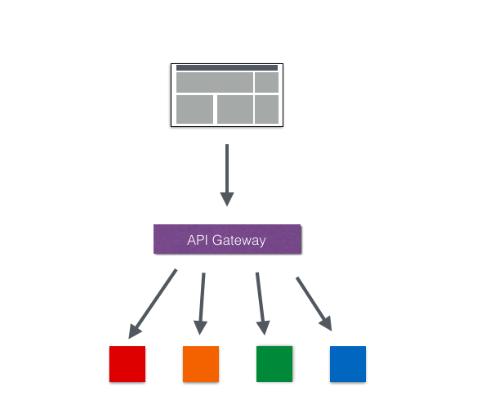   

## 2、数据裁剪以及聚合

通常而言不同的客户端在显示时对于数据的需求是不一致的，比如手机端或者Web端又或者在低延迟的网络环境或者高延迟的网络环境。  

因此为了优化客户端的使用体验，API Gateway可以对通用性的响应数据进行裁剪以适应不同客户端的使用需求。同时还可以将多个API调用逻辑进行聚合，
从而减少客户端的请求数，优化客户端用户体验。  

## 3、多渠道支持

当然我们还可以针对不同的渠道和客户端提供不同的API Gateway,对于该模式的使用由另外一个大家熟知的方式叫Backend for front-end, 
在Backend for front-end模式当中，我们可以针对不同的客户端分别创建其BFF。  

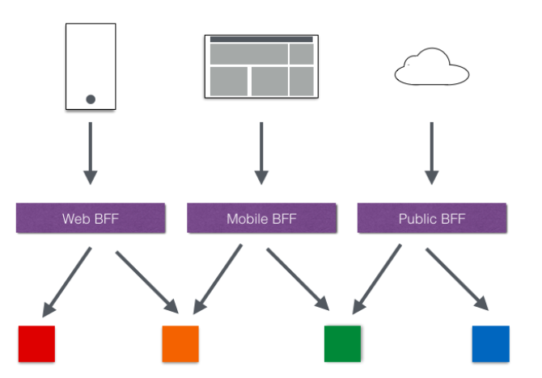  

## 4、遗留系统的微服务化改造

对于系统而言进行微服务改造通常是由于原有的系统存在或多或少的问题，比如技术债务，代码质量，可维护性，可扩展性等等。
API Gateway的模式同样适用于这一类遗留系统的改造，通过微服务化的改造逐步实现对原有系统中的问题的修复，从而提升对于原有业务响应力的提升。
通过引入抽象层，逐步使用新的实现替换旧的实现。 
 
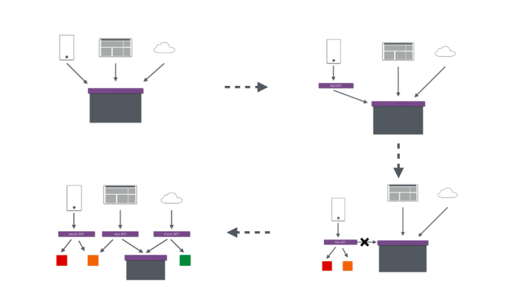  

在Spring Cloud体系中， Spring Cloud Zuul就是提供负载均衡、反向代理、权限认证的一个API gateway。  

Spring Cloud Zuul路由是微服务架构的不可或缺的一部分，提供动态路由，监控，弹性，安全等的边缘服务。Zuul是Netflix出品的一个基于JVM路由和服务端的负载均衡器。  

# Zuul简介

Zuul的主要功能是路由转发和过滤器。路由功能是微服务的一部分，比如／api/user转发到到user服务，/api/shop转发到到shop服务。zuul默认和Ribbon结合实现了负载均衡的功能。    

服务网关是微服务架构中一个不可或缺的部分。通过服务网关统一向外系统提供REST API的过程中，除了具备服务路由、均衡负载功能之外，它还具备了权限控制等功能。     
Spring Cloud Netflix中的Zuul就担任了这样的一个角色，为微服务架构提供了前门保护的作用，同时将权限控制这些较重的非业务逻辑内容迁移到服务路由层面，
使得服务集群主体能够具备更高的可复用性和可测试性。  

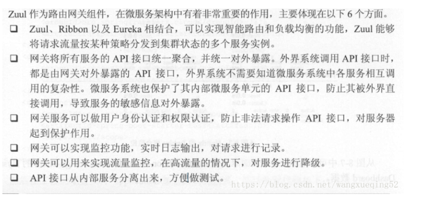 

zuul有以下功能：  
  Authentication  
  Insights  
  Stress Testing  
  Canary Testing  
  Dynamic Routing  
  Service Migration   
  Load Shedding  
  Security  
  Static Response handling  
  Active/Active traffic management  
  
## Zuul服务网关使用的架构图示    

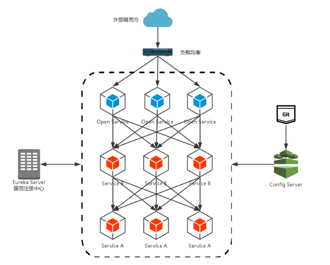 

#  路径匹配规则  

　/api-a/?　　　 可以匹配 /api-a/ 之后拼接一个任务字符的路径 , 比如 /api-a/a , /api-a/b , /api-a/c  

  /api-a/*　　　 可以匹配 /api-a/ 之后拼接任意字符的路径, 比如 /api-a/a, /api-a/aaa, /api-a/bbb . 但它无法匹配 /api-a/a/b 这种多级目录路径  

  /api-a/**　　　可以匹配 /api-a/* 包含的内容之外, 还可以匹配形如 /api-a/a/b 的多级目录路径  
  
# 路由匹配顺序  

随着版本的迭代, 我们需要对一个服务做一些功能拆分, 将原属于 api-a 服务的某些功能拆分到另一个全新的服务 api-a-part 中, 而这些拆分的外部调用 URL 路径希望能够符合规则 /api-a/part/** .  
```
  zuul.routes.api-a.path=/api-a/**  
　zuul.routes.api-a.service-id=api-a  

　zuul.routes.api-a-part.path=/api-a/part/**  
　zuul.routes.api-a-part.service-id=api-a-part  

```
在源码中, 路由规则是通过 LinkedHashMap 保存的, 也就是说, 路由规则的保存时有序的, 而内容的加载是通过遍历配置文件中路由规则依次加入的, 所以导致问题的根本原因是对配置文件中内容的读取, 但上述properties配置无法保证路由规则加载顺序, 
我们需要使用 YML 文件来配置, 以实现有序的路由规则.   

```
zuul:  
    routes:  
        api-a-part:  
            path=/api-a/part/**  
            service-id=api-a-part　  
        api-a:  
            path=/api-a/**  
            service-id=api-a  

```
# 本地跳转

```　  
zuul.routes.api-c.path=/api-c/**
zuul.routes.api-c.url=forward:/api-c
```
以上配置使用了本地跳转,当 url 符合 /api-c/** 规则时,会被网关转发到 自己本身 服务的对应接口.    

# 路由熔断
路由熔断只需要实现FallbackProvider接口即可，实现里面的getRoute()方法和fallbackResponse()方法，
具体代码逻辑请查看CustomZuulFilter类中的相关代码，这里就不展示了。  

注意：Zuul 目前只支持服务级别的熔断，不支持具体到某个URL进行熔断。  

# 路由重试
有时候因为网络或者其它原因，服务可能会暂时的不可用，这个时候我们希望可以再次对服务进行重试，Zuul也帮我们实现了此功能，
需要结合Spring Retry 一起来实现。下面我们以上面的项目为例做演示。  
添加Spring Retry依赖  
首先在fukun-core-zuul-server项目中添加Spring Retry依赖。  
开启Zuul Retry  
再配置文件中配置启用Zuul Retry  

```
#是否开启重试功能
zuul.retryable=true
#对当前服务的重试次数
ribbon.MaxAutoRetries=2
#切换相同Server的次数
ribbon.MaxAutoRetriesNextServer=0
```
这样我们就开启了Zuul的重试功能。  
然后在fukun-core-consul-producer1的控制器中加入如下的代码：  

```
 @GetMapping("/zuul/retry")
    public String zuul() {
        System.out.println("重试次数：" + ac.addAndGet(1));
        try {
            Thread.sleep(1000000);
        } catch (Exception e) {
            System.err.println("失败");
        }
        return "zuul-retry";
    }
```
分别开启fukun-core-consul-producer1和fukun-core-zuul-server，然后访问http://localhost:8888/consul-service-producer/zuul/retry?token=1，
这个时候看一下fukun-core-consul-producer1的控制台，如下：   

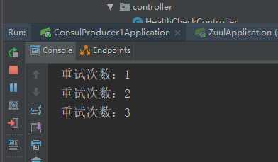   

然后看一下浏览器，如下：  

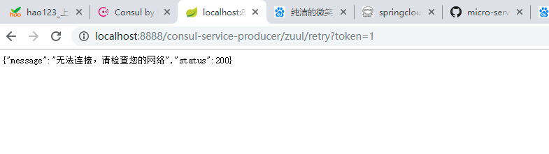   

说明进行了三次请求，也就是进行了两次的重试。这样也就验证了我们的配置信息，完成了Zuul的重试功能。    

注意：  

开启重试在某些情况下是有问题的，比如当压力过大，一个实例停止响应时，路由将流量转到另一个实例，很有可能导致最终所有的实例全被压垮。
说到底，断路器的其中一个作用就是防止故障或者压力扩散。用了retry，断路器就只有在该服务的所有实例都无法运作的情况下才能起作用。
这种时候，断路器的形式更像是提供一种友好的错误信息，或者假装服务正常运行的假象给使用者。

不用retry，仅使用负载均衡和熔断，就必须考虑到是否能够接受单个服务实例关闭和eureka刷新服务列表之间带来的短时间的熔断。
如果可以接受，就无需使用retry。  

# zuul的高可用
为了保证Zuul的高可用性，前端可以同时启动多个Zuul实例进行负载，在Zuul的前端使用Nginx或者F5进行负载转发以达到高可用性。   

 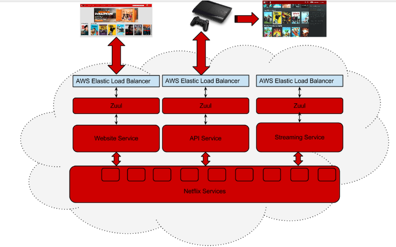  
 
# 请求响应信息输出

## 获取请求信息
系统在生产环境出现问题时，排查问题最好的方式就是查看日志了，日志的记录尽量详细，这样你才能快速定位问题。  
下面带大家学习如何在Zuul中输出请求响应的信息来辅助我们解决一些问题。  
熟悉Zuul的朋友都知道，Zuul中有4种类型过滤器，每种都有特定的使用场景，
要想记录响应数据，那么必须是在请求路由到了具体的服务之后，返回了才有数据，这种需求就适合用post过滤器来实现了。  
在请求被路由到微服务之前，日志输出请求详细的信息，在 ZuulPreFilter 过滤器类中添加如下的内容：  

``` 
        //Zull获取请求信息
        final RequestContext ctx = RequestContext.getCurrentContext();
        // 开启zuul的调试模式
        ctx.setDebugRouting(true);
        ctx.setDebugRequest(true);
        HttpServletRequest request = ctx.getRequest();
        if (log.isInfoEnabled()) {
            log.info("REQUEST:: {} {}:{}", request.getScheme(), request.getRemoteAddr(), request.getRemotePort());
        }
        StringBuilder params = new StringBuilder("?");
        // 获取URL参数
        Enumeration<String> names = request.getParameterNames();
        if (request.getMethod().equals(GET_METHOD)) {
            while (names.hasMoreElements()) {
                String name = names.nextElement();
                params.append(name);
                params.append("=");
                params.append(request.getParameter(name));
                params.append("&");
            }
        }

        if (params.length() > 0) {
            params.delete(params.length() - 1, params.length());
        }

        if (log.isInfoEnabled()) {
            log.info("REQUEST:: > {} {} {} {}", request.getMethod(), request.getRequestURL(), params, request.getProtocol());
        }

        Enumeration<String> headers = request.getHeaderNames();
        while (headers.hasMoreElements()) {
            String name = headers.nextElement();
            String value = request.getHeader(name);
            if (log.isInfoEnabled()) {
                log.info("REQUEST:: > {}:{}", name, value);
            }
        }

        // 获取请求体参数
        if (!ctx.isChunkedRequestBody()) {
            ServletInputStream inp;
            try {
                inp = ctx.getRequest().getInputStream();
                String body;
                if (null != inp) {
                    body = IOUtils.toString(inp);
                    if (log.isInfoEnabled()) {
                        log.info("REQUEST:: > {}", body);
                    }
                }
            } catch (IOException e) {
                e.printStackTrace();
                if (log.isInfoEnabled()) {
                    log.error("出现IO异常！");
                }
            }
        }
```
添加如上代码后，当路由访问某个资源时，就会打印以上配置的请求信息。  

## 获取响应信息

在 ZuulPostFilter 过滤器中添加打印响应信息的逻辑，注意该过滤器的优先级要设置比
ZuulPreFilter 中配置的优先级要低，如下：  

```  

package com.fukun.zuul.filter;

import com.netflix.zuul.ZuulFilter;
import com.netflix.zuul.context.RequestContext;
import io.micrometer.core.instrument.util.IOUtils;
import lombok.extern.slf4j.Slf4j;
import org.springframework.stereotype.Component;

import java.io.InputStream;
import java.util.Optional;

/**
 * 自定义过滤器，需要继承ZuulFilter的类，并覆盖其中的4个方法
 * 比如：我们可以定制一种STATIC类型的过滤器，直接在Zuul中生成响应，
 * 而不将请求转发到后端的微服务。
 * 网关过滤器，对请求进行拦截与过滤
 *
 * @author tangyifei
 * @since 2019-6-13 15:14:27
 * @since jdk1.8
 */
@Slf4j
@Component
public class ZuulPostFilter extends ZuulFilter {

    /**
     * 4种过滤器类型,
     * 　　pre；可以在请求被路由之前调用，可利用这种过滤器实现身份验证、在集群中选择请求的微服务、记录调试信息等。
     * 　　routing：在路由请求时候被调用，这种过滤器将请求路由到微服务。这种过滤器用于构建发送给微服务的请求，并使用Apache HttpClient或Netfilx Ribbon请求微服务。
     * 　　post：在route和error过滤器之后被调用，这种过滤器在路由到微服务以后执行。这种过滤器可用来为响应添加标准的HTTP Header、收集统计信息和指标、将响应从微服务发送给客户端等。
     * 　　error：处理请求时发生错误时被调用，在其他阶段发生错误时执行该过滤器。
     *
     * @return 过滤器类型
     */
    @Override
    public String filterType() {
        return "post";
    }

    /**
     * 优先级为1，数字越大，优先级越低，越后执行
     *
     * @return 优先级
     */
    @Override
    public int filterOrder() {
        return 1;
    }

    /**
     * 是否执行该过滤器，此处为true，说明需要过滤并执行，为false，表示不执行
     *
     * @return 是否应当过滤
     */
    @Override
    public boolean shouldFilter() {
        return true;
    }

    /**
     * 过滤微服务端的响应内容
     *
     * @return 过滤后的响应
     */
    @Override
    public Object run() {
        InputStream stream = RequestContext.getCurrentContext().getResponseDataStream();
        if (null != stream) {
            String body = IOUtils.toString(stream);
            if (log.isInfoEnabled()) {
                log.info("RESPONSE:: > {}", body);
            }
            RequestContext.getCurrentContext().setResponseBody(body);
        }
        return Optional.empty();
    }
}

```
# RequestContext中的调试信息作为响应头输出
首先开启调试功能，如下：  

```
final RequestContext ctx = RequestContext.getCurrentContext();
// 开启zuul的调试模式
ctx.setDebugRouting(true);
ctx.setDebugRequest(true);
```
在配置文件中增加下面的配置即可：  
zuul.include-debug-header=true  

查看响应头中的调试信息，如下：  

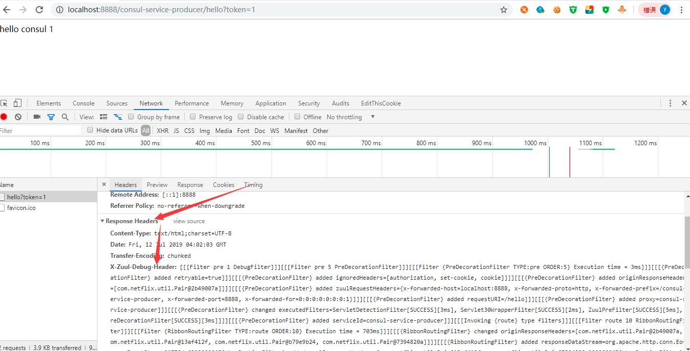  

# 文件上传
通过Zuul上传文件，如果超过1M需要配置上传文件的大小, Zuul和上传的服务都要加上配置： 
 
spring.servlet.multipart.max-file-size=1000Mb  
spring.servlet.multipart.max-request-size=1000Mb  

在zuul这边还有一种方式，在网关的请求地址前面加上/zuul，就可以绕过Spring DispatcherServlet进行上传大文件。  

正常的地址  
http://localhost:2103/zuul-file-demo/file/upload  
绕过的地址  
http://localhost:2103/zuul/zuul-file-demo/file/upload  

`通过加上/zuul前缀可以让Zuul服务不用配置文件上传大小，但是接收文件的服务还是需要配置文件上传大小，否则文件还是会上传失败。`

在上传大文件的时候，时间比较会比较长，这个时候需要设置合理的超时时间来避免超时。  
  
ribbon.ConnectTimeout=3000  
ribbon.ReadTimeout=60000  

在Hystrix隔离模式为线程下zuul.ribbon-isolation-strategy=thread，需要设置Hystrix超时时间。  
  
hystrix.command.default.execution.isolation.thread.timeoutInMilliseconds=60000    

温馨提示：  

当@EnableZuulProxy与Spring Boot Actuator配合使用时，Zuul会暴露一个路由管理端点/routes。  
借助这个端点，可以方便、直观地查看以及管理Zuul的路由。  
将所有端点都暴露出来，增加下面的配置:  

management.endpoints.web.exposure.include=*  

访问 http://localhost:8888/actuator/routes 可以显示所有路由信息：  

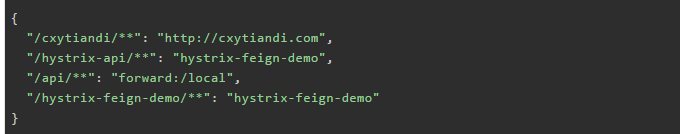   

/fliters端点会返回Zuul中所有过滤器的信息。可以清楚的了解Zuul中目前有哪些过滤器，哪些被禁用了等详细信息。  

访问 http://localhost:8888/actuator/filters 可以显示所有过滤器信息：  

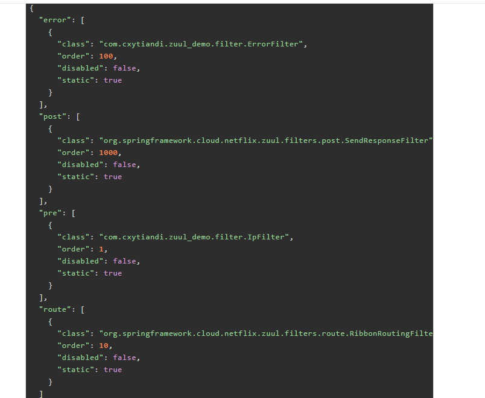    


