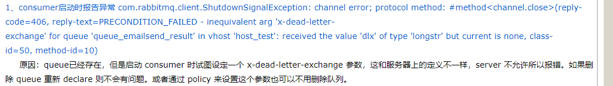
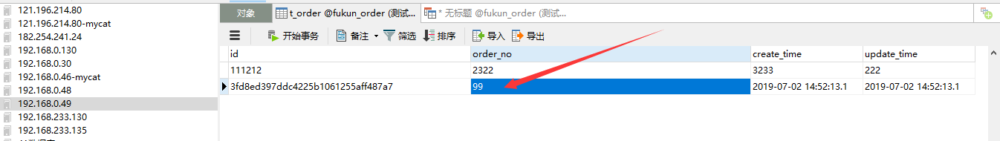
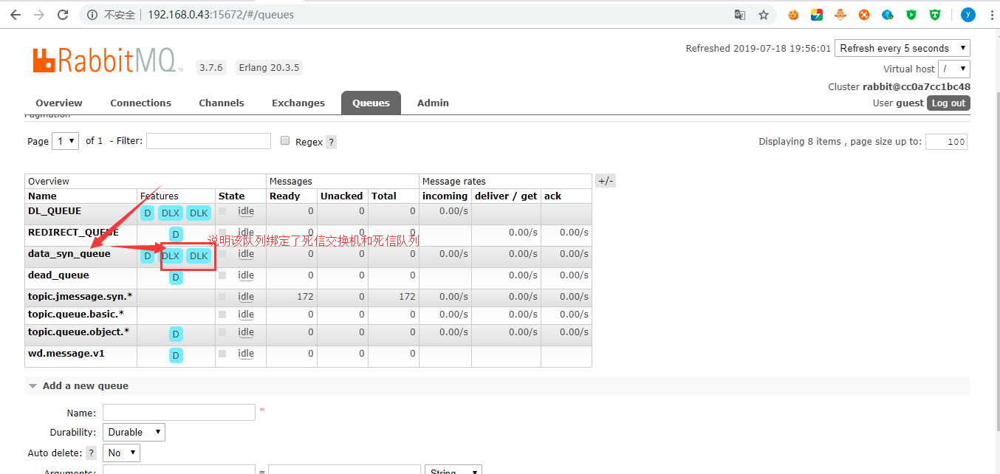
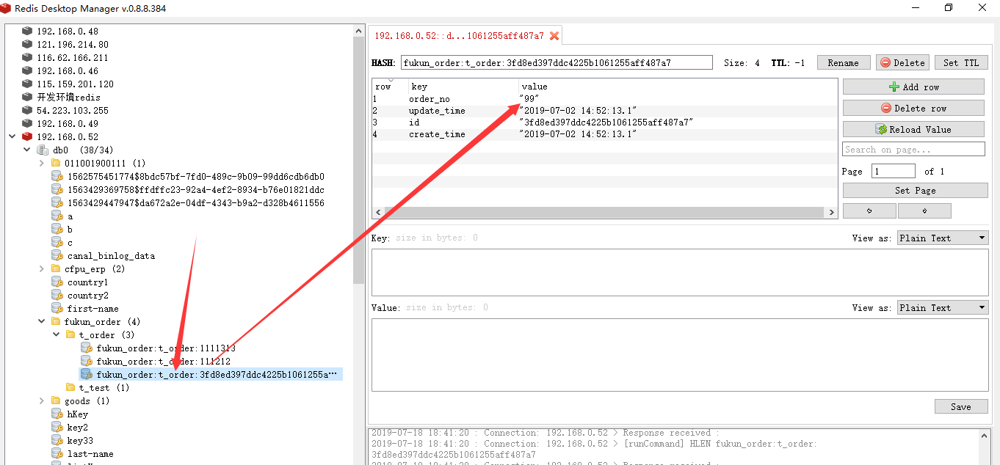

# 核心思想
1、对mysql的修改，添加，删除会产生binlog日志。  
2、对mysql binlog(row) parser 这一步交给canal。  
3、MQ对解析后binlog增量数据进行推送。  
4、redis等相关的nosql对MQ数据进行消费（接收+数据解析，考虑消费速度，MQ队列的阻塞），数据写入/修改到nosql 。 

binlog为记录触发事件，canal的作用是将事件实时通知出来， 并将binlog解析成所有语言都可读，
在事件传输的各个环节 提高 可用性 和 扩展性 （加入MQ等方法）最终提高系统的稳定。  

  

问题1：为什么要使用消息队列（MQ）进行binlog传输？
回答： 增加缓冲，binlog生产端（canal client）只负责生产而不需要考虑消费端的消费能力, 不等待阻塞。  
binlog 消费端: 可实时根据MQ消息的堆积情况，动态 增加/减少 消费端的数量，达到合理的资源利用和消费。  

# 日志增量订阅和消费的业务场景
数据库镜像  
数据库实时备份  
索引构建和实时维护(拆分异构索引、倒排索引等)  
业务 cache 刷新  
带业务逻辑的增量数据处理  

# canal [kə'næl]介绍
译意： 水道/管道/沟渠  
产品定位： 基于数据库增量日志解析，提供增量数据订阅和消费    

## 工作原理
MySQL主备复制原理  

    

MySQL master 将数据变更写入二进制日志( binary log, 其中记录叫做二进制日志事件binary log events，可以通过 show binlog events 进行查看)。  
MySQL slave 将 master 的 binary log events 拷贝到它的中继日志(relay log)。  
MySQL slave 重放 relay log 中事件，将数据变更反映它自己的数据。  

canal 工作原理  

   

canal 模拟 MySQL slave 的交互协议，伪装自己为 MySQL slave ，向 MySQL master 发送dump 协议。  
MySQL master 收到 dump 请求，开始推送 binary log 给 slave (即 canal )。  
canal 解析 binary log 对象(原始为 byte 流) 。  

# 准备
对于自建 MySQL , 需要先开启 Binlog 写入功能，配置 binlog-format 为 ROW 模式，my.cnf 中配置如下：  
```
[mysqld]
log-bin=mysql-bin # 开启 binlog
binlog-format=ROW # 选择 ROW 模式
server_id=1 # 配置 MySQL replaction 需要定义，不要和 canal 的 slaveId 重复
```
注意：针对阿里云 RDS for MySQL , 默认打开了 binlog , 并且账号默认具有 binlog dump 权限 , 不需要任何权限或者 binlog 设置,可以直接跳过这一步。  
授权 canal 链接 MySQL 账号具有作为 MySQL slave 的权限, 如果已有账户可直接 grant。  
```
CREATE USER canal IDENTIFIED BY 'canal';  
FLUSH PRIVILEGES;
GRANT SELECT, REPLICATION SLAVE, REPLICATION CLIENT ON *.* TO 'canal'@'%';
-- GRANT ALL PRIVILEGES ON *.* TO 'canal'@'%' ;
FLUSH PRIVILEGES;
```
# canal server 安装并启动
下载 canal, [访问 release 页面](https://github.com/alibaba/canal/releases) , 选择需要的包下载, 如以 1.0.17 版本为例。  
```
wget https://github.com/alibaba/canal/releases/download/canal-1.0.17/canal.deployer-1.0.17.tar.gz  

```
解压缩  
mkdir /tmp/canal  
tar -zxvf canal.deployer-1.1.0.tar.gz -C /tmp/canal  
解压完成后，进入 /tmp/canal 目录，可以看到如下结构  

  

配置修改  
公共配置  
sudo vim conf/canal.properties    
canal.port= 11111 # canal server 运行端口，保证该端口为占用状态，或者使用其他未占用端口。   
保存退出。   

实例配置  
sudo vi conf/example/instance.properties   
 
```
## mysql serverId
canal.instance.mysql.slaveId = 1234
#position info，需要改成自己的数据库信息
canal.instance.master.address = 127.0.0.1:3306  # mysql连接
canal.instance.master.journal.name = 
canal.instance.master.position = 
canal.instance.master.timestamp = 
#canal.instance.standby.address = 
#canal.instance.standby.journal.name =
#canal.instance.standby.position = 
#canal.instance.standby.timestamp = 
#username/password，需要改成自己的数据库信息
canal.instance.dbUsername = canal  # mysql账号
canal.instance.dbPassword = canal  # 密码
canal.instance.defaultDatabaseName = # 需要同步的库名
canal.instance.connectionCharset = UTF-8 # mysql编码
#table regex
canal.instance.filter.regex = .\*\\\\..\*
```
保存退出。  
canal.instance.connectionCharset 代表数据库的编码方式对应到 java 中的编码类型，比如 UTF-8，GBK , ISO-8859-1。  
如果系统是1个 cpu，需要将 canal.instance.parser.parallel 设置为 false。  

启动  
sh bin/startup.sh  
  

查看 server 日志，canal server端运行日志
vi logs/canal/canal.log  
  

查看 instance 的日志，canal client端连接日志
vi logs/example/example.log  

logs/example/meta.log # 实例binlog 读取记录文件（记录变更位置，默认为新增变更(tail)）  

发现报错，如下：  
   
报错原因：mysql版本的问题。    
解决办法      
以管理员的账号与密码登录，然后执行如下的操作：  
mysql> use mysql;    
mysql> delete from user where user='';     
mysql> flush privileges;    
   
执行 sh bin/stop.sh 关闭canal，重启canal，成功启动日志如下：  
    

# canal client 配置启动
canal client将从canal server获取的binlog数据最终以json行格式保存到指定文件(也可省略这步，
直接发送到MQ)。   
binlog生产端和消费端的之间，增加MQ作为缓冲，增加容错度和动态扩展性。  

**`这里实现的canal客户端，如果 emptyCount 达到了上限120，就退出相关的连接监听，就不在执行数据同步的操作了，
所以可以调节上限 totalEmptyCount ，但一般不需要改动，因为数据库的记录只要用户使用系统，都会导致数据库
相关记录的变更，这样就会产生binlog日志，emptyCount 的值不会一直增加，达到上限。  `**

## 依赖配置
``` 
<dependency>
    <groupId>com.alibaba.otter</groupId>
    <artifactId>canal.client</artifactId>
    <version>1.1.0</version>
</dependency>
```

## 增加canal服务端的连接信息
修改 application.yml，添加连接canal服务端的连接信息配置，如下：  
```
canal:
  server:
    ip: 192.168.0.43
    port: 11111
    dest: example
    userName:
    userPass:
```    
## 增加从canal服务端读取binlog的canal客户端相关的类  
相关的类是 CanalClient，进入该类自己查看相应的业务逻辑。  

## 启动类中获取 CanalClient，程序启动的时候进行监听服务端的 binlog 日志的获取  

```
 public static void main(String[] args) {
        SpringApplication.run(DataSynApplication.class, args);
        CanalClient canalClient = SpringContext.getBean(CanalClient.class);
        canalClient.createConnect();
    }
```

启动项目，修改数据库相关的表的记录，控制台打印日志如下：    
    

下面我们优化以上的逻辑，就是把监控到的binlog以json格式发送到rabbitmq中，然后redis异步从
rabbitmq中获取数据进行数据库中的数据与缓存中的数据的数据同步，实际的生产环境要保证redis与
rabbitmq的高可用。  

在 application.yml 文件中增加一个 messageComponentType，用于判断使用哪种消息中间件，
messageComponentType 数值对应 MessageComponentTypeEnums类中的枚举值定义，如下：    

```  
canal:
  server:
    ip: 192.168.0.43
    port: 11111
    dest: example
    userName:
    userPass:
    # 1表示rabbitMq 2表示redis 3表示kafka 4表示rocket
    messageComponentType: 1
```
然后修改启动类，分别注入 RabbitTemplate 类、RedisHandler类，不要使用@Resource注解，
不然会报空指针，如下：  
```
 RabbitTemplate rabbitTemplate = SpringContext.getBean(RabbitTemplate.class);
 RedisHandler redisHandler = SpringContext.getBean(RedisHandler.class);
```

创建 MessageEntry 类，这个类主要是封装binlog相关的消息数据，具体查看代码，其实使用HashMap比使用MessageEntry类要好。    

修改 CanalClient 类，增加如下代码：
```  
  if (entry.getEntryType() == EntryType.TRANSACTIONBEGIN || entry.getEntryType() == EntryType.TRANSACTIONEND) {
             return;
         }
 
         RowChange rowChange;
         try {
             rowChange = RowChange.parseFrom(entry.getStoreValue());
         } catch (Exception e) {
             throw new RuntimeException("ERROR ## parser of eromanga-event has an error , data:" + entry.toString(),
                     e);
         }
 
         // 获取事件类型 UPDATE INSERT DELETE CREATE ALTER ERASE
         EventType eventType = rowChange.getEventType();
         if (log.isInfoEnabled()) {
             log.info(String.format("================>>>>binlog[%s:%s] , name[%s,%s] , eventType : %s",
                     entry.getHeader().getLogfileName(), entry.getHeader().getLogfileOffset(),
                     entry.getHeader().getSchemaName(), entry.getHeader().getTableName(),
                     eventType));
         }
         resultMap.put("logfileName", entry.getHeader().getLogfileName());
         resultMap.put("logfileOffset", entry.getHeader().getLogfileOffset());
         resultMap.put("schemaName", entry.getHeader().getSchemaName());
         resultMap.put("tableName", entry.getHeader().getTableName());
         for(RowData rowData : rowChange.getRowDatasList()) {
             if (eventType == EventType.DELETE) {
                 resultMap.put("eventType", EventType.DELETE);
                 printColumn(rowData.getBeforeColumnsList(), 1, resultMap);
             } else if (eventType == EventType.INSERT) {
                 resultMap.put("eventType", EventType.INSERT);
                 printColumn(rowData.getAfterColumnsList(), 1, resultMap);
             } else {
                 resultMap.put("eventType", EventType.UPDATE);
                 if (log.isInfoEnabled()) {
                     log.info("------->>> 更新之前的行数据");
                 }
                 printColumn(rowData.getBeforeColumnsList(), 0, resultMap);
                 if (log.isInfoEnabled()) {
                     log.info("------->>> 更新之后的行数据");
                 }
                 printColumn(rowData.getAfterColumnsList(), 1, resultMap);
             }
         }
         // 发送消息到rabbitMq
         sendToRabbitmq(resultMap, rabbitTemplate, redisHandler);
```
这段代码就是将canal监控到的binlog发送给消息队列rabbitmq，并设置消息重发次数等操作，具体请查看
CanalClient 类的 sendToRabbitmq 方法，重发策略等保证生产端到mq的消息不丢失的具体实现请参考
fukun-message-queue-rabbitmq-producer 中的代码实现。  

修改rabbitmq的配置，这里使用了 fanout 类型的交换机，使用死信队列避免消费端消费失败而导致mq到消费端的消息丢失问题。  
RabbitMqConfiguration 类的配置请参考代码。

**`备注：在实际的开发过程中，不要把消费端与生产端都写在一个程序里， 应该分开写，不然体现不了rabbitmq的异步解耦
等特性，并且当生产消息的速率大于消毒消息的速率的时候，可以多起几个消费端实例扩大消费，这样可以避免消息队列的
消息积压问题`。**  
 
下面说一下死信队列的实现，就是我这里面 data_syn_queue 队列绑定死信交换机 dead_exchange，当 data_syn_queue 
队列中的消息消费失败，data_syn_queue 中的被消费者消费失败消息会进入死信队列中，这里的死信队列是 dead_queue，
消费者开一个后台线程监听死信队列，处理之前处理失败的消息。
如果在没有添加死信队列的功能之前添加过队列 data_syn_queue ，那么当使用死信队列的时候，请在rabbitmq的控制台删除该死信队列，不然
会报如下类似的错误：  
    

配置 data_syn_queue 队列绑定死信交换机与死信队列，如下：  

```
 @Bean
    public Queue fanOutQueue() {
        Map<String, Object> args = new HashMap<>(2);
        // 设置队列中的消息 10s 钟后过期
        // args.put("x-message-ttl", 10000);
//       x-dead-letter-exchange    声明  死信交换机
        args.put("x-dead-letter-exchange", RabbitMqConstants.DEAD_LETTER_EXCHANGE_NAME);
//       x-dead-letter-routing-key    声明 死信路由键
        args.put("x-dead-letter-routing-key", RabbitMqConstants.DEAD_LETTER_ROUTING_KEY);
        // 队列持久化
        return new Queue(Constants.FANOUT_QUEUE_NAME, true, false, false, args);
    }
```
其他的请参考代码，这里注意我使用的是fanout类型的交换机，如果你用topic等类型的交换机
并且在定义死信交换机时，清修改 ExchangeBuilder.fanoutExchange() 为 ExchangeBuilder.topicExchange()，

修改消费端 RabbitMqConsumer 的代码，在RabbitMqConsumer的handleObjectMessage方法中，我故意使用 int a = 1 / 0，抛异常，
让消费端消费消息失败，测试消费失败的消息是否进入了死信队列而重新被消费，监控死信队列的代码是RabbitMqConsumer
中的redirect方法，具体实现请看代码，在redirect方法中监控死信队列中的消息，然后同步到redis中，同步到redis中的代码逻辑请参考
RabbitMqConsumer类中的synRedis的方法。  
启动工程，修改数据库的相关记录，如下：  
  

查看控制台和rabbitmq的控制台，如下：  
  

控制台的部分输出如下：  

```
java.lang.ArithmeticException: / by zero
	at com.fukun.syn.consumer.RabbitMqConsumer.handleObjectMessage(RabbitMqConsumer.java:41) ~[classes/:na]
	at sun.reflect.NativeMethodAccessorImpl.invoke0(Native Method) ~[na:1.8.0_144]
	at sun.reflect.NativeMethodAccessorImpl.invoke(NativeMethodAccessorImpl.java:62) ~[na:1.8.0_144]
	at sun.reflect.DelegatingMethodAccessorImpl.invoke(DelegatingMethodAccessorImpl.java:43) ~[na:1.8.0_144]
	at java.lang.reflect.Method.invoke(Method.java:498) ~[na:1.8.0_144]
	at org.springframework.messaging.handler.invocation.InvocableHandlerMethod.doInvoke(InvocableHandlerMethod.java:171) [spring-messaging-5.1.8.RELEASE.jar:5.1.8.RELEASE]
	at org.springframework.messaging.handler.invocation.InvocableHandlerMethod.invoke(InvocableHandlerMethod.java:120) [spring-messaging-5.1.8.RELEASE.jar:5.1.8.RELEASE]
	at org.springframework.amqp.rabbit.listener.adapter.HandlerAdapter.invoke(HandlerAdapter.java:50) [spring-rabbit-2.1.7.RELEASE.jar:2.1.7.RELEASE]
	at org.springframework.amqp.rabbit.listener.adapter.MessagingMessageListenerAdapter.invokeHandler(MessagingMessageListenerAdapter.java:196) [spring-rabbit-2.1.7.RELEASE.jar:2.1.7.RELEASE]
	at org.springframework.amqp.rabbit.listener.adapter.MessagingMessageListenerAdapter.onMessage(MessagingMessageListenerAdapter.java:129) [spring-rabbit-2.1.7.RELEASE.jar:2.1.7.RELEASE]
	at org.springframework.amqp.rabbit.listener.AbstractMessageListenerContainer.doInvokeListener(AbstractMessageListenerContainer.java:1552) [spring-rabbit-2.1.7.RELEASE.jar:2.1.7.RELEASE]
	at org.springframework.amqp.rabbit.listener.AbstractMessageListenerContainer.actualInvokeListener(AbstractMessageListenerContainer.java:1478) [spring-rabbit-2.1.7.RELEASE.jar:2.1.7.RELEASE]
	at org.springframework.amqp.rabbit.listener.AbstractMessageListenerContainer.invokeListener(AbstractMessageListenerContainer.java:1466) [spring-rabbit-2.1.7.RELEASE.jar:2.1.7.RELEASE]
	at org.springframework.amqp.rabbit.listener.AbstractMessageListenerContainer.doExecuteListener(AbstractMessageListenerContainer.java:1461) [spring-rabbit-2.1.7.RELEASE.jar:2.1.7.RELEASE]
	at org.springframework.amqp.rabbit.listener.AbstractMessageListenerContainer.executeListener(AbstractMessageListenerContainer.java:1410) [spring-rabbit-2.1.7.RELEASE.jar:2.1.7.RELEASE]
	at org.springframework.amqp.rabbit.listener.SimpleMessageListenerContainer.doReceiveAndExecute(SimpleMessageListenerContainer.java:870) ~[spring-rabbit-2.1.7.RELEASE.jar:2.1.7.RELEASE]
	at org.springframework.amqp.rabbit.listener.SimpleMessageListenerContainer.receiveAndExecute(SimpleMessageListenerContainer.java:854) ~[spring-rabbit-2.1.7.RELEASE.jar:2.1.7.RELEASE]
	at org.springframework.amqp.rabbit.listener.SimpleMessageListenerContainer.access$1600(SimpleMessageListenerContainer.java:78) ~[spring-rabbit-2.1.7.RELEASE.jar:2.1.7.RELEASE]
	at org.springframework.amqp.rabbit.listener.SimpleMessageListenerContainer$AsyncMessageProcessingConsumer.mainLoop(SimpleMessageListenerContainer.java:1137) ~[spring-rabbit-2.1.7.RELEASE.jar:2.1.7.RELEASE]
	at org.springframework.amqp.rabbit.listener.SimpleMessageListenerContainer$AsyncMessageProcessingConsumer.run(SimpleMessageListenerContainer.java:1043) ~[spring-rabbit-2.1.7.RELEASE.jar:2.1.7.RELEASE]
	at java.lang.Thread.run(Thread.java:748) ~[na:1.8.0_144]

2019-07-18 19:58:56.204  INFO 15696 --- [ntContainer#0-1] com.fukun.syn.consumer.RabbitMqConsumer  : dead message  10s 后 消费消息 {"logfileName":"mysql-bin.000008","logfileOffset":141821,"schemaName":"cfpu_erp","tableName":"t_exchange_rate","eventType":"INSERT"

```
消息处理失败，消费者会从死信队列中获取之前处理失败的消息再次消费，建议在实际的开发中，最好开一个后台线程去处理失败的消息。  

然后查看redis中的数据有没有同步成功，如下：  
  
说明同步成功。  

[阿里巴巴 MySQL binlog 增量订阅&消费组件](https://github.com/alibaba/canal)

[其他代码实现参考](https://github.com/BooksCup/canal-client)


  


  


