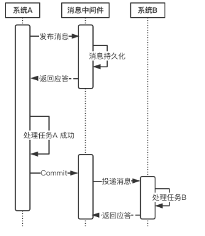
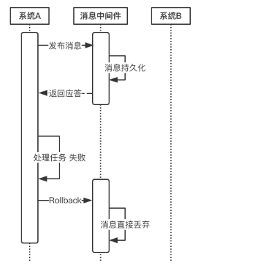
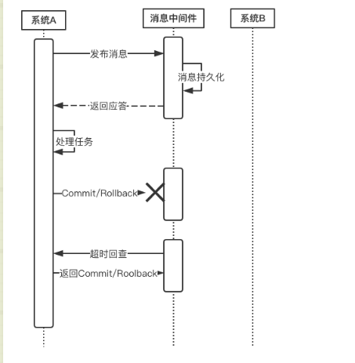

# 分布式事务
## 前沿
众所周知，数据库能实现本地事务，也就是在同一个数据库中，你可以允许一组操作要么全都正确执行，要么全都不执行。  
这里特别强调了本地事务，也就是目前的数据库只能支持同一个数据库中的事务。  
但现在的系统往往采用微服务架构，业务系统拥有独立的数据库，因此就出现了跨多个数据库的事务需求，这种事务即为“分布式事务”。  
那么在目前数据库不支持跨库事务的情况下，我们应该如何实现分布式事务呢？

## 什么是事务？
事务由一组操作构成，我们希望这组操作能够全部正确执行，如果这一组操作中的任意一个步骤发生错误，那么就需要回滚之前已经完成的操作。  
也就是同一个事务中的所有操作，要么全都正确执行，要么全都不要执行。

## 事务的四大特性 ACID
说到事务，就不得不提一下事务著名的四大特性。  
### 原子性 
原子性要求，事务是一个不可分割的执行单元，事务中的所有操作要么全都执行，要么全都不执行。  
### 一致性 
一致性要求，事务在开始前和结束后，数据库的完整性约束没有被破坏。  
### 隔离性 
事务的执行是相互独立的，它们不会相互干扰，一个事务不会看到另一个正在运行过程中的事务的数据。  
### 持久性 
持久性要求，一个事务完成之后，事务的执行结果必须是持久化保存的。即使数据库发生崩溃，在数据库恢复后事务提交的结果仍然不会丢失。 

注意：**事务只能保证数据库的高可靠性，即数据库本身发生问题后，事务提交后的数据仍然能恢复；而如果不是数据库本身的故障，如硬盘损坏了，  
那么事务提交的数据可能就丢失了。这属于『高可用性』的范畴。因此，事务只能保证数据库的『高可靠性』，而『高可用性』需要整个系统共同配合实现。** 

## 事务的隔离级别
在事务的四大特性ACID中，要求的隔离性是一种严格意义上的隔离，也就是多个事务是串行执行的，彼此之间不会受到任何干扰。  
这确实能够完全保证数据的安全性，但在实际业务系统中，这种方式性能不高。因此，数据库定义了四种隔离级别，  
隔离级别和数据库的性能是呈反比的，**隔离级别越低，数据库性能越高，而隔离级别越高，数据库性能越差**。

### 事务并发执行会出现的问题
#### 更新丢失 （更新覆盖）
当有两个并发执行的事务，更新同一行数据，那么有可能一个事务会把另一个事务的更新覆盖掉。   
当数据库没有加任何锁操作的情况下会发生。
#### 脏读
一个事务读到另一个尚未提交的事务中的数据。该数据可能会被回滚从而失效。 如果第一个事务拿着失效的数据去处理那就发生错误了。
#### 不可重复读 
不可重复度的含义：一个事务对同一行数据读了两次，却得到了不同的结果。它具体分为如下两种情况：  

虚读：在事务1两次读取同一记录的过程中，事务2对该记录进行了修改，从而事务1第二次读到了不一样的记录。  
幻读：事务1在两次查询的过程中，事务2对该表进行了插入、删除操作，从而事务1第二次查询的结果发生了变化。

### 不可重复读与脏读的区别？ 
脏读读到的是尚未提交的数据，而不可重复读读到的是已经提交的数据，只不过在两次读的过程中数据被另一个事务改过了。  

## 数据库的四种隔离级别
数据库一共有如下四种隔离级别： 
 
### Read uncommitted 读未提交 
在该级别下，一个事务对一行数据修改的过程中，不允许另一个事务对该行数据进行修改，但允许另一个事务对该行数据读。  
因此本级别下，不会出现更新丢失，但会出现脏读、不可重复读。  

### Read committed 读提交 
在该级别下，未提交的写事务不允许其他事务访问该行，因此不会出现脏读；但是读取数据的事务允许其他事务的访问该行数据，因此会出现不可重复读的情况。

### Repeatable read 重复读 
在该级别下，读事务禁止写事务，但允许读事务，因此不会出现同一事务两次读到不同的数据的情况（不可重复读），且写事务禁止其他一切事务。  

### Serializable 序列化  
该级别要求所有事务都必须串行执行，因此能避免一切因并发引起的问题，但效率很低。  

隔离级别越高，越能保证数据的完整性和一致性，但是对并发性能的影响也越大。  
对于多数应用程序，可以优先考虑把数据库系统的隔离级别设为Read Committed。  
它能够避免脏读取，而且具有较好的并发性能。尽管它会导致不可重复读、幻读和第二类丢失更新这些并发问题，在可能出现这类问题的个别场合，可以由应用程序采用悲观锁或乐观锁来控制。

## 什么是分布式事务？
上面介绍的事务都是基于单数据库的本地事务，目前的数据库仅支持单库事务，并不支持跨库事务。  
而随着微服务架构的普及，一个大型业务系统往往由若干个子系统构成，这些子系统又拥有各自独立的数据库。  
往往一个业务流程需要由多个子系统共同完成，而且这些操作可能需要在一个事务中完成。  
在微服务系统中，这些业务场景是普遍存在的。此时，我们就需要在数据库之上通过某种手段，  
实现支持跨数据库的事务支持，这也就是大家常说的“分布式事务”。

这里举一个分布式事务的典型例子——用户下单过程。   
当我们的系统采用了微服务架构后，一个电商系统往往被拆分成如下几个子系统：商品系统、订单系统、支付系统、积分系统等。整个下单的过程如下：  
1、用户通过商品系统浏览商品，他看中了某一项商品，便点击下单  
2、此时订单系统会生成一条订单  
3、订单创建成功后，支付系统提供支付功能  
4、当支付完成后，由积分系统为该用户增加积分  

上述步骤2、3、4需要在一个事务中完成。对于传统单体应用而言，实现事务非常简单，只需将这三个步骤放在一个方法A中，  
再用Spring的@Transactional注解标识该方法即可。Spring通过数据库的事务支持，保证这些步骤要么全都执行完成，要么全都不执行。  
但在这个微服务架构中，这三个步骤涉及三个系统，涉及三个数据库，此时我们必须在数据库和应用系统之间，通过某项黑科技，实现分布式事务的支持。

## CAP理论
CAP理论说的是：在一个分布式系统中，最多只能满足C、A、P中的两个需求。 
 
CAP的含义：  
### C：Consistency 一致性 
同一数据的多个副本是否实时相同。  
### A：Availability 可用性 
可用性：一定时间内系统返回一个明确的结果 则称为该系统可用。  
### P：Partition tolerance 分区容错性 
将同一服务分布在多个系统中，从而保证某一个系统宕机，仍然有其他系统提供相同的服务。 
 
CAP理论告诉我们，在分布式系统中，C、A、P三个条件中我们最多只能选择两个。那么问题来了，究竟选择哪两个条件较为合适呢？  

对于一个业务系统来说，可用性和分区容错性是必须要满足的两个条件，并且这两者是相辅相成的。  

业务系统之所以使用分布式系统，主要原因有两个：
  
### 提升整体性能 
**当业务量猛增，单个服务器已经无法满足我们的业务需求的时候，就需要使用分布式系统，使用多个节点提供相同的功能，
从而整体上提升系统的性能，这就是使用分布式系统的第一个原因。**

### 实现分区容错性 
**单一节点 或 多个节点处于相同的网络环境下，那么会存在一定的风险，万一该机房断电、该地区发生自然灾害，
那么业务系统就全面瘫痪了。为了防止这一问题，采用分布式系统，将多个子系统分布在不同的地域、
不同的机房中，从而保证系统高可用性。**

这说明分区容错性是分布式系统的根本，如果分区容错性不能满足，那使用分布式系统将失去意义。  

此外，可用性对业务系统也尤为重要。在大谈用户体验的今天，如果业务系统时常出现“系统异常”、响应时间过长等情况，
这使得用户对系统的好感度大打折扣，在互联网行业竞争激烈的今天，相同领域的竞争者不甚枚举，
系统的间歇性不可用会立马导致用户流向竞争对手。因此，我们只能通过牺牲一致性来换取系统的可用性和分区容错性。这也就是下面要介绍的BASE理论。

## BASE理论（牺牲强一致性换取弱一致性）
CAP理论告诉我们一个悲惨但不得不接受的事实——我们只能在C、A、P中选择两个条件。而对于业务系统而言，我们往往选择牺牲一致性来换取系统的可用性和分区容错性。不过这里要指出的是，
所谓的“牺牲一致性”并不是完全放弃数据一致性，而是牺牲强一致性换取弱一致性。下面来介绍下BASE理论。

### BA：Basic Available 基本可用   
整个系统在某些不可抗力的情况下，仍然能够保证“可用性”，即一定时间内仍然能够返回一个明确的结果。只不过“基本可用”和“高可用”的区别是： 
1、“一定时间”可以适当延长   
当举行大促时，响应时间可以适当延长。  

2、给部分用户返回一个降级页面   
给部分用户直接返回一个降级页面，从而缓解服务器压力。但要注意，返回降级页面仍然是返回明确结果。  

### S：Soft State：柔性状态 
同一数据的不同副本的状态，可以不需要实时一致。  

### E：Eventual Consistency：最终一致性 
同一数据的不同副本的状态，可以不需要实时一致，但一定要保证经过一定时间后仍然是一致的。  

## 酸碱平衡
ACID能够保证事务的强一致性，即数据是实时一致的。这在本地事务中是没有问题的，在分布式事务中，强一致性会极大影响分布式系统的性能，
因此分布式系统中遵循BASE理论即可。但分布式系统的不同业务场景对一致性的要求也不同。如交易场景下，就要求强一致性，
此时就需要遵循ACID理论，而在注册成功后发送短信验证码等场景下，并不需要实时一致，因此遵循BASE理论即可。因此要根据具体业务场景，
在ACID和BASE之间寻求平衡。

## 分布式事务协议
下面介绍几种实现分布式事务的协议。  

### 两阶段提交协议 2PC
分布式系统的一个难点是如何保证架构下多个节点在进行事务性操作的时候保持数据一致性。为实现这个目的，二阶段提交算法的成立基于以下假设： 
1、该分布式系统中，存在一个节点作为协调者(Coordinator)，其他节点作为参与者(Cohorts)。且节点之间可以进行网络通信。    
2、所有节点都采用预写式日志，且日志被写入后即被保持在可靠的存储设备上，即使节点损坏不会导致日志数据的消失。  
3、所有节点不会永久性损坏，即使损坏后仍然可以恢复。  

#### 第一阶段（投票阶段）：  
1、协调者节点向所有参与者节点询问是否可以执行提交操作(vote)，并开始等待各参与者节点的响应。  
2、参与者节点执行询问发起为止的所有事务操作，并将Undo信息和Redo信息写入日志。（注意：若成功这里其实每个参与者已经执行了事务操作）  
3、各参与者节点响应协调者节点发起的询问。如果参与者节点的事务操作实际执行成功，则它返回一个”同意”消息；如果参与者节点的事务操作实际执行失败，则它返回一个”中止”消息。  

#### 第二阶段（提交执行阶段）：
1、协调者节点向所有参与者节点发出”正式提交(commit)”的请求。  
2、参与者节点正式完成操作，并释放在整个事务期间内占用的资源。  
3、参与者节点向协调者节点发送”完成”消息。  
4、协调者节点收到所有参与者节点反馈的”完成”消息后，完成事务。 

如果任一参与者节点在第一阶段返回的响应消息为”中止”，或者 协调者节点在第一阶段的询问超时之前无法获取所有参与者节点的响应消息时：  
1、协调者节点向所有参与者节点发出”回滚操作(rollback)”的请求。  
2、参与者节点利用之前写入的Undo信息执行回滚，并释放在整个事务期间内占用的资源。  
3、参与者节点向协调者节点发送”回滚完成”消息。  
4、协调者节点收到所有参与者节点反馈的”回滚完成”消息后，取消事务。

不管最后结果如何，第二阶段都会结束当前事务。  

二阶段提交看起来确实能够提供原子性的操作，但是不幸的事，二阶段提交还是有几个缺点的：  
1、执行过程中，所有参与节点都是事务阻塞型的。当参与者占有公共资源时，其他第三方节点访问公共资源不得不处于阻塞状态。  
2、参与者发生故障。协调者需要给每个参与者额外指定超时机制，超时后整个事务失败。（没有多少容错机制）
3、协调者发生故障。参与者会一直阻塞下去。需要额外的备机进行容错。（这个可以依赖后面要讲的Paxos协议实现HA）  
4、二阶段无法解决的问题：协调者再发出commit消息之后宕机，而唯一接收到这条消息的参与者同时也宕机了。
那么即使协调者通过选举协议产生了新的协调者，这条事务的状态也是不确定的，没人知道事务是否被已经提交。  

### 三阶段提交协议 3PC
与两阶段提交不同的是，三阶段提交有两个改动点。  
1、引入超时机制。同时在协调者和参与者中都引入超时机制。  
2、在第一阶段和第二阶段中插入一个准备阶段。保证了在最后提交阶段之前各参与节点的状态是一致的。  

也就是说，除了引入超时机制之外，3PC把2PC的准备阶段再次一分为二，这样三阶段提交就有CanCommit、PreCommit、DoCommit三个阶段。  

#### CanCommit阶段 
3PC的CanCommit阶段其实和2PC的准备阶段很像。协调者向参与者发送commit请求，参与者如果可以提交就返回Yes响应，否则返回No响应。  

1、事务询问   
协调者向参与者发送CanCommit请求。询问是否可以执行事务提交操作。然后开始等待参与者的响应。  

2、响应反馈   
参与者接到CanCommit请求之后，正常情况下，如果其自身认为可以顺利执行事务，则返回Yes响应，并进入预备状态。否则反馈No。  

#### PreCommit阶段
协调者根据参与者的反应情况来决定是否可以记性事务的PreCommit操作。根据响应情况，有以下两种可能。   
假如协调者从所有的参与者获得的反馈都是Yes响应，那么就会执行事务的预执行。  
  
1、发送预提交请求  
协调者向参与者发送PreCommit请求，并进入Prepared阶段。  

2、事务预提交   
参与者接收到PreCommit请求后，会执行事务操作，并将undo和redo信息记录到事务日志中。  

3、响应反馈 
如果参与者成功的执行了事务操作，则返回ACK响应，同时开始等待最终指令。  

假如有任何一个参与者向协调者发送了No响应，或者等待超时之后，协调者都没有接到参与者的响应，那么就执行事务的中断。

1、发送中断请求   
协调者向所有参与者发送abort请求。  

2、中断事务   
参与者收到来自协调者的abort请求之后（或超时之后，仍未收到协调者的请求），执行事务的中断。  

#### doCommit阶段 
该阶段进行真正的事务提交，也可以分为以下两种情况。  

1、执行提交  
发送提交请求   
协调接收到参与者发送的ACK响应，那么他将从预提交状态进入到提交状态。并向所有参与者发送doCommit请求。  

事务提交   
参与者接收到doCommit请求之后，执行正式的事务提交。并在完成事务提交之后释放所有事务资源。  

响应反馈   
事务提交完之后，向协调者发送Ack响应。  

完成事务   
协调者接收到所有参与者的ack响应之后，完成事务。  

2、中断事务  
协调者没有接收到参与者发送的ACK响应（可能是接受者发送的不是ACK响应，也可能响应超时），那么就会执行中断事务。  

发送中断请求   
协调者向所有参与者发送abort请求  

事务回滚   
参与者接收到abort请求之后，利用其在阶段二记录的undo信息来执行事务的回滚操作，并在完成回滚之后释放所有的事务资源。  

反馈结果   
参与者完成事务回滚之后，向协调者发送ACK消息  

中断事务   
协调者接收到参与者反馈的ACK消息之后，执行事务的中断。  

## 分布式事务的解决方案
全局消息  
基于可靠消息服务的分布式事务  
TCC  
最大努力通知  

### 方案1：全局事务（DTP模型）
全局事务基于DTP模型实现。DTP是由X/Open组织提出的一种分布式事务模型——X/Open Distributed Transaction Processing Reference Model。
它规定了要实现分布式事务，需要三种角色：  

AP：Application 应用系统   
它就是我们开发的业务系统，在我们开发的过程中，可以使用资源管理器提供的事务接口来实现分布式事务。  

TM：Transaction Manager 事务管理器  
1、分布式事务的实现由事务管理器来完成，它会提供分布式事务的操作接口供我们的业务系统调用。这些接口称为TX接口。  
2、事务管理器还管理着所有的资源管理器，通过它们提供的XA接口来统一调度这些资源管理器，以实现分布式事务。  
3、DTP只是一套实现分布式事务的规范，并没有定义具体如何实现分布式事务，TM可以采用2PC、3PC、Paxos等协议实现分布式事务。  

RM：Resource Manager 资源管理器  
1、能够提供数据服务的对象都可以是资源管理器，比如：数据库、消息中间件、缓存等。大部分场景下，数据库即为分布式事务中的资源管理器。  
2、资源管理器能够提供单数据库的事务能力，它们通过XA接口，将本数据库的提交、回滚等能力提供给事务管理器调用，以帮助事务管理器实现分布式的事务管理。  
3、XA是DTP模型定义的接口，用于向事务管理器提供该资源管理器(该数据库)的提交、回滚等能力。  
4、DTP只是一套实现分布式事务的规范，RM具体的实现是由数据库厂商来完成的。  

### 方案2：基于可靠消息服务的分布式事务  
这种实现分布式事务的方式需要通过消息中间件来实现。假设有A和B两个系统，分别可以处理任务A和任务B。
此时系统A中存在一个业务流程，需要将任务A和任务B在同一个事务中处理。下面来介绍基于消息中间件来实现这种分布式事务。   

1、在系统A处理任务A前，首先向消息中间件发送一条消息。  
2、消息中间件收到后将该条消息持久化，但并不投递。此时下游系统B仍然不知道该条消息的存在。  
3、消息中间件持久化成功后，便向系统A返回一个确认应答。  
4、系统A收到确认应答后，则可以开始处理任务A。  
5、任务A处理完成后，向消息中间件发送Commit请求。该请求发送完成后，对系统A而言，该事务的处理过程就结束了，此时它可以处理别的任务了。
但commit消息可能会在传输途中丢失，从而消息中间件并不会向系统B投递这条消息，从而系统就会出现不一致性。这个问题由消息中间件的事务回查机制完成，下文会介绍。  
6、消息中间件收到Commit指令后，便向系统B投递该消息，从而触发任务B的执行。  
7、当任务B执行完成后，系统B向消息中间件返回一个确认应答，告诉消息中间件该消息已经成功消费，此时，这个分布式事务完成。

上述过程可以得出如下几个结论：  
1. 消息中间件扮演者分布式事务协调者的角色。   
2. 系统A完成任务A后，到任务B执行完成之间，会存在一定的时间差。在这个时间差内，
整个系统处于数据不一致的状态，但这短暂的不一致性是可以接受的，因为经过短暂的时间后，系统又可以保持数据一致性，满足BASE理论。  

上述过程中，如果任务A处理失败，那么需要进入回滚流程，如下图所示：  
  
若系统A在处理任务A时失败，那么就会向消息中间件发送Rollback请求。和发送Commit请求一样，
系统A发完之后便可以认为回滚已经完成，它便可以去做其他的事情。
消息中间件收到回滚请求后，直接将该消息丢弃，而不投递给系统B，从而不会触发系统B的任务B。

此时系统又处于一致性状态，因为任务A和任务B都没有执行。  

上面所介绍的Commit和Rollback都属于理想情况，但在实际系统中，Commit和Rollback指令都有可能在传输途中丢失。
那么当出现这种情况的时候，消息中间件是如何保证数据一致性呢？  
<table><tr><td bgcolor=orange> 答案就是超时询问机制。</td></tr></table>  

   

系统A除了实现正常的业务流程外，还需提供一个事务询问的接口，供消息中间件调用。当消息中间件收到一条事务型消息后便开始计时，
如果到了超时时间也没收到系统A发来的Commit或Rollback指令的话，就会主动调用系统A提供的事务询问接口询问该系统目前的状态。
该接口会返回三种结果： 
 
1、提交   
若获得的状态是“提交”，则将该消息投递给系统B。  

2、回滚   
若获得的状态是“回滚”，则直接将条消息丢弃。  

3、处理中   
若获得的状态是“处理中”，则继续等待。  

<table><tr><td bgcolor=orange>
消息中间件的超时询问机制能够防止上游系统因在传输过程中丢失Commit/Rollback指令而导致的系统不一致情况，
而且能降低上游系统的阻塞时间，上游系统只要发出Commit/Rollback指令后便可以处理其他任务，无需等待确认应答。
而Commit/Rollback指令丢失的情况通过超时询问机制来弥补，这样大大降低上游系统的阻塞时间，提升系统的并发度。
</td></tr></table> 

``

         

