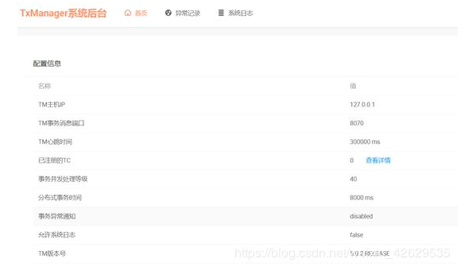

# LCN分布式事务
## 说明
txlcn-tm-5.0.2.RELEASE.zip是最新版LCN5.0.2 版本的TM端 （事务协调器）的源码包，还包含编译号的jar包（jar包下载后使用压缩工具打开，修改相应配置，重新打包后缀为jar）即可直接运行。  
如果想在本地运行，解压tx-lcn-5.0.2.RELEASE.zip并导入到idea中，运行txlcn-tm这个项目。注意该项目中的依赖首先要装到本地，  
并且必须提前安装并运行mysql、redis，执行步骤如下：  

## LCN 5.x使用
### 配置TM （5.0.2）
#### 操作前准备
需要redis和mysql（创建好表格）  
运行TM之前要先启动redis和mysql。  
运行tx-manager.sql  

#### 可能存在问题
源码中大量的log无法通过@Slf4j注解找到log变量，而且大量的set/get方法注解也都失效了。

#### 解决
[下载lombok.jar ](https://projectlombok.org/download.html)

#### 配置配置文件
```
spring.application.name=TransactionManager  
server.port=7970  

spring.datasource.driver-class-name=com.mysql.jdbc.Driver  
spring.datasource.url=jdbc:mysql://127.0.0.1:3306/tx-manager?characterEncoding=UTF-8  
spring.datasource.username=root  
spring.datasource.password=xxxx  

spring.jpa.database-platform=org.hibernate.dialect.MySQL5InnoDBDialect  
spring.jpa.hibernate.ddl-auto=update  

spring.redis.host=192.168.153.136  
spring.redis.port=6379  
spring.redis.password=  
```

#### 项目启动

#### 访问：http://localhost:7970
初始密码：codingapi  
出现如下界面，表示启动成功  



## 配置TC
### TC引入pom依赖
```
        <dependency>
            <groupId>com.codingapi.txlcn</groupId>
            <artifactId>txlcn-tc</artifactId>
            <version>5.0.2.RELEASE</version>
        </dependency>
 
        <dependency>
            <groupId>com.codingapi.txlcn</groupId>
            <artifactId>txlcn-txmsg-netty</artifactId>
            <version>5.0.2.RELEASE</version>
        </dependency>
```
### TC开启分布式事务注解
在主类上使用@EnableDistributedTransaction  
```
@SpringBootApplication  
@EnableDistributedTransaction  
public class DemoAApplication {  
 
    public static void main(String[] args) {  
        SpringApplication.run(DemoDubboClientApplication.class, args);  
    }  
 
}  
```
### TC微服务A业务方法配置
```
@Service  
public class ClientA {  
    
    @Autowired  
    private ValueDao valueDao; //本地db操作  
    
    @Autowired  
    private ClientB clientB;//远程B模块业务  
    
    @LcnTransaction //分布式事务注解  
    @Transactional //本地事务注解  
    public String execute(String value) throws BusinessException {  
        // step1. call remote service B  
        String result = clientB.rpc(value);  // (1)  
        // step2. local store operate. DTX commit if save success, rollback if not.  
        valueDao.save(value);  // (2)  
        valueDao.saveBackup(value);  // (3)  
        return result + " > " + "ok-A";  
    }  
}  
```

### TC微服务B业务方法配置
```
@Service
public class ClientB {
    
    @Autowired
    private ValueDao valueDao; //本地db操作
    
    @LcnTransaction //分布式事务注解
    @Transactional  //本地事务注解
    public String rpc(String value) throws BusinessException {
        valueDao.save(value);  // (4)
        valueDao.saveBackup(value);  // (5)
        return "ok-B";
    }
}

```

### TC配置信息说明
tx-lcn.client.manager-address=127.0.0.1:8070   

[打包好的TM包](https://download.csdn.net/download/weixin_42629535/11033690)  

[打包好的TC依赖](https://download.csdn.net/download/weixin_42629535/11033548)

[参考](http://www.pianshen.com/article/2877299796/)


