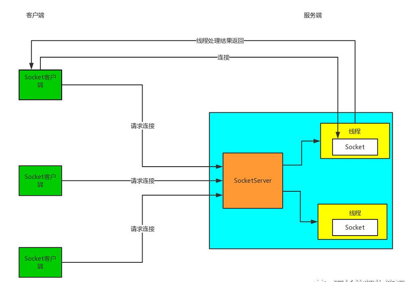
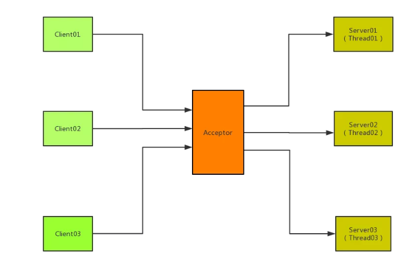
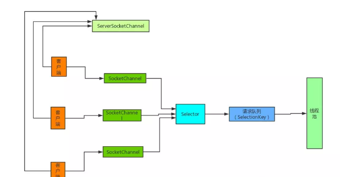
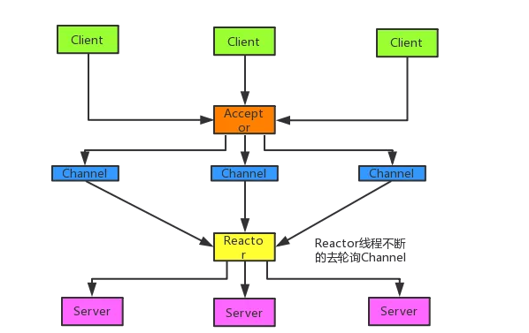
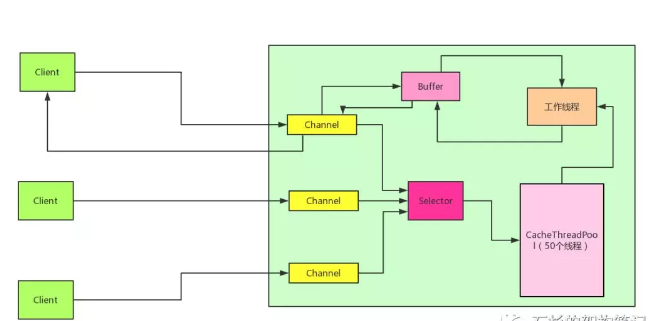
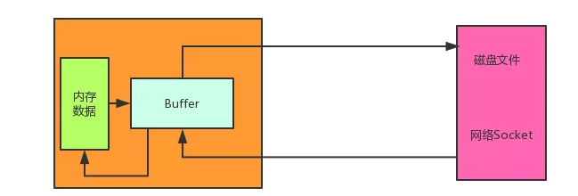
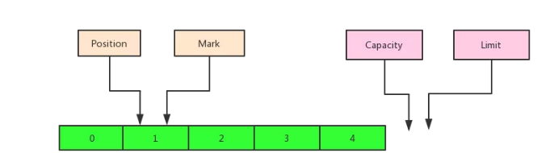
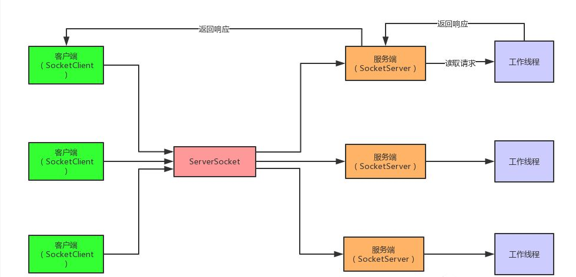
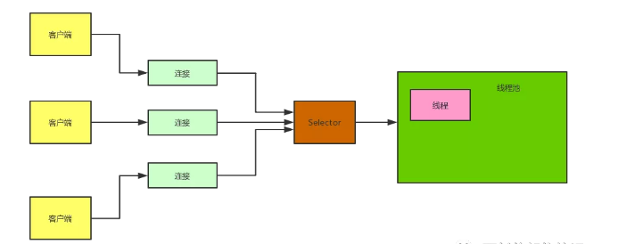

# 同步阻塞IO（BIO）
传统的网络通讯模型，就是BIO，同步阻塞IO。 
它其实就是服务端创建一个ServerSocket， 然后就是客户端用一个Socket去连接服务端的那个ServerSocket，
ServerSocket接收到了一个的连接请求就创建一个Socket和一个线程去跟那个Socket进行通讯。    
接着客户端和服务端就进行阻塞式的通信，客户端发送一个请求，服务端Socket进行处理后返回响应。   
在响应返回前，客户端那边就阻塞等待，什么事情也做不了。  
这种方式的缺点：每次一个客户端接入，都需要在服务端创建一个线程来服务这个客户端。  
这样大量客户端来的时候，就会造成服务端的线程数量可能达到了几千甚至几万，这样就可能会造成服务端过载过高，最后崩溃死掉。  

BIO模型图：  

  

## Acceptor 模式
传统的IO模型的网络服务的设计模式中有两种比较经典的设计模式：一个是多线程， 一种是依靠线程池来进行处理。  
如果是基于多线程的模式来处理的话，就是这样的模式，这种也是Acceptor线程模型。   
 
  

# 同步非阻塞IO（NIO）
NIO是一种同步非阻塞IO, 基于Reactor模型来实现的。  
其实相当于就是一个线程处理大量的客户端的请求，通过一个线程轮询大量的channel，
每次就获取一批有事件的channel，然后对每个请求启动一个线程处理即可。   
这里的核心就是非阻塞，就那个selector一个线程就可以不停轮询channel，所有客户端请求都不会阻塞，直接就会进来，大不了就是等待一下排着队而已。  
这里面优化BIO的核心就是，`一个客户端并不是时时刻刻都有数据进行交互，没有必要死耗着一个线程不放，所以客户端选择了让线程歇一歇，
只有客户端有相应的操作的时候才发起通知，创建一个线程来处理请求。  `
NIO：模型图  

  

Reactor模型:  

  

# 异步非阻塞IO（AIO）
AIO：异步非阻塞IO，基于Proactor模型实现。  
每个连接发送过来的请求，都会绑定一个Buffer，然后通知操作系统去完成异步的读，这个时间你就可以去做其他的事情。  
等到操作系统完成读之后，就会调用你的接口，给你操作系统异步读完的数据。这个时候你就可以拿到数据进行处理，将数据往回写。  
在往回写的过程，同样是给操作系统一个Buffer，让操作系统去完成写，写完了来通知你。  
这俩个过程都有buffer存在，数据都是通过buffer来完成读写。  
这里面的主要的区别在于将数据写入的缓冲区后，就不去管它，剩下的去交给操作系统去完成。  
操作系统写回数据也是一样，先写到Buffer里面，写完后通知客户端来从buffer进行读取数据。  
从上面可以看出一些数据的读写操作全部交给操作系统来完成，而自己可以去干其他的事情，这就实现了
异步非阻塞的操作。  
AIO：模型图  

    

聊完了BIO，NIO，AIO的区别之后，现在我们再结合这三个模型来说下同步和阻塞的一些问题。  

# 问答
问题1：为什么说BIO是同步阻塞的呢？  
回答：其实这里说的不是针对网络通讯模型而言，而是针对磁盘文件读写IO操作来说的。
因为用BIO的流读写文件，例如FileInputStream，是说你发起个IO请求直接hang死，卡在那里，必须等着搞完了这次IO才能返回。   

问题2：为什么说NIO是同步非阻塞？  
回答：因为无论多少客户端都可以接入服务端，客户端接入并不会耗费一个线程，只会创建一个连接然后注册到selector上去，这样你就可以去干其他你想干的事情了。  
一个selector线程不断的轮询所有的socket连接，发现有事件了就通知你，然后你就启动一个线程处理一个请求即可，这个过程的话就是非阻塞的。  
但是这个处理的过程中，你还是要先读取数据，处理，再返回的，这是个同步的过程。  

问题3：为什么说AIO是异步非阻塞？  
回答：通过AIO发起个文件IO操作之后，你立马就返回可以干别的事儿了，接下来你也不用管了，操作系统自己干完了IO之后，告诉你说ok了。  
当你基于AIO的api去读写文件时， 当你发起一个请求之后，剩下的事情就是交给了操作系统
当读写完成后， 操作系统会来回调你的接口， 告诉你操作完成。  
在这期间不需要等待， 也不需要去轮询判断操作系统完成的状态，你可以去干其他的事情。  
同步就是自己还得主动去轮询操作系统，异步就是操作系统反过来通知你。所以来说， AIO就是异步非阻塞的。  

问题4：为什么传统的socket不支持海量连接？  
回答：每次一个客户端接入，都是要在服务端创建一个线程来服务这个客户端的。  
这会导致大量的客户端的时候，服务端的线程数量可能达到几千甚至几万，几十万，这会导致服务器端程序负载过高，不堪重负，最终系统崩溃死掉。  

问题5：多路复用机制是如何支持海量连接？  
回答：NIO的线程模型对Socket发起的连接不需要每个都创建一个线程，完全可以使用一个Selector来多路复用监听N多个Channel是否有请求，该请求是对应的连接请求，还是发送数据的请求。  
这里面是基于操作系统底层的Select通知机制的，一个Selector不断的轮询多个Channel，这样避免了创建多个线程。  
只有当莫个Channel有对应的请求的时候才会创建线程，可能说1000个请求， 只有100个请求是有数据交互的，
这个时候可能server端就提供10个线程就能够处理这些请求。这样的话就可以避免了创建大量的线程。  

问题6：NIO如何通过Buffer来缓冲数据的？  
回答：
  
学习NIO，首当其冲就是要了解所谓的Buffer缓冲区，这个东西是NIO里比较核心的一个部分。  
一般来说，如果你要通过NIO写数据到文件或者网络，或者是从文件和网络读取数据出来此时就需要通过Buffer缓冲区来进行。  
Buffer的使用一般有如下几个步骤：    
写入数据到Buffer，调用flip()方法，从Buffer中读取数据，调用clear()方法或者compact()方法。  

问题7：Buffer中对应的Position， Mark， Capacity，Limit都啥？  
回答：
  
capacity：缓冲区容量的大小，就是里面包含的数据大小。  
limit：对buffer缓冲区使用的一个限制，从这个index开始就不能读取数据了。  
position：代表着数组中可以开始读写的index， 不能大于limit。  
mark：是类似路标的东西，在某个position的时候，设置一下mark，此时就可以设置一个标记。  
后续调用reset()方法可以把position复位到当时设置的那个mark上。去把position或limit调整为小于mark的值时，就丢弃这个mark
如果使用的是Direct模式创建的Buffer的话，就会减少中间缓冲直接使用DirectorBuffer来进行数据的存储。  

问题8：NIO中，Channel是什么？  
回答：Channel是NIO中的数据通道，类似流，但是又有些不同。
Channel既可从中读取数据，又可以写数据到通道中，但是流的读写通常是单向的。  
Channel可以异步的读写。Channel中的数据总是要先读到一个Buffer中，或者从缓冲区中将数据写到通道中。  
    

问题9：FileChannel的作用是什么？  
回答：Buffer有不同的类型，同样Channel也有好几个类型。  
FileChannel  
DatagramChannel  
SocketChannel  
ServerSocketChannel  
这些通道涵盖了UDP 和 TCP 网络IO，以及文件IO。而FileChannel就是文件IO对应的管道， 在读取文件的时候会用到这个管道。  

# NIO核心组件详细讲解
学习NIO先来搞清楚一些相关的概念，NIO通讯有哪些相关组件，对应的作用都是什么，之间有哪些联系？ 
 
##多路复用机制实现Selector  
首先我们来了解下传统的Socket网络通讯模型。    
传统Socket通讯原理图  

  

接着来看下NIO是如何基于Selector实现多路复用机制支持的海量连接。    

NIO原理图  

  

 

 
 
