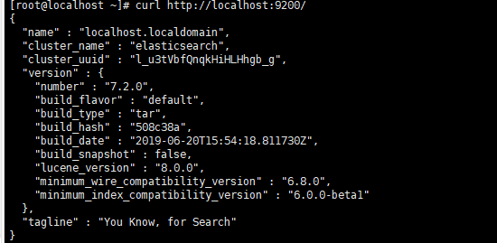

# 安装 ElasticSearch 
进入 [ElasticSearch 中文官网](https://www.elastic.co/cn/products/elasticsearch) 下载对应版本的安装包。  
  
最新的es到2019年6月26日已经更新到了7.2.0版本，如下所示：  
  

进入到 es 的下载页面，该页面提供了详细的安装步骤，如下：  
    

下面以在 linux 系统中安装 es 为例进行说明。  
使用wget命令进行下载 es，如下：  

```
wget https://artifacts.elastic.co/downloads/elasticsearch/elasticsearch-7.2.0-linux-x86_64.tar.gz  
```
  

这个下载要等一段时间，就看自己所处的网络情况了。  
下载成功，如下：  
  

然后使用 tar -zxvf elasticsearch-7.2.0-linux-x86_64.tar.gz 进行解压。  

解压成功，使用 cd elasticsearch-7.2.0 进入解压后的目录，如下：  
   

进入 bin 目录，使用 ./elasticsearch -d -p es.pid 运行es，-d 表示以守护进程启动，-p 表示指向进程id的文件，如下：  
  

发现报错了，elasticsearch是不允许使用root用户启动的，解决办法如下：  
1、使用 cd /home/tang/ 切换到es相关的目录，将 elasticsearch-7.2.0 重命名为 elasticsearch。  
2、使用 groupadd es 增加用户组，名为es。  
3、使用 useradd es -g es -p elasticsearch 创建一个用户es并加入es这个用户组中。  
4、使用 chown -R es:es  elasticsearch 更改 elasticsearch 文件夹及内部文件的所属用户及组为 es:es。  
5、使用 su es 切换到es用户再次使用 ./elasticsearch -d -p es.pid 启动，并进入 logs 目录，查看 es 相关的日志。  

如果启动的过程中，没有出现任何错误，使用 curl http://localhost:9200/ 查看是否启动成功，出现如下的
响应，说明启动成功，如下：  
   

关闭 es，找到 es.pid 文件，我使用 ./elasticsearch -d -p es.pid 启动 es 后，es.pid 生成路径在解压后的 elasticsearch
目录下，如下：  
  

使用 pkill -F es.pid 关闭es，发现关闭 es 后，es.pid 就消失了，如下：  
  

上面的步骤在[Install Elasticsearch from archive on Linux or MacOS](https://www.elastic.co/guide/en/elasticsearch/reference/current/targz.html)中有说明。  


