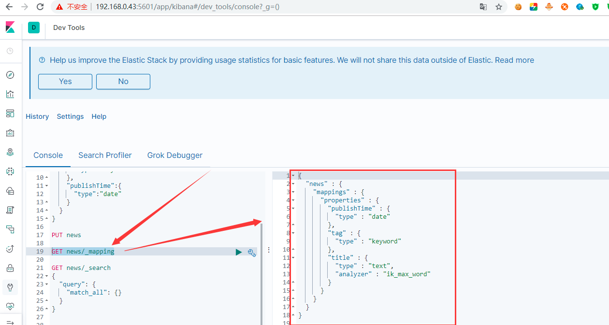

# 基本es操作
下面的基本es操作都是基于ES的7.X版本且都是使用可视化界面kibana进行操作，点击kibana界面左边栏的Dev Tools，点击Console选项卡即可。  
当Elasticsearch在前台运行，可以使用Ctrl-C快捷键终止，或者你可以调用shutdown API来关闭：  
curl -X POST http://ip地址:9200/_shutdown    
## 基础操作
1、使用 GET /_count 获取集群中的文档数量，如下：  
```
GET /_count
{
    "query": {
        "match_all": {}
    }
}
```
## 简单的CRUD操作和复杂的CRUD操作
1、使用 GET / 获取es节点信息，包括es节点名、集群名、集群uuid、版本信息。  
返回如下：  
```
{
  "name" : "fukun_es_2",
  "cluster_name" : "fukun_es",
  "cluster_uuid" : "l_u3tVbfQnqkHiHLHhgb_g",
  "version" : {
    "number" : "7.2.0",
    "build_flavor" : "default",
    "build_type" : "tar",
    "build_hash" : "508c38a",
    "build_date" : "2019-06-20T15:54:18.811730Z",
    "build_snapshot" : false,
    "lucene_version" : "8.0.0",
    "minimum_wire_compatibility_version" : "6.8.0",
    "minimum_index_compatibility_version" : "6.0.0-beta1"
  },
  "tagline" : "You Know, for Search"
}
```
2、使用 GET /_cat/indices 获取索引信息。如下：  
```
yellow open shakespeare          MQXJMp3PRKGLg43zxs7mpw 1 1 0 0   283b   283b
green  open .kibana_1            pC8mQ5HHQ_-Hi4VEpGMpfw 1 0 3 0 14.8kb 14.8kb
yellow open weather              EaPpIaqMQe-8pZTJClG12A 1 1 0 0   283b   283b
yellow open customer             ezirYJS5TBWkmjihsLLo6g 1 1 3 1  8.4kb  8.4kb
green  open .kibana_task_manager JvBosMWtTL278e6eYhUL5g 1 0 2 0 29.6kb 29.6kb
yellow open accounts             NxnMZTuiRqigh5KQMJknlQ 1 1 1 0  4.8kb  4.8kb
```
3、使用 GET /_cat/health 获取集群的健康程度。如下：  
1563846961 01:56:01 fukun_es yellow 1 1 6 6 0 0 4 0 - 60.0%  

4、增加文档    
添加索引名 twitter，文档类型 _doc，id为1的索引，下面 twitter 表示索引，_doc 表示文档，1表示id。  
```
POST twitter/_doc/1
{
  "user":"GB",
  "uid": 1,
  "city":"Beijing",
  "province":"Beijing",
  "country":"China"
}
```
返回结果如下：  
```
{
  "_index" : "twitter",
  "_type" : "_doc",
  "_id" : "1",
  "_version" : 1,
  "result" : "created",
  "_shards" : {
    "total" : 2,
    "successful" : 1,
    "failed" : 0
  },
  "_seq_no" : 0,
  "_primary_term" : 1
}
```
5、使用 GET twitter/_doc/1 获取添加的文档信息，返回信息如下：  
```
{
  "_index" : "twitter",
  "_type" : "_doc",
  "_id" : "1",
  "_version" : 1,
  "_seq_no" : 0,
  "_primary_term" : 1,
  "found" : true,
  "_source" : {
    "user" : "GB",
    "uid" : 1,
    "city" : "Beijing",
    "province" : "Beijing",
    "country" : "China"
  }
}
```
上面的 _source 表示的是索引中的文档内容。   

6、使用 PUT twitter/_doc/1 修改索引中的id为1的文档内容，覆盖旧文档的内容，如下： 
``` 
PUT twitter/_doc/1
{
   "user" : "GB",
    "uid" : 1,
    "city" : "北京",
    "province" : "北京",
    "country" : "中国",
    "location":{
      "lat":"29.084661",
      "lon":"111.335210"
    }
}
```
返回信息如下：  
```
{
  "_index" : "twitter",
  "_type" : "_doc",
  "_id" : "1",
  "_version" : 2,
  "result" : "updated",
  "_shards" : {
    "total" : 2,
    "successful" : 1,
    "failed" : 0
  },
  "_seq_no" : 1,
  "_primary_term" : 1
}
```
然后使用 GET twitter/_doc/1 获取修改后的索引中的文档信息，查看是否修改成功，如下：  
```
{
  "_index" : "twitter",
  "_type" : "_doc",
  "_id" : "1",
  "_version" : 2,
  "_seq_no" : 1,
  "_primary_term" : 1,
  "found" : true,
  "_source" : {
    "user" : "GB",
    "uid" : 1,
    "city" : "北京",
    "province" : "北京",
    "country" : "中国",
    "location" : {
      "lat" : "29.084661",
      "lon" : "111.335210"
    }
  }
}
```
7、使用 POST twitter/_update_by_query 根据条件修改文档信息，将city和province为北京修改为city和province为上海，如下：  
```
POST twitter/_update_by_query
{
  "script":{
    "source":"ctx._source.city=params.city;ctx._source.province=params.province",
    "long":"painless",
    "params":{
      "city":"上海",
      "province":"上海"
    }
  },
  "query":{
    "match":{
      "user":"GB"
    }
    
  }
}
```
结果如下：  
```
{
  "took" : 183,
  "timed_out" : false,
  "total" : 1,
  "updated" : 1,
  "deleted" : 0,
  "batches" : 1,
  "version_conflicts" : 0,
  "noops" : 0,
  "retries" : {
    "bulk" : 0,
    "search" : 0
  },
  "throttled_millis" : 0,
  "requests_per_second" : -1.0,
  "throttled_until_millis" : 0,
  "failures" : [ ]
}
```
然后使用 GET twitter/_doc/1 获取根据条件修改后的索引中的文档信息，查看根据相关的条件是否修改成功，如下：  
```
{
  "_index" : "twitter",
  "_type" : "_doc",
  "_id" : "1",
  "_version" : 3,
  "_seq_no" : 2,
  "_primary_term" : 1,
  "found" : true,
  "_source" : {
    "uid" : 1,
    "country" : "中国",
    "province" : "上海",
    "city" : "上海",
    "location" : {
      "lon" : "111.335210",
      "lat" : "29.084661"
    },
    "user" : "GB"
  }
}
```
上面演示了根据id修改文档信息和根据相关的条件修改索引信息，es在修改信息方面显得很强大。  

8、使用 DELETE twitter 删除索引，返回如下的信息：  
```  
{
  "acknowledged" : true
}
```
9、使用 POST _bulk 批量插入数据，注意下面批量插入的格式，以行为单位，每行必须以\n结尾，
不然会报如下相关的错误：   

```
"reason": "Unexpected end-of-input: expected close marker for OBJECT (from [Source: [B@1ce48eee; line: 1, column: 0])\n at [Source: [B@1ce48eee; line: 1, column: 3]"
```  
```
POST _bulk
{"index":{"_index":"twitter"}}
{"user":"双榆树-张三","message":"今天天气不错，出去转转去","uid": 2,"age":20, "city":"北京","province":"北京", "country":"中国", "address":"中国北京市海淀区", "location":{ "lat":"39.970718", "lon":"116.325747"}}
{"index":{"_index":"twitter"}}
{"user":"东城区-老刘","message":"出发，下一站云南！","uid": 3, "age":30,"city":"北京","province":"北京","country":"中国","address":"中国北京市东城区台基厂三条3号", "location":{ "lat":"39.904313","lon":"116.412754"}}
{"index":{"_index":"twitter"}}
{"user":"东城区-李四","message":"Happy Birthday！", "uid": 4,"age":30, "city":"北京", "province":"北京","country":"中国","address":"中国北京市东城区", "location":{"lat":"39.893801","lon":"116.408986" }}
{"index":{"_index":"twitter"}}
{"user":"朝阳区-老贾", "message":"123,gogogo！","uid": 5,"age":35,"city":"北京","province":"北京","country":"中国","address":"中国北京市朝阳区建国门", "location":{ "lat":"39.718256", "lon":"116.367910" }}
{"index":{"_index":"twitter"}}
{ "user":"朝阳区-老王","message":"Happy Birthday！My Friend", "uid": 6,"age":50, "city":"北京","province":"北京","country":"中国","address":"中国北京市朝阳区国贸", "location":{"lat":"39.918256","lon":"116.467910" }}
{"index":{"_index":"twitter"}}
{ "user":"虹桥-老吴","message":"好友来了都今天我生日，好友来了，什么birthday happy 就成","uid": 7, "age":50, "city":"上海","province":"上海", "country":"中国","address":"中国上海市闵行区","location":{ "lat":"31.175927", "lon":"112.383328"}}

```
返回结果如下：  
```
{
  "took" : 72,
  "errors" : false,
  "items" : [
    {
      "index" : {
        "_index" : "twitter",
        "_type" : "_doc",
        "_id" : "5x_sHGwB01YPn65fACZH",
        "_version" : 1,
        "result" : "created",
        "_shards" : {
          "total" : 2,
          "successful" : 1,
          "failed" : 0
        },
        "_seq_no" : 6,
        "_primary_term" : 1,
        "status" : 201
      }
    },
    {
      "index" : {
        "_index" : "twitter",
        "_type" : "_doc",
        "_id" : "6B_sHGwB01YPn65fACZI",
        "_version" : 1,
        "result" : "created",
        "_shards" : {
          "total" : 2,
          "successful" : 1,
          "failed" : 0
        },
        "_seq_no" : 7,
        "_primary_term" : 1,
        "status" : 201
      }
    },
    {
      "index" : {
        "_index" : "twitter",
        "_type" : "_doc",
        "_id" : "6R_sHGwB01YPn65fACZI",
        "_version" : 1,
        "result" : "created",
        "_shards" : {
          "total" : 2,
          "successful" : 1,
          "failed" : 0
        },
        "_seq_no" : 8,
        "_primary_term" : 1,
        "status" : 201
      }
    },
    {
      "index" : {
        "_index" : "twitter",
        "_type" : "_doc",
        "_id" : "6h_sHGwB01YPn65fACZI",
        "_version" : 1,
        "result" : "created",
        "_shards" : {
          "total" : 2,
          "successful" : 1,
          "failed" : 0
        },
        "_seq_no" : 9,
        "_primary_term" : 1,
        "status" : 201
      }
    },
    {
      "index" : {
        "_index" : "twitter",
        "_type" : "_doc",
        "_id" : "6x_sHGwB01YPn65fACZI",
        "_version" : 1,
        "result" : "created",
        "_shards" : {
          "total" : 2,
          "successful" : 1,
          "failed" : 0
        },
        "_seq_no" : 10,
        "_primary_term" : 1,
        "status" : 201
      }
    },
    {
      "index" : {
        "_index" : "twitter",
        "_type" : "_doc",
        "_id" : "7B_sHGwB01YPn65fACZI",
        "_version" : 1,
        "result" : "created",
        "_shards" : {
          "total" : 2,
          "successful" : 1,
          "failed" : 0
        },
        "_seq_no" : 11,
        "_primary_term" : 1,
        "status" : 201
      }
    }
  ]
}
```
上面就表示批量插入成功。  

10、上面执行了批量操作，下面使用 GET twitter/_search 查询插入的结果，如下： 
``` 
{
  "took" : 2,
  "timed_out" : false,
  "_shards" : {
    "total" : 1,
    "successful" : 1,
    "skipped" : 0,
    "failed" : 0
  },
  "hits" : {
    "total" : {
      "value" : 6,
      "relation" : "eq"
    },
    "max_score" : 1.0,
    "hits" : [
      {
        "_index" : "twitter",
        "_type" : "_doc",
        "_id" : "7R_6HGwB01YPn65fZCaN",
        "_score" : 1.0,
        "_source" : {
          "user" : "双榆树-张三",
          "message" : "今天天气不错，出去转转去",
          "uid" : 2,
          "age" : 20,
          "city" : "北京",
          "province" : "北京",
          "country" : "中国",
          "address" : "中国北京市海淀区",
          "location" : {
            "lat" : "39.970718",
            "lon" : "116.325747"
          }
        }
      },
      {
        "_index" : "twitter",
        "_type" : "_doc",
        "_id" : "7h_6HGwB01YPn65fZCaN",
        "_score" : 1.0,
        "_source" : {
          "user" : "东城区-老刘",
          "message" : "出发，下一站云南！",
          "uid" : 3,
          "age" : 30,
          "city" : "北京",
          "province" : "北京",
          "country" : "中国",
          "address" : "中国北京市东城区台基厂三条3号",
          "location" : {
            "lat" : "39.904313",
            "lon" : "116.412754"
          }
        }
      },
      {
        "_index" : "twitter",
        "_type" : "_doc",
        "_id" : "7x_6HGwB01YPn65fZCaN",
        "_score" : 1.0,
        "_source" : {
          "user" : "东城区-李四",
          "message" : "Happy Birthday！",
          "uid" : 4,
          "age" : 30,
          "city" : "北京",
          "province" : "北京",
          "country" : "中国",
          "address" : "中国北京市东城区",
          "location" : {
            "lat" : "39.893801",
            "lon" : "116.408986"
          }
        }
      },
      {
        "_index" : "twitter",
        "_type" : "_doc",
        "_id" : "8B_6HGwB01YPn65fZCaN",
        "_score" : 1.0,
        "_source" : {
          "user" : "朝阳区-老贾",
          "message" : "123,gogogo！",
          "uid" : 5,
          "age" : 35,
          "city" : "北京",
          "province" : "北京",
          "country" : "中国",
          "address" : "中国北京市朝阳区建国门",
          "location" : {
            "lat" : "39.718256",
            "lon" : "116.367910"
          }
        }
      },
      {
        "_index" : "twitter",
        "_type" : "_doc",
        "_id" : "8R_6HGwB01YPn65fZCaN",
        "_score" : 1.0,
        "_source" : {
          "user" : "朝阳区-老王",
          "message" : "Happy Birthday！My Friend",
          "uid" : 6,
          "age" : 50,
          "city" : "北京",
          "province" : "北京",
          "country" : "中国",
          "address" : "中国北京市朝阳区国贸",
          "location" : {
            "lat" : "39.918256",
            "lon" : "116.467910"
          }
        }
      },
      {
        "_index" : "twitter",
        "_type" : "_doc",
        "_id" : "8h_6HGwB01YPn65fZCaN",
        "_score" : 1.0,
        "_source" : {
          "user" : "虹桥-老吴",
          "message" : "好友来了都今天我生日，好友来了，什么birthday happy 就成",
          "uid" : 7,
          "age" : 50,
          "city" : "上海",
          "province" : "上海",
          "country" : "中国",
          "address" : "中国上海市闵行区",
          "location" : {
            "lat" : "31.175927",
            "lon" : "112.383328"
          }
        }
      }
    ]
  }
}

```
说明第九项批量插入成功。  

11、使用 GET twitter/_mapping 获取索引的映射信息，mapping相当于数据库的库表结构，这里指的是index的一种结构，返回信息如下：  
```
{
  "twitter" : {
    "mappings" : {
      "properties" : {
        "address" : {
          "type" : "text",
          "fields" : {
            "keyword" : {
              "type" : "keyword",
              "ignore_above" : 256
            }
          }
        },
        "age" : {
          "type" : "long"
        },
        "city" : {
          "type" : "text",
          "fields" : {
            "keyword" : {
              "type" : "keyword",
              "ignore_above" : 256
            }
          }
        },
        "country" : {
          "type" : "text",
          "fields" : {
            "keyword" : {
              "type" : "keyword",
              "ignore_above" : 256
            }
          }
        },
        "location" : {
          "properties" : {
            "lon" : {
              "type" : "text",
              "fields" : {
                "keyword" : {
                  "type" : "keyword",
                  "ignore_above" : 256
                }
              }
            },
            "lat" : {
              "type" : "text",
              "fields" : {
                "keyword" : {
                  "type" : "keyword",
                  "ignore_above" : 256
                }
              }
            }
          }
        },
        "message" : {
          "type" : "text",
          "fields" : {
            "keyword" : {
              "type" : "keyword",
              "ignore_above" : 256
            }
          }
        },
        "province" : {
          "type" : "text",
          "fields" : {
            "keyword" : {
              "type" : "keyword",
              "ignore_above" : 256
            }
          }
        },
        "uid" : {
          "type" : "long"
        },
        "user" : {
          "type" : "text",
          "fields" : {
            "keyword" : {
              "type" : "keyword",
              "ignore_above" : 256
            }
          }
        }
      }
    }
  }
}
```
**上面的mapping中的type为text的类型可以用于全文搜索，keyword类型可以用于聚合查询和统计分析，上面有些字段类型即是text又是keyword，表明该字段即能用于全文搜索，
又能进行统计分析，支持不同的用途，发现上面执行批量插入后，mapping是自动发生的，即自动产生了mapping，通常叫它Dynamic Mapping，即动态mapping。
但是动态mapping有时会有问题，比如上面的location字段没有mapping正确，没有映射为地理位置（geo_point）的相关类型，而是mapping成text了，这就出现问题了。
那遇到这种问题怎么解决呢？必须重新配置mapping，下面就进行重新配置mapping的操作。**  

12、首先执行 DELETE twitter，删除这个索引，然后执行如下命令：  
```
PUT twitter
{
  "settings":{"number_of_shards": 1}
}
```
**上面设置了一个分片，7.X版本之前默认是5个分片，到了7.X后，默认都是一个分片。**       

13、重新定义mapping，让 location 映射成 geo_point类型，正确设置成地理位置，如下：  
```
PUT twitter/_mapping
{
  "properties": {
    "address":{
      "type":"text",
      "fields": {
        "keyword":{
          "type":"keyword",
          "ignore_above":256
        }
      }
    },
    "city":{
      "type":"keyword"
    },
    "province":{
      "type":"keyword"
    },
     "country":{
      "type":"keyword"
    },
     "location":{
      "type":"geo_point"
    },
     "uid":{
      "type":"long"
    },
    "user":{
      "type":"text",
      "fields": {
        "keyword":{
          "type":"keyword",
          "ignore_above":256
        }
      }
    }
  }
}
```
keyword类型的保存比text类型的保存节省内存空间，再次通过 GET twitter/_mapping 获取索引的映射信息，如下：  
```
{
  "twitter" : {
    "mappings" : {
      "properties" : {
        "address" : {
          "type" : "text",
          "fields" : {
            "keyword" : {
              "type" : "keyword",
              "ignore_above" : 256
            }
          }
        },
        "city" : {
          "type" : "keyword"
        },
        "country" : {
          "type" : "keyword"
        },
        "location" : {
          "type" : "geo_point"
        },
        "province" : {
          "type" : "keyword"
        },
        "uid" : {
          "type" : "long"
        },
        "user" : {
          "type" : "text",
          "fields" : {
            "keyword" : {
              "type" : "keyword",
              "ignore_above" : 256
            }
          }
        }
      }
    }
  }
}
```
然后再次批量插入之前的数据，如下： 
``` 
POST _bulk
{"index":{"_index":"twitter"}}
{"user":"双榆树-张三","message":"今天天气不错，出去转转去","uid": 2,"age":20, "city":"北京","province":"北京", "country":"中国", "address":"中国北京市海淀区", "location":{ "lat":"39.970718", "lon":"116.325747"}}
{"index":{"_index":"twitter"}}
{"user":"东城区-老刘","message":"出发，下一站云南！","uid": 3, "age":30,"city":"北京","province":"北京","country":"中国","address":"中国北京市东城区台基厂三条3号", "location":{ "lat":"39.904313","lon":"116.412754"}}
{"index":{"_index":"twitter"}}
{"user":"东城区-李四","message":"Happy Birthday！", "uid": 4,"age":30, "city":"北京", "province":"北京","country":"中国","address":"中国北京市东城区", "location":{"lat":"39.893801","lon":"116.408986" }}
{"index":{"_index":"twitter"}}
{"user":"朝阳区-老贾", "message":"123,gogogo！","uid": 5,"age":35,"city":"北京","province":"北京","country":"中国","address":"中国北京市朝阳区建国门", "location":{ "lat":"39.718256", "lon":"116.367910" }}
{"index":{"_index":"twitter"}}
{ "user":"朝阳区-老王","message":"Happy Birthday！My Friend", "uid": 6,"age":50, "city":"北京","province":"北京","country":"中国","address":"中国北京市朝阳区国贸", "location":{"lat":"39.918256","lon":"116.467910" }}
{"index":{"_index":"twitter"}}
{ "user":"虹桥-老吴","message":"好友来了都今天我生日，好友来了，什么birthday happy 就成","uid": 7, "age":50, "city":"上海","province":"上海", "country":"中国","address":"中国上海市闵行区","location":{ "lat":"31.175927", "lon":"112.383328"}}

PUT twitter/_doc/1
{
   "user" : "GB",
    "uid" : 1,
    "city" : "北京",
    "province" : "北京",
    "country" : "中国",
    "location":{
      "lat":"29.084661",
      "lon":"111.335210"
    }
}
```
再次使用 GET twitter/_search 查看是否插入成功，发现  
```
 "total" : {
      "value" : 7,
      "relation" : "eq"
    },
```
中的value值为7，说明插入成功。  

下面演示怎么去查询。  

14、查询city为北京的索引记录，如下：  
```
GET twitter/_search
{
  "query":{
    "match": {
      "city": "北京"
    }
  }
  
}
```
返回结果为6条。  

15、查询city是北京并且年龄是30的索引记录，如下：  

```
GET twitter/_search
{
  "query": {
    "bool": {
      "must": [
        {"match": {
          "city": "北京"
        }},
        {"match": {
          "age": 30
        } }
      ]
    }
  }
}
```
返回结果为2条记录。  

16、查询city不在北京的索引记录，如下： 
``` 
GET twitter/_search
{
  "query": {
    "bool": {
      "must": [
        {"match": {
          "city": "北京"
        }},
        {"match": {
          "age": 30
        } }
      ]
    }
  }
}
```
查到了city为上海的索引记录且只有一条。   

17、查询city即是北京又是上海的索引记录，前面使用的bool表达式中的must，下面使用bool表达式中的
should，如下：  
```
GET twitter/_search
{
  "query": {
    "bool": {
      "should": [
        {"match": {
          "city": "北京"
        }},
        {"match": {
          "city": "上海"
        } }
      ]
    }
  }
}
```
上面应该查到7条索引记录，把city为北京和上海的索引记录都查出来。  

18、查询city即是北京又是上海的索引记录的总数，如下：  
```
GET twitter/_count
{
  "query": {
    "bool": {
      "should": [
        {"match": {
          "city": "北京"
        }},
        {"match": {
          "city": "上海"
        } }
      ]
    }
  }
}
```
返回结果如下：  
```
{
  "count" : 7,
  "_shards" : {
    "total" : 1,
    "successful" : 1,
    "skipped" : 0,
    "failed" : 0
  }
}
```
上面说的都是最基础的查询，下面说几个复杂一点查询，如下：  

19、查询地址是北京，地理位置距离设置的经纬度3KM的索引记录，首先按照查询条件筛选出地址是北京，然后
对查询的结果按照地理位置进行过滤，如下：  
```
GET twitter/_search
{
  "query": {
    "bool": {
      "must": [
        {"match": {
          "address": "北京"
        }}
      ]
    }
  },
  "post_filter": {
    "geo_distance": {
      "distance": "3km",
      "location": {
        "lat": 39.920086,
        "lon": 116.454182
      }
    }
  }
}
```
距离为3KM，查询结果只有一条索引记录；设置距离为5KM，发现查到3条索引记录。   

20、查询地址是北京，距离设置的经纬度为5公里，并且按照地理位置的距离升序排序的索引记录，如下：  
```
GET twitter/_search
{
  "query": {
    "bool": {
      "must": [
        {"match": {
          "address": "北京"
        }}
      ]
    }
  },
  "post_filter": {
    "geo_distance": {
      "distance": "5km",
      "location": {
        "lat": 39.920086,
        "lon": 116.454182
      }
    }
  },"sort": [
    {
      "_geo_distance": {
        "location": {
          "lat": 39.920086,
          "lon": 116.454182
        }, 
        "order": "asc",
        "unit": "km"
      }
    }
  ]
}    
```
21、使用区间过滤器查询age大于等于30岁小于等于40岁的索引记录，并且按照年龄降序排序，如下： 
``` 
GET twitter/_search
{
  "query": {
  "range": {
    "age": {
      "gte": 30,
      "lte": 40
    }
  }
  },
  "sort": [
    {
      "age": {
        "order": "desc"
      }
    }
  ]
}
```
22、es的短语搜索，查询message包含 happy birthday 的索引记录，如下：     
```
GET twitter/_search
{
  "query": {
    "match": {
      "message": "happy birthday"
    }
 
  }
}
```
查询结果只要message中包含 happy birthday 都会被查出来，而且不区分大小写，Happy Birthday也查出来了，并且 happy birthday 倒过来，即包含 birthday happy 的索引记录也会被查出来了。  
那么怎么过滤掉倒过来的birthday happy，只查询不区分大小写的happy birthday的索引记录呢？ 如下：  
```
GET twitter/_search
{
  "query": {
    "match_phrase": {
      "message": "happy birthday"
    }
 
  }
}
```
上面的结果说明了默认的分词是不区分大小写的。  

23、对查询的结果进行高亮的展示，如下：  

```
GET twitter/_search
{
  "query": {
    "match_phrase": {
      "message": "happy birthday"
    }
  },
  "highlight": {
    "fields": {
      "message": {}
    }
  }
}
```
从结果可以发现message变成了如下的模样：  
```
 "highlight" : {
          "message" : [
            "<em>Happy</em> <em>Birthday</em>！"
          ]
        }
```
对内容加上了<em>标签，对happy和birthday进行高亮显示，用于返回给前端高亮显示。   

前面我们说了单个条件的查询和复合条件的查询等相关的搜索与查询，下面我们说一下相关的
聚合操作。  

24、只要是聚合分析的都是以aggs开头的key，统计不同年龄段的人数，如下：  

```
GET twitter/_search
{
  "size":0,
  "aggs": {
    "age": {
      "range": {
        "field":"age",
        "ranges":[
          {
            "from":20,
            "to":30
          },
           {
            "from":30,
            "to":40
          },
           {
            "from":40,
            "to":50
          }
          ]
        
      }
    }
  } 
} 
```
上面的内容 size = 0，表示命中的内容不展示，但是如果把size设置不为0，比如为10，那么命中的内容
就会随着统计信息一起展示。  
size = 0 的结果如下（只展示aggregations部分）：  
```
"aggregations" : {
    "age" : {
      "buckets" : [
        {
          "key" : "20.0-30.0",
          "from" : 20.0,
          "to" : 30.0,
          "doc_count" : 1
        },
        {
          "key" : "30.0-40.0",
          "from" : 30.0,
          "to" : 40.0,
          "doc_count" : 3
        },
        {
          "key" : "40.0-50.0",
          "from" : 40.0,
          "to" : 50.0,
          "doc_count" : 0
        }
      ]
    }
  }
```
从上面的结果可以看出，年龄在20岁到30岁的人数为1人，30岁到40岁的人数为3人，没有年龄在40岁到50岁的人。  
size = 10 的结果如下：  
```
{
  "took" : 2,
  "timed_out" : false,
  "_shards" : {
    "total" : 1,
    "successful" : 1,
    "skipped" : 0,
    "failed" : 0
  },
  "hits" : {
    "total" : {
      "value" : 7,
      "relation" : "eq"
    },
    "max_score" : 1.0,
    "hits" : [
      {
        "_index" : "twitter",
        "_type" : "_doc",
        "_id" : "-R9kHWwB01YPn65fkSbk",
        "_score" : 1.0,
        "_source" : {
          "user" : "双榆树-张三",
          "message" : "今天天气不错，出去转转去",
          "uid" : 2,
          "age" : 20,
          "city" : "北京",
          "province" : "北京",
          "country" : "中国",
          "address" : "中国北京市海淀区",
          "location" : {
            "lat" : "39.970718",
            "lon" : "116.325747"
          }
        }
      },
      {
        "_index" : "twitter",
        "_type" : "_doc",
        "_id" : "-h9kHWwB01YPn65fkSbk",
        "_score" : 1.0,
        "_source" : {
          "user" : "东城区-老刘",
          "message" : "出发，下一站云南！",
          "uid" : 3,
          "age" : 30,
          "city" : "北京",
          "province" : "北京",
          "country" : "中国",
          "address" : "中国北京市东城区台基厂三条3号",
          "location" : {
            "lat" : "39.904313",
            "lon" : "116.412754"
          }
        }
      },
      {
        "_index" : "twitter",
        "_type" : "_doc",
        "_id" : "-x9kHWwB01YPn65fkSbk",
        "_score" : 1.0,
        "_source" : {
          "user" : "东城区-李四",
          "message" : "Happy Birthday！",
          "uid" : 4,
          "age" : 30,
          "city" : "北京",
          "province" : "北京",
          "country" : "中国",
          "address" : "中国北京市东城区",
          "location" : {
            "lat" : "39.893801",
            "lon" : "116.408986"
          }
        }
      },
      {
        "_index" : "twitter",
        "_type" : "_doc",
        "_id" : "_B9kHWwB01YPn65fkSbk",
        "_score" : 1.0,
        "_source" : {
          "user" : "朝阳区-老贾",
          "message" : "123,gogogo！",
          "uid" : 5,
          "age" : 35,
          "city" : "北京",
          "province" : "北京",
          "country" : "中国",
          "address" : "中国北京市朝阳区建国门",
          "location" : {
            "lat" : "39.718256",
            "lon" : "116.367910"
          }
        }
      },
      {
        "_index" : "twitter",
        "_type" : "_doc",
        "_id" : "_R9kHWwB01YPn65fkSbk",
        "_score" : 1.0,
        "_source" : {
          "user" : "朝阳区-老王",
          "message" : "Happy Birthday！My Friend",
          "uid" : 6,
          "age" : 50,
          "city" : "北京",
          "province" : "北京",
          "country" : "中国",
          "address" : "中国北京市朝阳区国贸",
          "location" : {
            "lat" : "39.918256",
            "lon" : "116.467910"
          }
        }
      },
      {
        "_index" : "twitter",
        "_type" : "_doc",
        "_id" : "_h9kHWwB01YPn65fkSbk",
        "_score" : 1.0,
        "_source" : {
          "user" : "虹桥-老吴",
          "message" : "好友来了都今天我生日，好友来了，什么birthday happy 就成",
          "uid" : 7,
          "age" : 50,
          "city" : "上海",
          "province" : "上海",
          "country" : "中国",
          "address" : "中国上海市闵行区",
          "location" : {
            "lat" : "31.175927",
            "lon" : "112.383328"
          }
        }
      },
      {
        "_index" : "twitter",
        "_type" : "_doc",
        "_id" : "1",
        "_score" : 1.0,
        "_source" : {
          "user" : "GB",
          "uid" : 1,
          "city" : "北京",
          "province" : "北京",
          "country" : "中国",
          "location" : {
            "lat" : "29.084661",
            "lon" : "111.335210"
          }
        }
      }
    ]
  },
  "aggregations" : {
    "age" : {
      "buckets" : [
        {
          "key" : "20.0-30.0",
          "from" : 20.0,
          "to" : 30.0,
          "doc_count" : 1
        },
        {
          "key" : "30.0-40.0",
          "from" : 30.0,
          "to" : 40.0,
          "doc_count" : 3
        },
        {
          "key" : "40.0-50.0",
          "from" : 40.0,
          "to" : 50.0,
          "doc_count" : 0
        }
      ]
    }
  }
}
```
聚合的时候只需要统计结果，不需要把命中的信息都展示出来，所以一般设置size为0。  

25、查询message包含happy birthday的索引记录，并且对查询的结果按照city进行分组，如下：  

```
GET twitter/_search
{
  "query": {
    "match": {
      "message": "happy birthday"
    }
  },
  "size":0,
  "aggs": {
    "age": {
      "terms": {
        "field":"city",
        "size": 10
        
      }
    }
  }
}
```
查询结果如下：  
```
{
  "took" : 9,
  "timed_out" : false,
  "_shards" : {
    "total" : 1,
    "successful" : 1,
    "skipped" : 0,
    "failed" : 0
  },
  "hits" : {
    "total" : {
      "value" : 3,
      "relation" : "eq"
    },
    "max_score" : null,
    "hits" : [ ]
  },
  "aggregations" : {
    "age" : {
      "doc_count_error_upper_bound" : 0,
      "sum_other_doc_count" : 0,
      "buckets" : [
        {
          "key" : "北京",
          "doc_count" : 2
        },
        {
          "key" : "上海",
          "doc_count" : 1
        }
      ]
    }
  }
}
```
上面查出2个人在北京，一个人在上海，并且按照城市city进行分组，可以将size = 0 设置 size = 3，详细查看
哪三个人被命中。  

下面说一下分词的使用，分词和分析器是比较重要的，通过分析器对文本进行分词并且过滤操作，生成倒排索引供我们搜索的时候使用。    
一般的分析器 analyzer 有三部分组成，一个是char filter，对字符进行过滤；一个是tokenizer，即分词器，对一个文本进行分词；
最后一个是filter，对分开的词进行过滤。

26、使用 standard 分词器进行分词，查看它是怎么对一个文本进行分词的。如下：  
```  
GET twitter/_analyze
{
  "text":["Happy Birthday"],
  "analyzer": "standard"
}
```
结果如下：  
```
{
  "tokens" : [
    {
      "token" : "happy",
      "start_offset" : 0,
      "end_offset" : 5,
      "type" : "<ALPHANUM>",
      "position" : 0
    },
    {
      "token" : "birthday",
      "start_offset" : 6,
      "end_offset" : 14,
      "type" : "<ALPHANUM>",
      "position" : 1
    }
  ]
}
```
从上面的结果可以看出，标准的分析器把Happy Birthday以中间的空格分成了happy和birthday两个词，并且Happy和Birthday都变成了小写，
但是如果"Happy Birthday" 中间的空格是一个点，那么使用标准的分词器就无法进行分词了，如下：  
```
{
  "tokens" : [
    {
      "token" : "Happy.Birthday",
      "start_offset" : 0,
      "end_offset" : 14,
      "type" : "<ALPHANUM>",
      "position" : 0
    }
  ]
}
```
发现 Happy.Birthday 没有分开。  

那么对于这种情况能不能使用其他的分词器进行分呢？当然有，如下：  
```
GET twitter/_analyze
{
  "text":["Happy.Birthday"],
   "analyzer": "simple"
}
```
执行以上的请求，就可以按照点进行分词了，并且Happy和Birthday都变成了小写。  
其实在前面设置mapping的时候我们可以针对某个字段指定分词器，如果不指定，默认就是使用标准的
分词器。如下： 
``` 
"user" : {
          "type" : "text",
          "analyzer":"standard",
          "fields" : {
            "keyword" : {
              "type" : "keyword",
              "ignore_above" : 256
            }
          }
        }
```
当然了我们可以指定用户自己的分词器，或者ik中文分词器。    

能不能自己设置分词器与filter呢？当然可以，如下的操作首先选择一个分词器，然后
对分词器分过的词进行过滤，比如变成小写，如下：  
```
GET twitter/_analyze
{
  "text":["Happy Birthday"],
   "tokenizer": "standard",
   "filter": ["lowercase"]
}
```
返回结果如下：  
```
{
  "tokens" : [
    {
      "token" : "happy",
      "start_offset" : 0,
      "end_offset" : 5,
      "type" : "<ALPHANUM>",
      "position" : 0
    },
    {
      "token" : "birthday",
      "start_offset" : 6,
      "end_offset" : 14,
      "type" : "<ALPHANUM>",
      "position" : 1
    }
  ]
}
```

# 使用 Java API 进行单元测试
创建新闻相关的索引并指定news的index的mapping结构，然后对索引字段指定IK中文分词器，
es中的IK分词器的插件安装这里不做赘述。  
创建映射之前，首先使用 PUT news 创建索引，然后使用 PUT news/_mapping 指定news索引的
映射结构并对全文搜索字段指定ik中文分析器，如下：  
```
PUT news/_mapping
{
  "properties": {
   "id":{
        "type":"keyword"
      },
    "title":{
      "type":"text",
      "analyzer": "ik_max_word"
      },
    "tag":{
      "type":"keyword"
    },
    "publishTime":{
      "type":"date"
    }
  }
}
```
然后使用 GET news/_mapping 命令查看是否设置成功，如下：  
  
从结果可以看出设置成功。  
上面使用java API进行操作可以参考单元测试类中 createMappingTest 方法即可。  

下面批量添加数据，如下：  
```
POST _bulk
{"index":{"_index":"news"}}
{"title":"中印边防军于拉达克举行会晤 强调维护边境和平","tag":"军事","publishTime":"2018-01-27T08:34:00Z"}
{"index":{"_index":"news"}}
{"title":"费德勒收郑泫退赛礼 进决赛战西里奇","tag":"体育","publishTime":"2018-01-26T14:34:00Z"}
{"index":{"_index":"news"}}
{"title":"欧文否认拿动手术威胁骑士 兴奋全明星联手詹皇","tag":"体育","publishTime":"2018-01-26T08:34:00Z"}
{"index":{"_index":"news"}}
{"title":"皇马官方通告拉莫斯伊斯科伤情 将缺阵西甲关键战","tag":"体育","publishTime":"2018-01-26T20:34:00Z"}
```
查看批量添加的文档数据是否成功，如下：  
```
GET news/_search
{
  "query": {
    "match_all": {}
  }
}
```
返回结果：  
```
{
  "took" : 0,
  "timed_out" : false,
  "_shards" : {
    "total" : 1,
    "successful" : 1,
    "skipped" : 0,
    "failed" : 0
  },
  "hits" : {
    "total" : {
      "value" : 4,
      "relation" : "eq"
    },
    "max_score" : 1.0,
    "hits" : [
      {
        "_index" : "news",
        "_type" : "_doc",
        "_id" : "AR8oMWwB01YPn65fVSe5",
        "_score" : 1.0,
        "_source" : {
          "title" : "中印边防军于拉达克举行会晤 强调维护边境和平",
          "tag" : "军事",
          "publishTime" : "2018-01-27T08:34:00Z"
        }
      },
      {
        "_index" : "news",
        "_type" : "_doc",
        "_id" : "Ah8oMWwB01YPn65fVSe5",
        "_score" : 1.0,
        "_source" : {
          "title" : "费德勒收郑泫退赛礼 进决赛战西里奇",
          "tag" : "体育",
          "publishTime" : "2018-01-26T14:34:00Z"
        }
      },
      {
        "_index" : "news",
        "_type" : "_doc",
        "_id" : "Ax8oMWwB01YPn65fVSe5",
        "_score" : 1.0,
        "_source" : {
          "title" : "欧文否认拿动手术威胁骑士 兴奋全明星联手詹皇",
          "tag" : "体育",
          "publishTime" : "2018-01-26T08:34:00Z"
        }
      },
      {
        "_index" : "news",
        "_type" : "_doc",
        "_id" : "BB8oMWwB01YPn65fVSe5",
        "_score" : 1.0,
        "_source" : {
          "title" : "皇马官方通告拉莫斯伊斯科伤情 将缺阵西甲关键战",
          "tag" : "体育",
          "publishTime" : "2018-01-26T20:34:00Z"
        }
      }
    ]
  }
}
```
说明添加成功。  
使用 java API 进行批量添加，参考单元测试类中的batchAddTest方法即可，运行该方法，在kibana可视化界面查看
是否添加成功，如下：  
```
GET news/_search
{
  "query": {
    "match_all": {}
  }
}
```
返回结果如下：  
```
{
  "took" : 1,
  "timed_out" : false,
  "_shards" : {
    "total" : 1,
    "successful" : 1,
    "skipped" : 0,
    "failed" : 0
  },
  "hits" : {
    "total" : {
      "value" : 4,
      "relation" : "eq"
    },
    "max_score" : 1.0,
    "hits" : [
      {
        "_index" : "news",
        "_type" : "_doc",
        "_id" : "BR9kMWwB01YPn65fOCeQ",
        "_score" : 1.0,
        "_source" : {
          "title" : "中印边防军于拉达克举行会晤 强调维护边境和平",
          "tag" : "军事",
          "publishTime" : "2018-01-27T08:34:00Z"
        }
      },
      {
        "_index" : "news",
        "_type" : "_doc",
        "_id" : "Bh9kMWwB01YPn65fOCeQ",
        "_score" : 1.0,
        "_source" : {
          "title" : "费德勒收郑泫退赛礼 进决赛战西里奇",
          "tag" : "体育",
          "publishTime" : "2018-01-26T14:34:00Z"
        }
      },
      {
        "_index" : "news",
        "_type" : "_doc",
        "_id" : "Bx9kMWwB01YPn65fOCeQ",
        "_score" : 1.0,
        "_source" : {
          "title" : "欧文否认拿动手术威胁骑士 兴奋全明星联手詹皇",
          "tag" : "体育",
          "publishTime" : "2018-01-26T08:34:00Z"
        }
      },
      {
        "_index" : "news",
        "_type" : "_doc",
        "_id" : "CB9kMWwB01YPn65fOCeQ",
        "_score" : 1.0,
        "_source" : {
          "title" : "皇马官方通告拉莫斯伊斯科伤情 将缺阵西甲关键战",
          "tag" : "体育",
          "publishTime" : "2018-01-26T20:34:00Z"
        }
      }
    ]
  }
}
```

查询目标：2018年1月26日早八点到晚八点关于费德勒的前十条体育新闻的标题。  
```
GET news/_search
{
    "from":"0",
    "size":"10",
    "_source":["title"],
    "query":{
        "bool":{
          "must": [
            {
              "match": {"title": "费德勒"}
            },
            {
              "term": {
                "tag": {
                  "value": "体育"
                }
              }
            },
            {
              "range": {
              "publishTime": {
                "gte": "2018-01-26T08:00:00Z",
                "lte": "2018-01-26T20:00:00Z"
              }
            }
            }
          ]
           
        }
    }

}
```
结果如下：  
```
{
  "took" : 8,
  "timed_out" : false,
  "_shards" : {
    "total" : 1,
    "successful" : 1,
    "skipped" : 0,
    "failed" : 0
  },
  "hits" : {
    "total" : {
      "value" : 1,
      "relation" : "eq"
    },
    "max_score" : 4.994704,
    "hits" : [
      {
        "_index" : "news",
        "_type" : "_doc",
        "_id" : "Ah8oMWwB01YPn65fVSe5",
        "_score" : 4.994704,
        "_source" : {
          "title" : "费德勒收郑泫退赛礼 进决赛战西里奇"
        }
      }
    ]
  }
}
```
使用java API怎么做呢？看一下EsTests的单元测试中的queryTest方法即可，执行该方法，
返回结果如下：
```  
 main] com.fukun.EsTests                        : Started EsTests in 22.166 seconds (JVM running for 27.598)
{
"took":4,"timed_out":false,"_shards":{"total":1,"successful":1,"skipped":0,"failed":0},"hits":{"total":{"value":1,"relation":"eq"},"max_score":4.994704,
"hits":[{"_index":"news","_type":"_doc","_id":"Ah8oMWwB01YPn65fVSe5","_score":4.994704,"_source":{"title":"费德勒收郑泫退赛礼 进决赛战西里奇"}}]}}

```

# 不停机之重建索引
我们在使用ES的时候，尤其是初学者，通常都会遇到一个问题，那就是文档字段的映射类型创建错误问题，
但是ES上却不能像mysql一样直接去修改字段类型，这时便出现了这个棘手的问题，今天让我们用一种索引重建的方式来修改字段映射类型。    
使用索引重建并且不停机，需要有个前提，那就是你在使用索引时，都是使用索引别名而不是使用真正的索引名 
，如果这点在你的程序上还没有做的话，那么请为其建立别名，好处很多，一旦当前索引出现了什么问题 不能及时恢复，
你可以紧急切换到备用索引上而无需再重启服务、方便索引重建等等。     

## 出现的业务场景
比如下面的一个场景;  
一开始我们使用es的动态mapping插入数据，但是不小心有些数据是2019-07-01这种日期格式的，所以title这种field被自动映射为了date类型，实际上它应该是string类型的，  
```
POST /my_index/3
{
  "title":"2019-07-05"
}

```
然后获取 my_index 的映射结果，如下：  
GET my_index/_mapping
  
```
{
  "my_index" : {
    "mappings" : {
      "properties" : {
        "title" : {
          "type" : "date"
        }
      }
    }
  }
}
```
发现title被自动映射成了date类型，当后期向索引中加入string类型的title值的时候，就会报错  
```
POST /my_index/2
{
  "title":"tangyifei"
}
```
返回信息如下：  
```
{
  "error": {
    "root_cause": [
      {
        "type": "mapper_parsing_exception",
        "reason": "failed to parse field [title] of type [date] in document with id 'Eh8MQWwB01YPn65f7ydw'"
      }
    ],
    "type": "mapper_parsing_exception",
    "reason": "failed to parse field [title] of type [date] in document with id 'Eh8MQWwB01YPn65f7ydw'",
    "caused_by": {
      "type": "illegal_argument_exception",
      "reason": "failed to parse date field [tangyifei] with format [strict_date_optional_time||epoch_millis]",
      "caused_by": {
        "type": "date_time_parse_exception",
        "reason": "Failed to parse with all enclosed parsers"
      }
    }
  },
  "status": 400
}
```
如果此时想修改title的类型，是不可能的。  
此时，唯一的办法，就是进行reindex，也就是说，重新建立一个索引，将旧索引的数据查询出来，再导入新索引  
如果说旧索引的名字是 old_index，新索引的名字是 new_index，终端java应用已经在使用old_index进行相关操作了，
难道还要去停止终端java应用，修改使用的index为new_index，才重新启动java应用吗？这个过程中，就会导致java应用停机，可用性降低。  
假如 old_index 和 new_index 的索引别名是 alias_index，其实终端java应用只要对index进行操作即可，而不需要java应用停机，
old_index 数据同步到 new_index 的操作并且切换到 new_index， 对终端java应用透明。   

## 实现思路
下面我们定义一个索引 old_index，并设置title字段为 2019-07-01，id为1的文档，如下： 
``` 
POST /old_index/1
{
  "id":1,
  "title":"2019-07-01"
}
```
返回动态生成的映射，如下：  
GET old_index/_mapping  
```
{
  "old_index" : {
    "mappings" : {
      "properties" : {
        "id" : {
          "type" : "long"
        },
        "title" : {
          "type" : "date"
        }
      }
    }
  }
}
```
发现 title 字段动态映射成了date类型，怎么修改这个字段类型呢？  
使用 PUT old_index/_alias/alias_index  为 old_index 索引定义一个别名 alias_index。  
 
定义一个 new_index 并设置 title 的字段类型为text，如下：  
PUT new_index  

```
PUT new_index/_mapping
{
  "properties": {
    "id":{
      "type":"long"
    },
    
       "title":{
      "type":"text",
      "analyzer": "ik_max_word"
      }
   
  }
}
```
然后执行数据复制操作，将 old_index 中的数据复制到 new_index 中，如下： 

```
POST _reindex
{
  "conflicts": "proceed",
  "source": {
    "index": "old_index"
  },
  "dest": {
    "index": "new_index",
    "op_type": "create",
    "version_type": "external"
  }
}
```
reindex会将一个索引的数据复制到另一个已存在的索引，但是并不会复制原索引的mapping（映射）、shard（分片）、replicas（副本）等配置信息，
所以这也是为什么 new_index 创建了和 old_index 结构基本相同的目标索引的原因。     
设置conflicts为proceed代表当复制数据时发生版本冲突时继续执行（默认设置在版本冲突时会中止了reindex进程）。  
设置op_type为create是指在目标索引 new_index 中创建丢失的文档，所有现有文件将导致版本冲突。  
设置version_type为external就是指数据从源索引 old_index 拷贝到目标索引 new_index 的时候会同时拷贝上版本号字段，并更新目标索引中 new_index 比源索引中 old_index 更旧版本的文档。    
这里说下该导入功能执行效率，线上一个索引的数据量在8w左右用时3秒多（其实跟你的索引的一个文档数据量也有关系，这里仅仅给个参考点）。  

查看数据是否复制成功，如下：  
```
GET new_index/_search
{
  "query": {
    "match_all": {}
  }
}
```
返回如下：  
```
{
  "took" : 325,
  "timed_out" : false,
  "_shards" : {
    "total" : 1,
    "successful" : 1,
    "skipped" : 0,
    "failed" : 0
  },
  "hits" : {
    "total" : {
      "value" : 1,
      "relation" : "eq"
    },
    "max_score" : 1.0,
    "hits" : [
      {
        "_index" : "new_index",
        "_type" : "_doc",
        "_id" : "Fh8fQWwB01YPn65f3SfC",
        "_score" : 1.0,
        "_source" : {
          "id" : 1,
          "title" : "2019-07-01"
        }
      }
    ]
  }
}
```
发现数据已经从 old_index 复制到了 new_index，然后把 old_index 别名删除并且同时为 new_index 添加别名 
alias_index（此时线上程序已经切换到 new_index 数据源上了） 。  
```
POST _aliases
{
  "actions": [
    {
     
      "remove": {
        "index": "old_index",
        "alias": "alias_index"
      }
    
    }
  ]
}

POST _aliases
{
  "actions": [
    {
     
      "add": {
        "index": "new_index",
        "alias": "alias_index"
      }
    
    }
  ]
}
```
再次进行数据复制，目的是增量同步 old_index 中修改但没有同步到 new_index 中的数据， 
因为在做以上的操作中的时候，很可能线上的 old_index 索引数据发生修改了，如下：  
```
POST _reindex
{
  "conflicts": "proceed",
  "source": {
    "index": "old_index"
  },
  "dest": {
    "index": "new_index",
    "op_type": "create",
    "version_type": "external"
  }
}
```

其他的 java API 操作请查看单元测试类，**`注意：该单元测试类最好按照顺序从上往下运行`**。  

  


 


  


